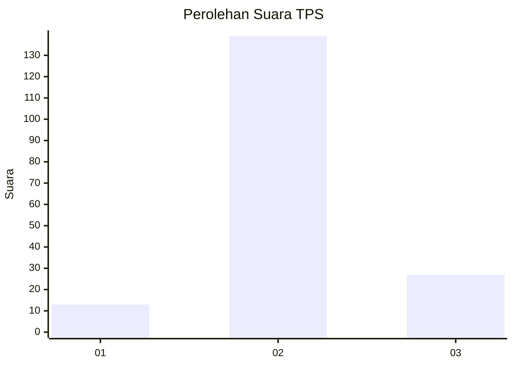

# Hasil

## Grafik

## Tabel

| No. | Nama Paslon    | Suara | Suara (raw) | Persentase |
|:--- |:-------------- | -----:| -----------:| ----------:|
| 1   | ANIES MUHAIMIN | 13    | [13][p-1]   | 7,26       |
| 2   | PRABOWO GIBRAN | 139   | [139][p-2]  | 77,65      |
| 3   | GANJAR MAHFUD  | 27    | [27][p-3]   | 15,08      |

[p-1]: https://github.com/gigit-pemilu/pemilu-2024-35-jawa-timur/blob/main/pilpres/hitung-suara/sub/35-jawa-timur/sub/01-pacitan/sub/01-donorojo/sub/2001-widoro/sub/001-tps/sub/paslon-1.txt
[p-2]: https://github.com/gigit-pemilu/pemilu-2024-35-jawa-timur/blob/main/pilpres/hitung-suara/sub/35-jawa-timur/sub/01-pacitan/sub/01-donorojo/sub/2001-widoro/sub/001-tps/sub/paslon-2.txt
[p-3]: https://github.com/gigit-pemilu/pemilu-2024-35-jawa-timur/blob/main/pilpres/hitung-suara/sub/35-jawa-timur/sub/01-pacitan/sub/01-donorojo/sub/2001-widoro/sub/001-tps/sub/paslon-3.txt

## Foto C Plano

https://sirekap-obj-formc.kpu.go.id/2e56/pemilu/ppwp/35/01/01/20/01/3501012001001-20240216-132854--9a450a5e-4842-43a3-a76d-4967a2eb26ad.jpg

https://sirekap-obj-formc.kpu.go.id/2e56/pemilu/ppwp/35/01/01/20/01/3501012001001-20240216-132855--a5700e8d-b065-422a-9b5f-422d4f2b7b3e.jpg

https://sirekap-obj-formc.kpu.go.id/2e56/pemilu/ppwp/35/01/01/20/01/3501012001001-20240216-132855--f528fbc6-1ed7-48de-8aae-969a8f4253d0.jpg

## Metadata

| Key        | Value               |
| ---------- | ------------------- |
| Time Stamp | 2024-02-16 21:01:00 |

## DATA PEMILIH TETAP

Jumlah pemilih dalam DPT: **185**.
 * L: **116**.
 * P: **133**.

## DATA PENGGUNA HAK PILIH

Jumlah pengguna hak pilih dalam DPT: **185**.
 * L: **86**.
 * P: **99**.

Jumlah pengguna hak pilih dalam DPTb: **0**.
 * L: **0**.
 * P: **0**.

Jumlah pengguna hak pilih dalam DPK: **0**.
 * L: **0**.
 * P: **0**.

Jumlah pengguna hak pilih: **185**.
 * L: **86**.
 * P: **99**.

## JUMLAH SUARA SAH DAN TIDAK SAH

JUMLAH SELURUH SUARA SAH: **179**.

JUMLAH SUARA TIDAK SAH: **6**.

JUMLAH SELURUH SUARA SAH DAN SUARA TIDAK SAH: **185**.

