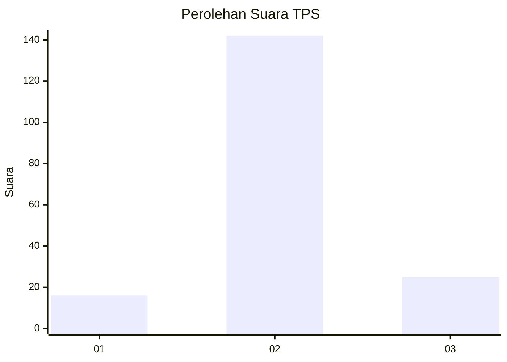
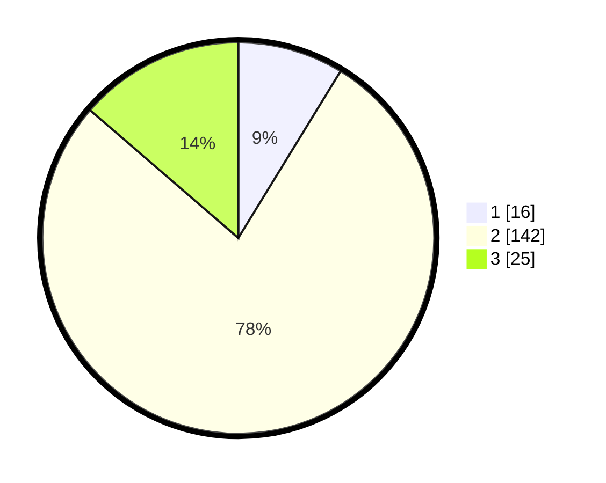

# Hasil

## Grafik

## Tabel

| No. | Nama Paslon    | Suara | Suara (raw) | Persentase |
|:--- |:-------------- | -----:| -----------:| ----------:|
| 1   | ANIES MUHAIMIN | 16    | [16][p-1]   | 8,74       |
| 2   | PRABOWO GIBRAN | 142   | [142][p-2]  | 77,60      |
| 3   | GANJAR MAHFUD  | 25    | [25][p-3]   | 13,66      |

[p-1]: https://github.com/gigit-pemilu/pemilu-2024/blob/main/pilpres/hitung-suara/sub/35-jawa-timur/sub/01-pacitan/sub/01-donorojo/sub/2001-widoro/sub/002-tps/sub/paslon-1.txt
[p-2]: https://github.com/gigit-pemilu/pemilu-2024/blob/main/pilpres/hitung-suara/sub/35-jawa-timur/sub/01-pacitan/sub/01-donorojo/sub/2001-widoro/sub/002-tps/sub/paslon-2.txt
[p-3]: https://github.com/gigit-pemilu/pemilu-2024/blob/main/pilpres/hitung-suara/sub/35-jawa-timur/sub/01-pacitan/sub/01-donorojo/sub/2001-widoro/sub/002-tps/sub/paslon-3.txt

## Foto C Plano

https://sirekap-obj-formc.kpu.go.id/cfb5/pemilu/ppwp/35/01/01/20/01/3501012001002-20240216-225124--21dd8b4b-ac55-48f4-a002-6a9d353ad183.jpg

https://sirekap-obj-formc.kpu.go.id/cfb5/pemilu/ppwp/35/01/01/20/01/3501012001002-20240216-225125--92998234-9a40-433b-bcfa-8c0ae6a63132.jpg

https://sirekap-obj-formc.kpu.go.id/cfb5/pemilu/ppwp/35/01/01/20/01/3501012001002-20240216-225124--b10ec289-52ed-41dd-a4d7-2bc45898e1da.jpg

## Metadata

| Key        | Value               |
| ---------- | ------------------- |
| Time Stamp | 2024-02-16 23:45:47 |

## DATA PEMILIH TETAP

Jumlah pemilih dalam DPT: **259**.
 * L: **124**.
 * P: **135**.

## DATA PENGGUNA HAK PILIH

Jumlah pengguna hak pilih dalam DPT: **185**.
 * L: **90**.
 * P: **95**.

Jumlah pengguna hak pilih dalam DPTb: **1**.
 * L: **0**.
 * P: **1**.

Jumlah pengguna hak pilih dalam DPK: **2**.
 * L: **2**.
 * P: **0**.

Jumlah pengguna hak pilih: **188**.
 * L: **92**.
 * P: **96**.

## JUMLAH SUARA SAH DAN TIDAK SAH

JUMLAH SELURUH SUARA SAH: **183**.

JUMLAH SUARA TIDAK SAH: **5**.

JUMLAH SELURUH SUARA SAH DAN SUARA TIDAK SAH: **188**.

