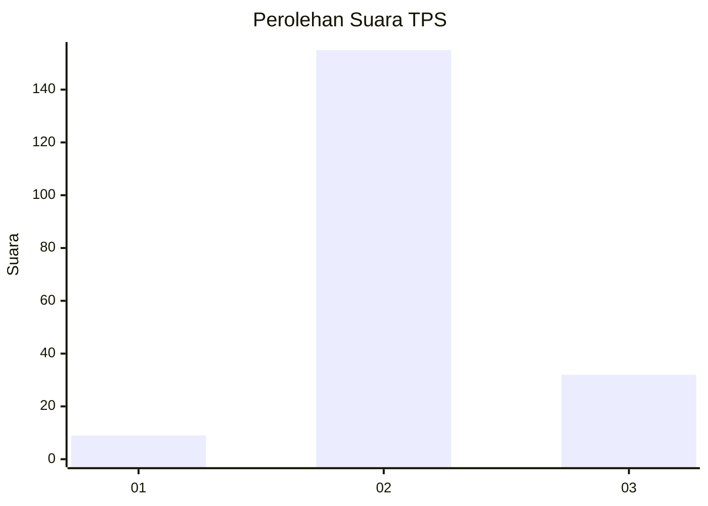
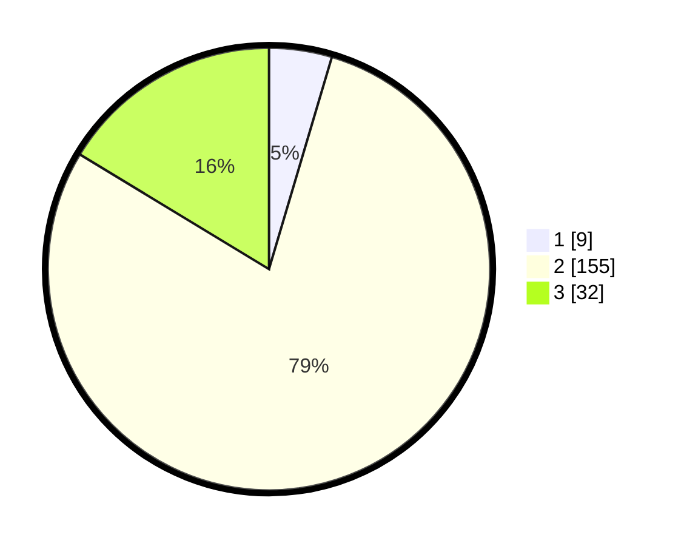

# Hasil

## Grafik

## Tabel

| No. | Nama Paslon    | Suara | Suara (raw) | Persentase |
|:--- |:-------------- | -----:| -----------:| ----------:|
| 1   | ANIES MUHAIMIN | 9     | [9][p-1]    | 4,59       |
| 2   | PRABOWO GIBRAN | 155   | [155][p-2]  | 79,08      |
| 3   | GANJAR MAHFUD  | 32    | [32][p-3]   | 16,33      |

[p-1]: https://github.com/gigit-pemilu/pemilu-2024-35-jawa-timur/blob/main/pilpres/hitung-suara/sub/35-jawa-timur/sub/01-pacitan/sub/01-donorojo/sub/2001-widoro/sub/003-tps/sub/paslon-1.txt
[p-2]: https://github.com/gigit-pemilu/pemilu-2024-35-jawa-timur/blob/main/pilpres/hitung-suara/sub/35-jawa-timur/sub/01-pacitan/sub/01-donorojo/sub/2001-widoro/sub/003-tps/sub/paslon-2.txt
[p-3]: https://github.com/gigit-pemilu/pemilu-2024-35-jawa-timur/blob/main/pilpres/hitung-suara/sub/35-jawa-timur/sub/01-pacitan/sub/01-donorojo/sub/2001-widoro/sub/003-tps/sub/paslon-3.txt

## Foto C Plano

https://sirekap-obj-formc.kpu.go.id/fceb/pemilu/ppwp/35/01/01/20/01/3501012001003-20240214-185243--94da3b07-6a34-4a10-9f62-f2af004f4210.jpg

https://sirekap-obj-formc.kpu.go.id/fceb/pemilu/ppwp/35/01/01/20/01/3501012001003-20240214-190231--fbfe7b21-2dd5-4ec5-9808-6a86a8b6780b.jpg

https://sirekap-obj-formc.kpu.go.id/fceb/pemilu/ppwp/35/01/01/20/01/3501012001003-20240214-190429--f1802f6e-9cb7-4b5d-824a-78e4449d2052.jpg

## Metadata

| Key        | Value               |
| ---------- | ------------------- |
| Time Stamp | 2024-02-14 21:46:01 |

## DATA PEMILIH TETAP

Jumlah pemilih dalam DPT: **273**.
 * L: **133**.
 * P: **140**.

## DATA PENGGUNA HAK PILIH

Jumlah pengguna hak pilih dalam DPT: **206**.
 * L: **106**.
 * P: **100**.

Jumlah pengguna hak pilih dalam DPTb: **0**.
 * L: **0**.
 * P: **0**.

Jumlah pengguna hak pilih dalam DPK: **0**.
 * L: **0**.
 * P: **0**.

Jumlah pengguna hak pilih: **206**.
 * L: **106**.
 * P: **100**.

## JUMLAH SUARA SAH DAN TIDAK SAH

JUMLAH SELURUH SUARA SAH: **196**.

JUMLAH SUARA TIDAK SAH: **10**.

JUMLAH SELURUH SUARA SAH DAN SUARA TIDAK SAH: **206**.

