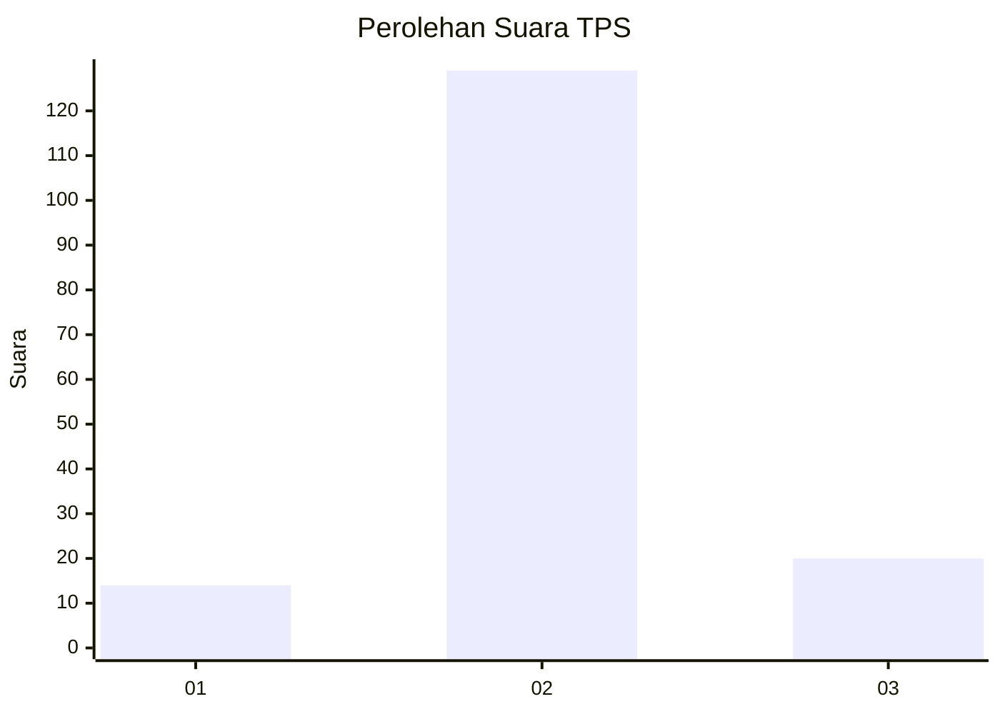
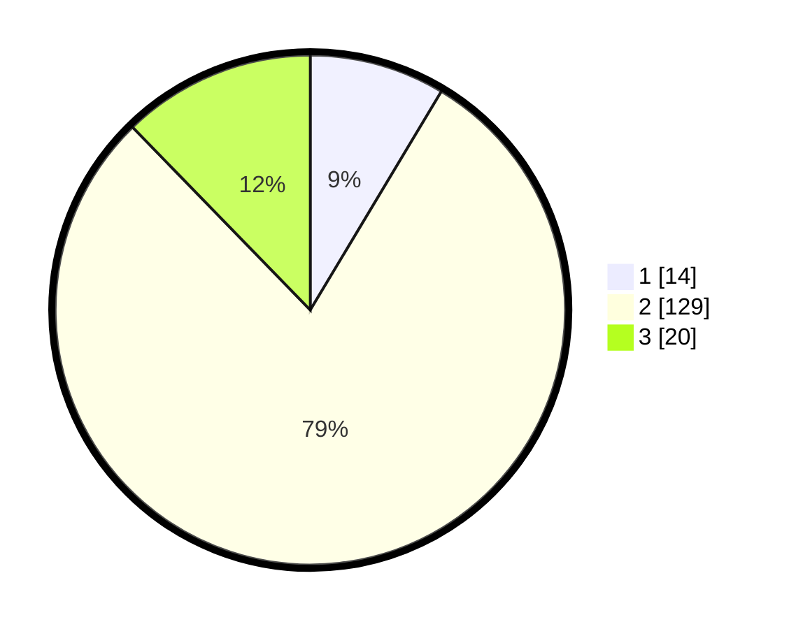

# Hasil

## Grafik

## Tabel

| No. | Nama Paslon    | Suara | Suara (raw) | Persentase |
|:--- |:-------------- | -----:| -----------:| ----------:|
| 1   | ANIES MUHAIMIN | 14    | [14][p-1]   | 8,59       |
| 2   | PRABOWO GIBRAN | 129   | [129][p-2]  | 79,14      |
| 3   | GANJAR MAHFUD  | 20    | [20][p-3]   | 12,27      |

[p-1]: https://github.com/gigit-pemilu/pemilu-2024/blob/main/pilpres/hitung-suara/sub/35-jawa-timur/sub/01-pacitan/sub/01-donorojo/sub/2001-widoro/sub/004-tps/sub/paslon-1.txt
[p-2]: https://github.com/gigit-pemilu/pemilu-2024/blob/main/pilpres/hitung-suara/sub/35-jawa-timur/sub/01-pacitan/sub/01-donorojo/sub/2001-widoro/sub/004-tps/sub/paslon-2.txt
[p-3]: https://github.com/gigit-pemilu/pemilu-2024/blob/main/pilpres/hitung-suara/sub/35-jawa-timur/sub/01-pacitan/sub/01-donorojo/sub/2001-widoro/sub/004-tps/sub/paslon-3.txt

## Foto C Plano

https://sirekap-obj-formc.kpu.go.id/1e37/pemilu/ppwp/35/01/01/20/01/3501012001004-20240217-015808--e69269cf-1a86-40de-8e61-7682e120b6c4.jpg

https://sirekap-obj-formc.kpu.go.id/1e37/pemilu/ppwp/35/01/01/20/01/3501012001004-20240217-015931--1e21a9d6-1efb-4e71-9e6e-21a07bc4d9e7.jpg

https://sirekap-obj-formc.kpu.go.id/1e37/pemilu/ppwp/35/01/01/20/01/3501012001004-20240217-020036--1770c3a2-bcf0-4781-9bb9-45859407e56b.jpg

## Metadata

| Key        | Value               |
| ---------- | ------------------- |
| Time Stamp | 2024-02-17 03:30:02 |

## DATA PEMILIH TETAP

Jumlah pemilih dalam DPT: **225**.
 * L: **115**.
 * P: **110**.

## DATA PENGGUNA HAK PILIH

Jumlah pengguna hak pilih dalam DPT: **169**.
 * L: **83**.
 * P: **86**.

Jumlah pengguna hak pilih dalam DPTb: **1**.
 * L: **1**.
 * P: **0**.

Jumlah pengguna hak pilih dalam DPK: **0**.
 * L: **0**.
 * P: **0**.

Jumlah pengguna hak pilih: **170**.
 * L: **84**.
 * P: **86**.

## JUMLAH SUARA SAH DAN TIDAK SAH

JUMLAH SELURUH SUARA SAH: **163**.

JUMLAH SUARA TIDAK SAH: **7**.

JUMLAH SELURUH SUARA SAH DAN SUARA TIDAK SAH: **170**.

