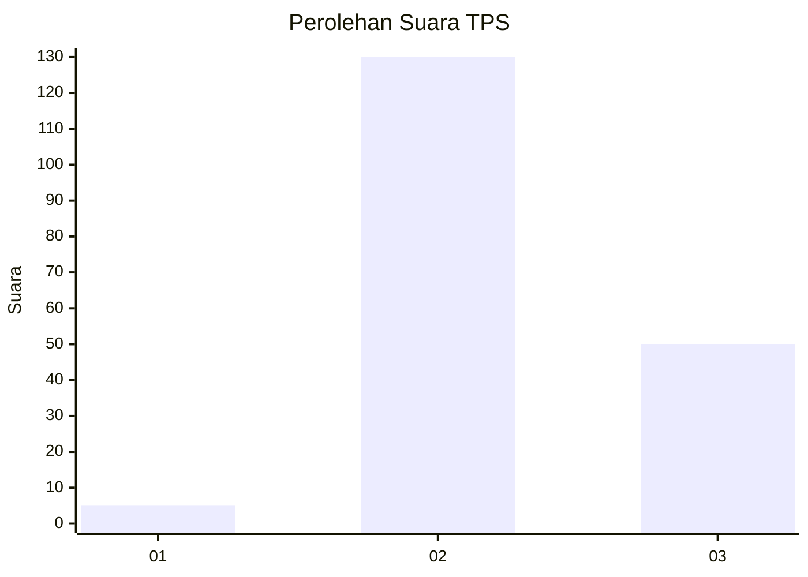
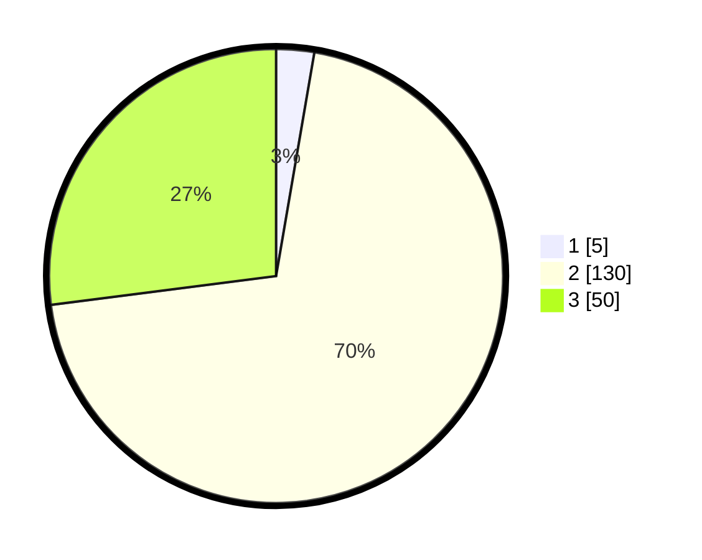

# Hasil

## Grafik

## Tabel

| No. | Nama Paslon    | Suara | Suara (raw) | Persentase |
|:--- |:-------------- | -----:| -----------:| ----------:|
| 1   | ANIES MUHAIMIN | 5     | [5][p-1]    | 2,70       |
| 2   | PRABOWO GIBRAN | 130   | [130][p-2]  | 70,27      |
| 3   | GANJAR MAHFUD  | 50    | [50][p-3]   | 27,03      |

[p-1]: https://github.com/gigit-pemilu/pemilu-2024/blob/main/pilpres/hitung-suara/sub/35-jawa-timur/sub/01-pacitan/sub/01-donorojo/sub/2001-widoro/sub/005-tps/sub/paslon-1.txt
[p-2]: https://github.com/gigit-pemilu/pemilu-2024/blob/main/pilpres/hitung-suara/sub/35-jawa-timur/sub/01-pacitan/sub/01-donorojo/sub/2001-widoro/sub/005-tps/sub/paslon-2.txt
[p-3]: https://github.com/gigit-pemilu/pemilu-2024/blob/main/pilpres/hitung-suara/sub/35-jawa-timur/sub/01-pacitan/sub/01-donorojo/sub/2001-widoro/sub/005-tps/sub/paslon-3.txt

## Foto C Plano

https://sirekap-obj-formc.kpu.go.id/21f8/pemilu/ppwp/35/01/01/20/01/3501012001005-20240217-181803--b9279dcd-62c4-432a-90ac-fe3ad9916c05.jpg

https://sirekap-obj-formc.kpu.go.id/21f8/pemilu/ppwp/35/01/01/20/01/3501012001005-20240217-181804--65dec4fb-e96a-4afb-a4a3-999ba002286a.jpg

https://sirekap-obj-formc.kpu.go.id/21f8/pemilu/ppwp/35/01/01/20/01/3501012001005-20240217-181804--3932124f-5932-4f87-97ea-eb7af302de46.jpg

## Metadata

| Key        | Value               |
| ---------- | ------------------- |
| Time Stamp | 2024-02-17 19:00:04 |

## DATA PEMILIH TETAP

Jumlah pemilih dalam DPT: **251**.
 * L: **122**.
 * P: **129**.

## DATA PENGGUNA HAK PILIH

Jumlah pengguna hak pilih dalam DPT: **185**.
 * L: **90**.
 * P: **95**.

Jumlah pengguna hak pilih dalam DPTb: **1**.
 * L: **1**.
 * P: **0**.

Jumlah pengguna hak pilih dalam DPK: **3**.
 * L: **2**.
 * P: **1**.

Jumlah pengguna hak pilih: **189**.
 * L: **93**.
 * P: **96**.

## JUMLAH SUARA SAH DAN TIDAK SAH

JUMLAH SELURUH SUARA SAH: **185**.

JUMLAH SUARA TIDAK SAH: **4**.

JUMLAH SELURUH SUARA SAH DAN SUARA TIDAK SAH: **189**.

