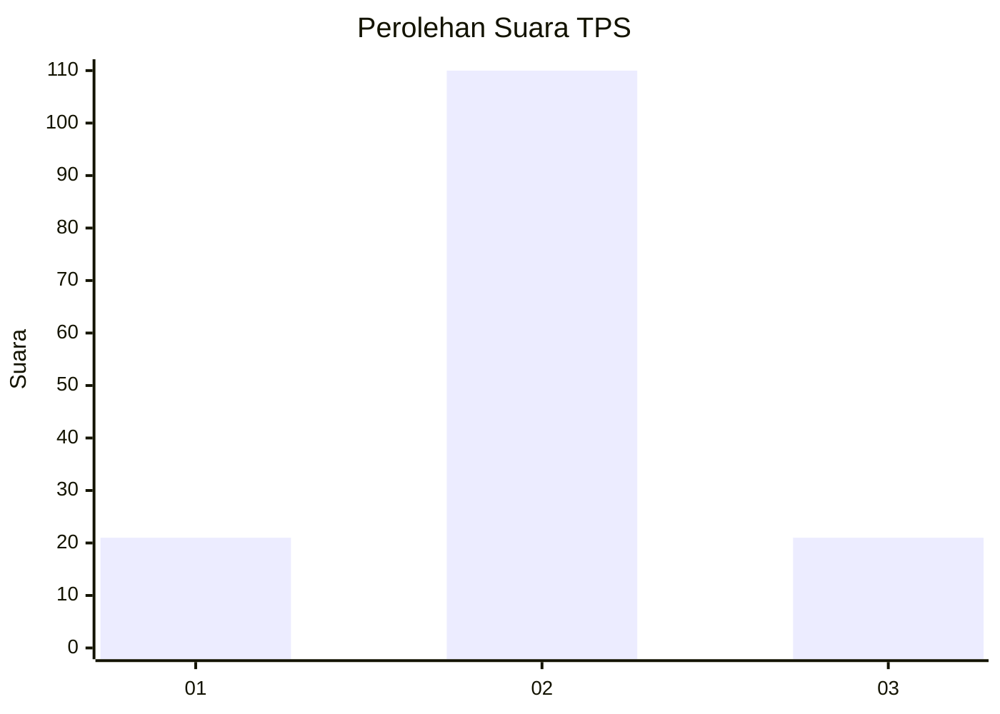
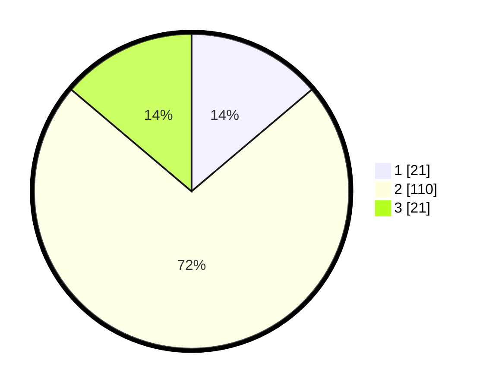

# Hasil

## Grafik

## Tabel

| No. | Nama Paslon    | Suara | Suara (raw) | Persentase |
|:--- |:-------------- | -----:| -----------:| ----------:|
| 1   | ANIES MUHAIMIN | 21    | [21][p-1]   | 13,82      |
| 2   | PRABOWO GIBRAN | 110   | [110][p-2]  | 72,37      |
| 3   | GANJAR MAHFUD  | 21    | [21][p-3]   | 13,82      |

[p-1]: https://github.com/gigit-pemilu/pemilu-2024-35-jawa-timur/blob/main/pilpres/hitung-suara/sub/35-jawa-timur/sub/01-pacitan/sub/01-donorojo/sub/2002-sawahan/sub/001-tps/sub/paslon-1.txt
[p-2]: https://github.com/gigit-pemilu/pemilu-2024-35-jawa-timur/blob/main/pilpres/hitung-suara/sub/35-jawa-timur/sub/01-pacitan/sub/01-donorojo/sub/2002-sawahan/sub/001-tps/sub/paslon-2.txt
[p-3]: https://github.com/gigit-pemilu/pemilu-2024-35-jawa-timur/blob/main/pilpres/hitung-suara/sub/35-jawa-timur/sub/01-pacitan/sub/01-donorojo/sub/2002-sawahan/sub/001-tps/sub/paslon-3.txt

## Foto C Plano

https://sirekap-obj-formc.kpu.go.id/cd0d/pemilu/ppwp/35/01/01/20/02/3501012002001-20240216-135921--2fdc800a-202c-4d25-b5f3-2c28f607d0a0.jpg

https://sirekap-obj-formc.kpu.go.id/cd0d/pemilu/ppwp/35/01/01/20/02/3501012002001-20240216-135922--223716d4-a0be-4278-ac54-001e4fed7a33.jpg

https://sirekap-obj-formc.kpu.go.id/cd0d/pemilu/ppwp/35/01/01/20/02/3501012002001-20240216-135922--1e3f2ad8-008b-49a1-8d57-e7a7acaa28f6.jpg

## Metadata

| Key        | Value               |
| ---------- | ------------------- |
| Time Stamp | 2024-02-16 21:01:00 |

## DATA PEMILIH TETAP

Jumlah pemilih dalam DPT: **214**.
 * L: **97**.
 * P: **117**.

## DATA PENGGUNA HAK PILIH

Jumlah pengguna hak pilih dalam DPT: **163**.
 * L: **71**.
 * P: **92**.

Jumlah pengguna hak pilih dalam DPTb: **0**.
 * L: **0**.
 * P: **0**.

Jumlah pengguna hak pilih dalam DPK: **0**.
 * L: **0**.
 * P: **0**.

Jumlah pengguna hak pilih: **163**.
 * L: **71**.
 * P: **92**.

## JUMLAH SUARA SAH DAN TIDAK SAH

JUMLAH SELURUH SUARA SAH: **152**.

JUMLAH SUARA TIDAK SAH: **11**.

JUMLAH SELURUH SUARA SAH DAN SUARA TIDAK SAH: **163**.

