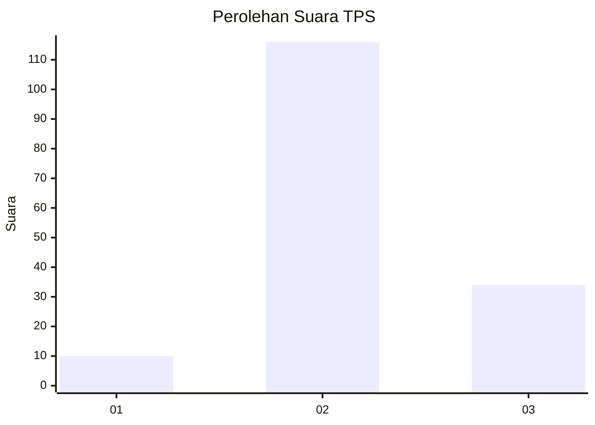

# Hasil

## Grafik

## Tabel

| No. | Nama Paslon    | Suara | Suara (raw) | Persentase |
|:--- |:-------------- | -----:| -----------:| ----------:|
| 1   | ANIES MUHAIMIN | 10    | [10][p-1]   | 6,25       |
| 2   | PRABOWO GIBRAN | 116   | [116][p-2]  | 72,50      |
| 3   | GANJAR MAHFUD  | 34    | [34][p-3]   | 21,25      |

[p-1]: https://github.com/gigit-pemilu/pemilu-2024-35-jawa-timur/blob/main/pilpres/hitung-suara/sub/35-jawa-timur/sub/01-pacitan/sub/01-donorojo/sub/2002-sawahan/sub/002-tps/sub/paslon-1.txt
[p-2]: https://github.com/gigit-pemilu/pemilu-2024-35-jawa-timur/blob/main/pilpres/hitung-suara/sub/35-jawa-timur/sub/01-pacitan/sub/01-donorojo/sub/2002-sawahan/sub/002-tps/sub/paslon-2.txt
[p-3]: https://github.com/gigit-pemilu/pemilu-2024-35-jawa-timur/blob/main/pilpres/hitung-suara/sub/35-jawa-timur/sub/01-pacitan/sub/01-donorojo/sub/2002-sawahan/sub/002-tps/sub/paslon-3.txt

## Foto C Plano

https://sirekap-obj-formc.kpu.go.id/94b3/pemilu/ppwp/35/01/01/20/02/3501012002002-20240214-194302--138a2e05-7570-45e9-a291-390b42dbaf58.jpg

https://sirekap-obj-formc.kpu.go.id/94b3/pemilu/ppwp/35/01/01/20/02/3501012002002-20240214-194359--7edfd2e6-aca5-4701-a38a-d66a6d91fab1.jpg

https://sirekap-obj-formc.kpu.go.id/94b3/pemilu/ppwp/35/01/01/20/02/3501012002002-20240214-194536--aa36d860-1d8c-4af0-98a6-065e530be550.jpg

## Metadata

| Key        | Value               |
| ---------- | ------------------- |
| Time Stamp | 2024-02-15 00:41:44 |

## DATA PEMILIH TETAP

Jumlah pemilih dalam DPT: **223**.
 * L: **106**.
 * P: **117**.

## DATA PENGGUNA HAK PILIH

Jumlah pengguna hak pilih dalam DPT: **161**.
 * L: **76**.
 * P: **85**.

Jumlah pengguna hak pilih dalam DPTb: **3**.
 * L: **1**.
 * P: **2**.

Jumlah pengguna hak pilih dalam DPK: **0**.
 * L: **0**.
 * P: **0**.

Jumlah pengguna hak pilih: **164**.
 * L: **77**.
 * P: **87**.

## JUMLAH SUARA SAH DAN TIDAK SAH

JUMLAH SELURUH SUARA SAH: **160**.

JUMLAH SUARA TIDAK SAH: **4**.

JUMLAH SELURUH SUARA SAH DAN SUARA TIDAK SAH: **164**.

