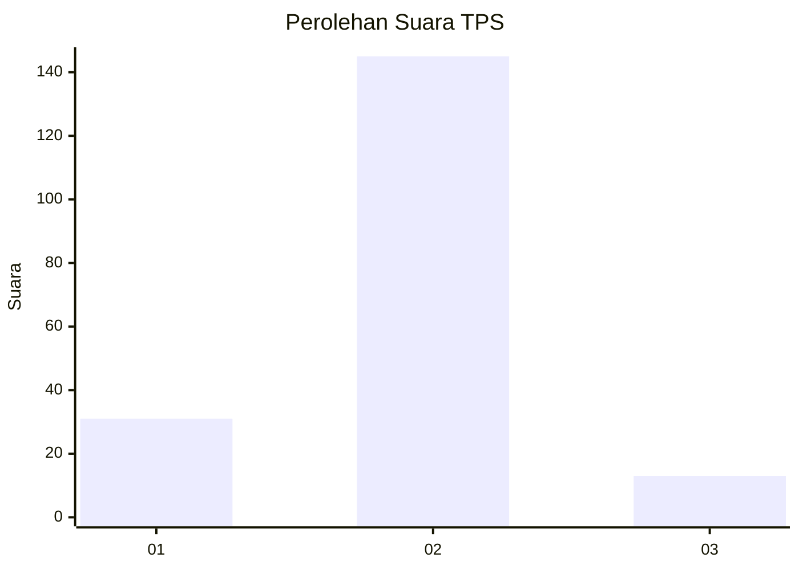
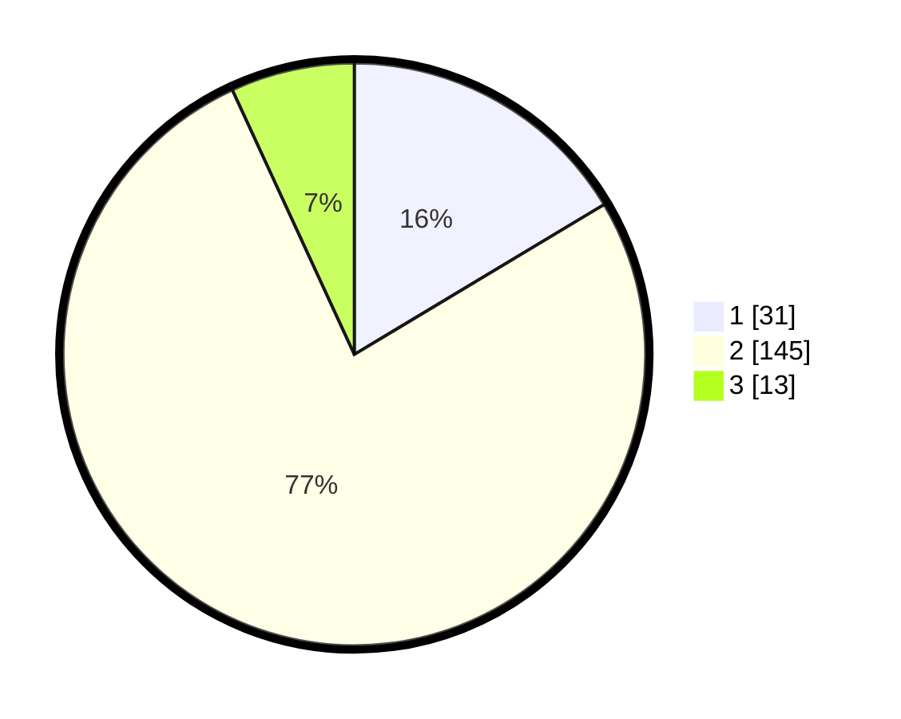

# Hasil

## Grafik

## Tabel

| No. | Nama Paslon    | Suara | Suara (raw) | Persentase |
|:--- |:-------------- | -----:| -----------:| ----------:|
| 1   | ANIES MUHAIMIN | 31    | [31][p-1]   | 16,40      |
| 2   | PRABOWO GIBRAN | 145   | [145][p-2]  | 76,72      |
| 3   | GANJAR MAHFUD  | 13    | [13][p-3]   | 6,88       |

[p-1]: https://github.com/gigit-pemilu/pemilu-2024/blob/main/pilpres/hitung-suara/sub/35-jawa-timur/sub/01-pacitan/sub/02-pringkuku/sub/2001-dersono/sub/001-tps/sub/paslon-1.txt
[p-2]: https://github.com/gigit-pemilu/pemilu-2024/blob/main/pilpres/hitung-suara/sub/35-jawa-timur/sub/01-pacitan/sub/02-pringkuku/sub/2001-dersono/sub/001-tps/sub/paslon-2.txt
[p-3]: https://github.com/gigit-pemilu/pemilu-2024/blob/main/pilpres/hitung-suara/sub/35-jawa-timur/sub/01-pacitan/sub/02-pringkuku/sub/2001-dersono/sub/001-tps/sub/paslon-3.txt

## Foto C Plano

https://sirekap-obj-formc.kpu.go.id/7bcf/pemilu/ppwp/35/01/02/20/01/3501022001001-20240216-145502--f2d522e3-bdf9-46f3-905a-bc13b8c113f0.jpg

https://sirekap-obj-formc.kpu.go.id/7bcf/pemilu/ppwp/35/01/02/20/01/3501022001001-20240216-145503--b938fe7d-f1e7-4f94-89a5-5f8c32ef0070.jpg

https://sirekap-obj-formc.kpu.go.id/7bcf/pemilu/ppwp/35/01/02/20/01/3501022001001-20240216-145502--220af3b4-127d-4441-9897-1f11da79494d.jpg

## Metadata

| Key        | Value               |
| ---------- | ------------------- |
| Time Stamp | 2024-02-16 16:25:10 |

## DATA PEMILIH TETAP

Jumlah pemilih dalam DPT: **245**.
 * L: **126**.
 * P: **119**.

## DATA PENGGUNA HAK PILIH

Jumlah pengguna hak pilih dalam DPT: **190**.
 * L: **95**.
 * P: **95**.

Jumlah pengguna hak pilih dalam DPTb: **3**.
 * L: **2**.
 * P: **1**.

Jumlah pengguna hak pilih dalam DPK: **0**.
 * L: **0**.
 * P: **0**.

Jumlah pengguna hak pilih: **193**.
 * L: **97**.
 * P: **96**.

## JUMLAH SUARA SAH DAN TIDAK SAH

JUMLAH SELURUH SUARA SAH: **189**.

JUMLAH SUARA TIDAK SAH: **4**.

JUMLAH SELURUH SUARA SAH DAN SUARA TIDAK SAH: **193**.

