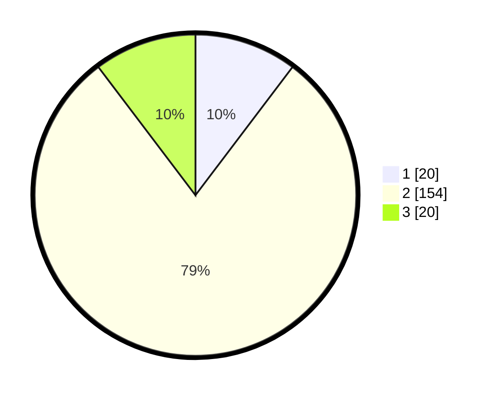

# Hasil

## Grafik

## Tabel

| No. | Nama Paslon    | Suara | Suara (raw) | Persentase |
|:--- |:-------------- | -----:| -----------:| ----------:|
| 1   | ANIES MUHAIMIN | 20    | [20][p-1]   | 10,31      |
| 2   | PRABOWO GIBRAN | 154   | [154][p-2]  | 79,38      |
| 3   | GANJAR MAHFUD  | 20    | [20][p-3]   | 10,31      |

[p-1]: https://github.com/gigit-pemilu/pemilu-2024-35-jawa-timur/blob/main/pilpres/hitung-suara/sub/35-jawa-timur/sub/01-pacitan/sub/02-pringkuku/sub/2001-dersono/sub/002-tps/sub/paslon-1.txt
[p-2]: https://github.com/gigit-pemilu/pemilu-2024-35-jawa-timur/blob/main/pilpres/hitung-suara/sub/35-jawa-timur/sub/01-pacitan/sub/02-pringkuku/sub/2001-dersono/sub/002-tps/sub/paslon-2.txt
[p-3]: https://github.com/gigit-pemilu/pemilu-2024-35-jawa-timur/blob/main/pilpres/hitung-suara/sub/35-jawa-timur/sub/01-pacitan/sub/02-pringkuku/sub/2001-dersono/sub/002-tps/sub/paslon-3.txt

## Foto C Plano

https://sirekap-obj-formc.kpu.go.id/76b5/pemilu/ppwp/35/01/02/20/01/3501022001002-20240216-144543--8a5b397a-9d64-4fec-a46c-1d4468350dcb.jpg

https://sirekap-obj-formc.kpu.go.id/76b5/pemilu/ppwp/35/01/02/20/01/3501022001002-20240216-104924--5ce103d1-8c98-436c-a257-97a3c89270f9.jpg

https://sirekap-obj-formc.kpu.go.id/76b5/pemilu/ppwp/35/01/02/20/01/3501022001002-20240216-111343--a60598e2-1ab9-41bc-8e17-b858e25bd5e0.jpg

## Metadata

| Key        | Value               |
| ---------- | ------------------- |
| Time Stamp | 2024-02-16 16:25:10 |

## DATA PEMILIH TETAP

Jumlah pemilih dalam DPT: **270**.
 * L: **138**.
 * P: **132**.

## DATA PENGGUNA HAK PILIH

Jumlah pengguna hak pilih dalam DPT: **201**.
 * L: **95**.
 * P: **106**.

Jumlah pengguna hak pilih dalam DPTb: **3**.
 * L: **1**.
 * P: **2**.

Jumlah pengguna hak pilih dalam DPK: **2**.
 * L: **0**.
 * P: **2**.

Jumlah pengguna hak pilih: **206**.
 * L: **96**.
 * P: **110**.

## JUMLAH SUARA SAH DAN TIDAK SAH

JUMLAH SELURUH SUARA SAH: **194**.

JUMLAH SUARA TIDAK SAH: **12**.

JUMLAH SELURUH SUARA SAH DAN SUARA TIDAK SAH: **206**.

