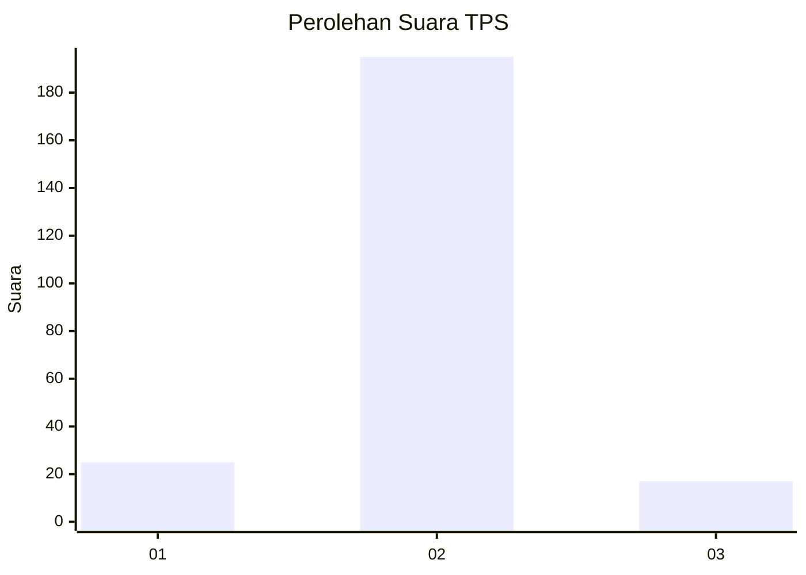
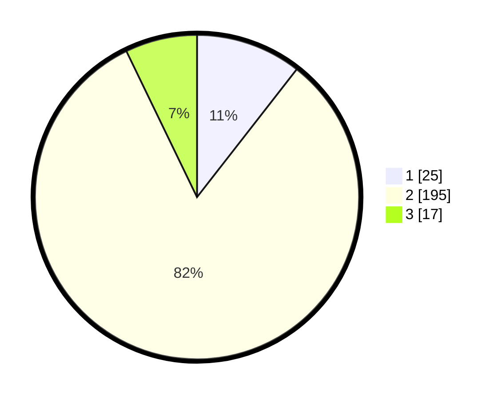

# Hasil

## Grafik

## Tabel

| No. | Nama Paslon    | Suara | Suara (raw) | Persentase |
|:--- |:-------------- | -----:| -----------:| ----------:|
| 1   | ANIES MUHAIMIN | 25    | [25][p-1]   | 10,55      |
| 2   | PRABOWO GIBRAN | 195   | [195][p-2]  | 82,28      |
| 3   | GANJAR MAHFUD  | 17    | [17][p-3]   | 7,17       |

[p-1]: https://github.com/gigit-pemilu/pemilu-2024/blob/main/pilpres/hitung-suara/sub/35-jawa-timur/sub/01-pacitan/sub/02-pringkuku/sub/2001-dersono/sub/006-tps/sub/paslon-1.txt
[p-2]: https://github.com/gigit-pemilu/pemilu-2024/blob/main/pilpres/hitung-suara/sub/35-jawa-timur/sub/01-pacitan/sub/02-pringkuku/sub/2001-dersono/sub/006-tps/sub/paslon-2.txt
[p-3]: https://github.com/gigit-pemilu/pemilu-2024/blob/main/pilpres/hitung-suara/sub/35-jawa-timur/sub/01-pacitan/sub/02-pringkuku/sub/2001-dersono/sub/006-tps/sub/paslon-3.txt

## Foto C Plano

https://sirekap-obj-formc.kpu.go.id/995d/pemilu/ppwp/35/01/02/20/01/3501022001006-20240216-145813--67eee479-5d54-46e1-a644-81e960816bda.jpg

https://sirekap-obj-formc.kpu.go.id/995d/pemilu/ppwp/35/01/02/20/01/3501022001006-20240216-145814--b2a187e4-3ea3-474f-ae25-0a5edcb7b4fa.jpg

https://sirekap-obj-formc.kpu.go.id/995d/pemilu/ppwp/35/01/02/20/01/3501022001006-20240216-145814--fc764579-e8bb-4cd6-9afa-146db39618fd.jpg

## Metadata

| Key        | Value               |
| ---------- | ------------------- |
| Time Stamp | 2024-02-16 16:25:10 |

## DATA PEMILIH TETAP

Jumlah pemilih dalam DPT: **268**.
 * L: **135**.
 * P: **133**.

## DATA PENGGUNA HAK PILIH

Jumlah pengguna hak pilih dalam DPT: **238**.
 * L: **120**.
 * P: **118**.

Jumlah pengguna hak pilih dalam DPTb: **0**.
 * L: **0**.
 * P: **0**.

Jumlah pengguna hak pilih dalam DPK: **0**.
 * L: **0**.
 * P: **0**.

Jumlah pengguna hak pilih: **238**.
 * L: **120**.
 * P: **118**.

## JUMLAH SUARA SAH DAN TIDAK SAH

JUMLAH SELURUH SUARA SAH: **237**.

JUMLAH SUARA TIDAK SAH: **1**.

JUMLAH SELURUH SUARA SAH DAN SUARA TIDAK SAH: **238**.

