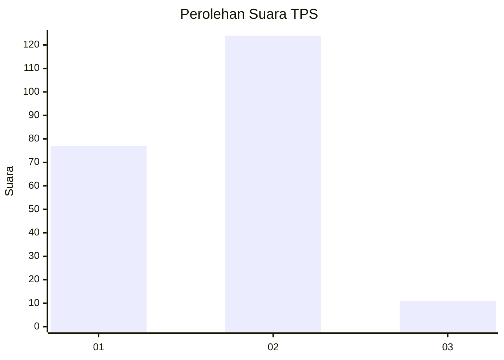
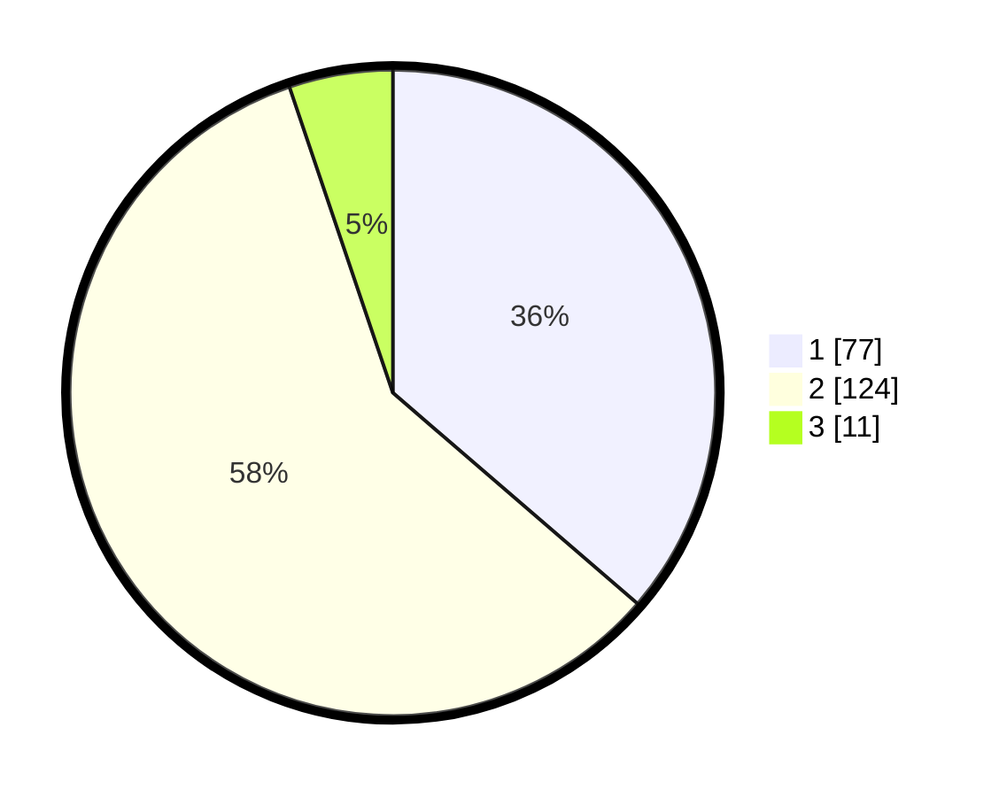

# Hasil

## Grafik

## Tabel

| No. | Nama Paslon    | Suara | Suara (raw) | Persentase |
|:--- |:-------------- | -----:| -----------:| ----------:|
| 1   | ANIES MUHAIMIN | 77    | [77][p-1]   | 36,32      |
| 2   | PRABOWO GIBRAN | 124   | [124][p-2]  | 58,49      |
| 3   | GANJAR MAHFUD  | 11    | [11][p-3]   | 5,19       |

[p-1]: https://github.com/gigit-pemilu/pemilu-2024/blob/main/pilpres/hitung-suara/sub/35-jawa-timur/sub/01-pacitan/sub/04-pacitan/sub/1001-sidoharjo/sub/002-tps/sub/paslon-1.txt
[p-2]: https://github.com/gigit-pemilu/pemilu-2024/blob/main/pilpres/hitung-suara/sub/35-jawa-timur/sub/01-pacitan/sub/04-pacitan/sub/1001-sidoharjo/sub/002-tps/sub/paslon-2.txt
[p-3]: https://github.com/gigit-pemilu/pemilu-2024/blob/main/pilpres/hitung-suara/sub/35-jawa-timur/sub/01-pacitan/sub/04-pacitan/sub/1001-sidoharjo/sub/002-tps/sub/paslon-3.txt

## Foto C Plano

https://sirekap-obj-formc.kpu.go.id/bbe1/pemilu/ppwp/35/01/04/10/01/3501041001002-20240214-210243--f45331ce-47f9-47ee-a76d-11bf91548db8.jpg

https://sirekap-obj-formc.kpu.go.id/bbe1/pemilu/ppwp/35/01/04/10/01/3501041001002-20240216-152312--f1e68a7e-6f61-4a88-b15e-b992041be994.jpg

https://sirekap-obj-formc.kpu.go.id/bbe1/pemilu/ppwp/35/01/04/10/01/3501041001002-20240216-152311--f9b44360-62a8-4127-a8cf-6ee43a55666c.jpg

## Metadata

| Key        | Value               |
| ---------- | ------------------- |
| Time Stamp | 2024-02-16 17:00:00 |

## DATA PEMILIH TETAP

Jumlah pemilih dalam DPT: **270**.
 * L: **229**.
 * P: **495**.

## DATA PENGGUNA HAK PILIH

Jumlah pengguna hak pilih dalam DPT: **214**.
 * L: **93**.
 * P: **121**.

Jumlah pengguna hak pilih dalam DPTb: **2**.
 * L: **1**.
 * P: **1**.

Jumlah pengguna hak pilih dalam DPK: **1**.
 * L: **1**.
 * P: **0**.

Jumlah pengguna hak pilih: **217**.
 * L: **95**.
 * P: **122**.

## JUMLAH SUARA SAH DAN TIDAK SAH

JUMLAH SELURUH SUARA SAH: **212**.

JUMLAH SUARA TIDAK SAH: **5**.

JUMLAH SELURUH SUARA SAH DAN SUARA TIDAK SAH: **217**.

