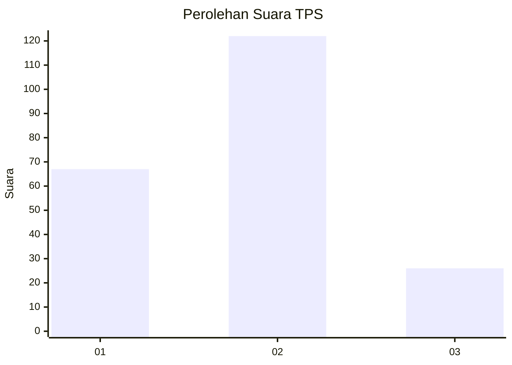
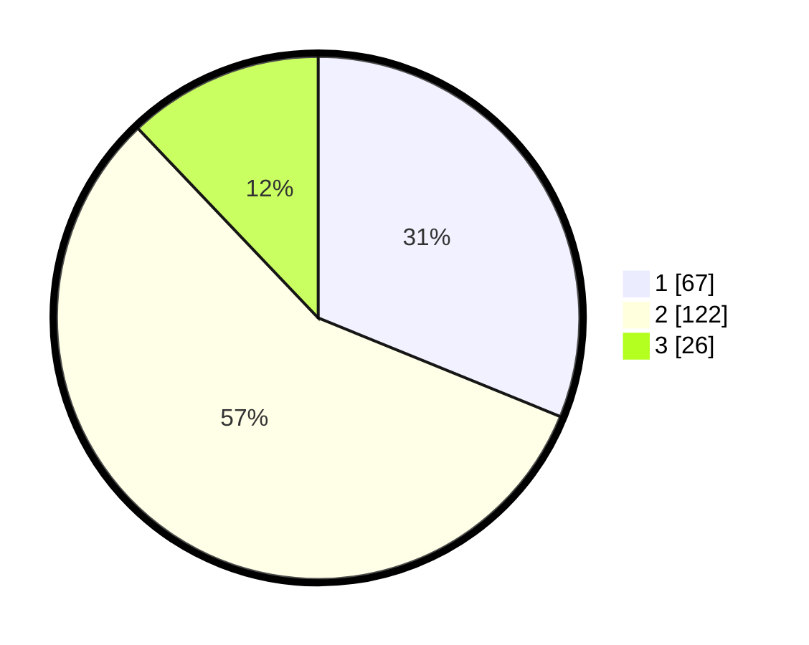

# Hasil

## Grafik

## Tabel

| No. | Nama Paslon    | Suara | Suara (raw) | Persentase |
|:--- |:-------------- | -----:| -----------:| ----------:|
| 1   | ANIES MUHAIMIN | 67    | [67][p-1]   | 31,16      |
| 2   | PRABOWO GIBRAN | 122   | [122][p-2]  | 56,74      |
| 3   | GANJAR MAHFUD  | 26    | [26][p-3]   | 12,09      |

[p-1]: https://github.com/gigit-pemilu/pemilu-2024/blob/main/pilpres/hitung-suara/sub/35-jawa-timur/sub/01-pacitan/sub/04-pacitan/sub/1001-sidoharjo/sub/004-tps/sub/paslon-1.txt
[p-2]: https://github.com/gigit-pemilu/pemilu-2024/blob/main/pilpres/hitung-suara/sub/35-jawa-timur/sub/01-pacitan/sub/04-pacitan/sub/1001-sidoharjo/sub/004-tps/sub/paslon-2.txt
[p-3]: https://github.com/gigit-pemilu/pemilu-2024/blob/main/pilpres/hitung-suara/sub/35-jawa-timur/sub/01-pacitan/sub/04-pacitan/sub/1001-sidoharjo/sub/004-tps/sub/paslon-3.txt

## Foto C Plano

https://sirekap-obj-formc.kpu.go.id/3e8a/pemilu/ppwp/35/01/04/10/01/3501041001004-20240214-215254--8d3e1b7a-9a54-41e4-a34a-7869d39f7e9b.jpg

https://sirekap-obj-formc.kpu.go.id/3e8a/pemilu/ppwp/35/01/04/10/01/3501041001004-20240216-205138--a134beec-c912-48b9-a5ae-5e7db6022ac5.jpg

https://sirekap-obj-formc.kpu.go.id/3e8a/pemilu/ppwp/35/01/04/10/01/3501041001004-20240216-205900--8d12caf9-bbda-4b68-8377-c504613ed155.jpg

## Metadata

| Key        | Value               |
| ---------- | ------------------- |
| Time Stamp | 2024-02-16 21:01:00 |

## DATA PEMILIH TETAP

Jumlah pemilih dalam DPT: **272**.
 * L: **125**.
 * P: **147**.

## DATA PENGGUNA HAK PILIH

Jumlah pengguna hak pilih dalam DPT: **219**.
 * L: **99**.
 * P: **120**.

Jumlah pengguna hak pilih dalam DPTb: **0**.
 * L: **0**.
 * P: **0**.

Jumlah pengguna hak pilih dalam DPK: **0**.
 * L: **0**.
 * P: **0**.

Jumlah pengguna hak pilih: **219**.
 * L: **99**.
 * P: **120**.

## JUMLAH SUARA SAH DAN TIDAK SAH

JUMLAH SELURUH SUARA SAH: **215**.

JUMLAH SUARA TIDAK SAH: **4**.

JUMLAH SELURUH SUARA SAH DAN SUARA TIDAK SAH: **219**.

