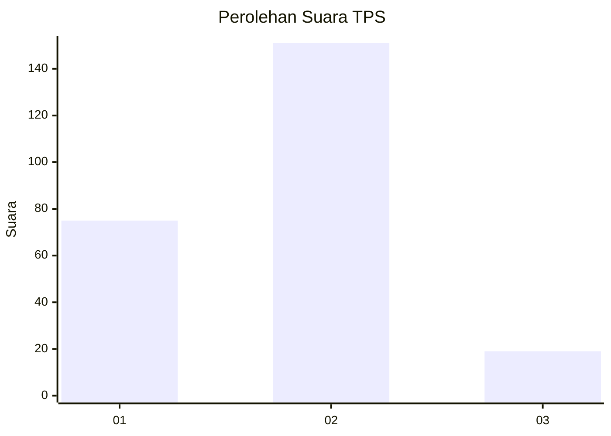
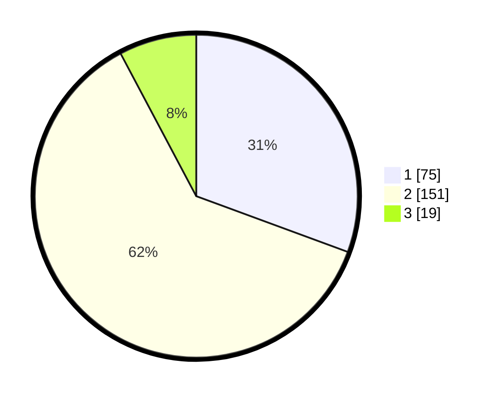

# Hasil

## Grafik

## Tabel

| No. | Nama Paslon    | Suara | Suara (raw) | Persentase |
|:--- |:-------------- | -----:| -----------:| ----------:|
| 1   | ANIES MUHAIMIN | 75    | [75][p-1]   | 30,61      |
| 2   | PRABOWO GIBRAN | 151   | [151][p-2]  | 61,63      |
| 3   | GANJAR MAHFUD  | 19    | [19][p-3]   | 7,76       |

[p-1]: https://github.com/gigit-pemilu/pemilu-2024/blob/main/pilpres/hitung-suara/sub/35-jawa-timur/sub/01-pacitan/sub/04-pacitan/sub/1001-sidoharjo/sub/021-tps/sub/paslon-1.txt
[p-2]: https://github.com/gigit-pemilu/pemilu-2024/blob/main/pilpres/hitung-suara/sub/35-jawa-timur/sub/01-pacitan/sub/04-pacitan/sub/1001-sidoharjo/sub/021-tps/sub/paslon-2.txt
[p-3]: https://github.com/gigit-pemilu/pemilu-2024/blob/main/pilpres/hitung-suara/sub/35-jawa-timur/sub/01-pacitan/sub/04-pacitan/sub/1001-sidoharjo/sub/021-tps/sub/paslon-3.txt

## Foto C Plano

https://sirekap-obj-formc.kpu.go.id/efed/pemilu/ppwp/35/01/04/10/01/3501041001021-20240215-014731--6d2b4ba3-10ac-4d88-9048-eb4ea2f5f6d7.jpg

https://sirekap-obj-formc.kpu.go.id/efed/pemilu/ppwp/35/01/04/10/01/3501041001021-20240214-232526--a58f5203-5946-40d6-a14d-2f6bc4db4b7c.jpg

https://sirekap-obj-formc.kpu.go.id/efed/pemilu/ppwp/35/01/04/10/01/3501041001021-20240215-014909--ad3f03f9-62a3-49da-8b95-415fd747d0af.jpg

## Metadata

| Key        | Value               |
| ---------- | ------------------- |
| Time Stamp | 2024-02-16 16:25:10 |

