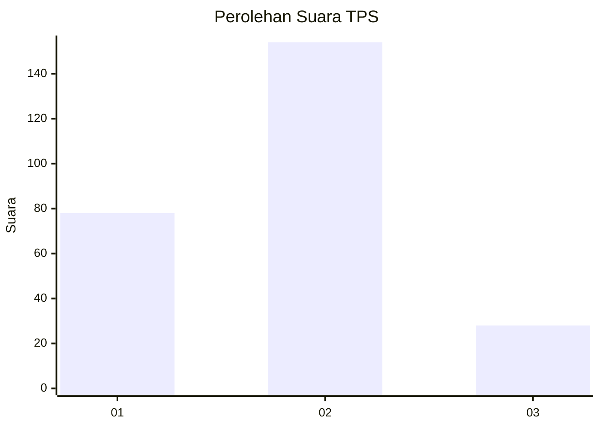
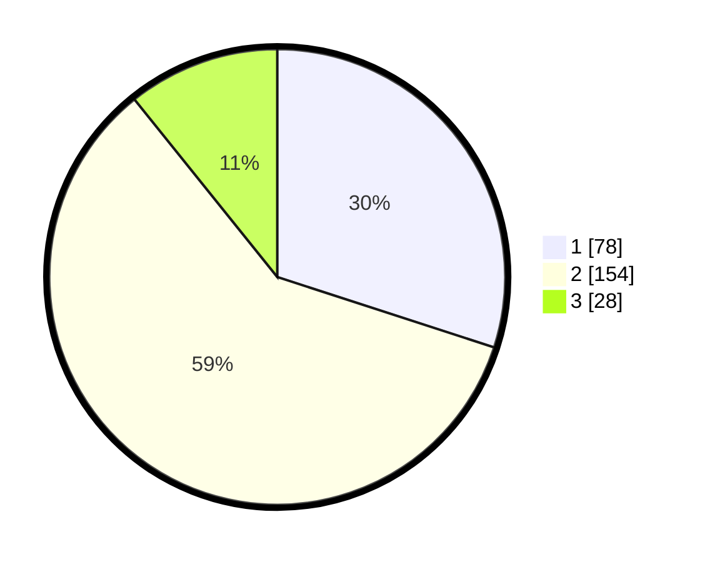

# Hasil

## Grafik

## Tabel

| No. | Nama Paslon    | Suara | Suara (raw) | Persentase |
|:--- |:-------------- | -----:| -----------:| ----------:|
| 1   | ANIES MUHAIMIN | 78    | [78][p-1]   | 30,00      |
| 2   | PRABOWO GIBRAN | 154   | [154][p-2]  | 59,23      |
| 3   | GANJAR MAHFUD  | 28    | [28][p-3]   | 10,77      |

[p-1]: https://github.com/gigit-pemilu/pemilu-2024/blob/main/pilpres/hitung-suara/sub/35-jawa-timur/sub/01-pacitan/sub/04-pacitan/sub/1002-ploso/sub/008-tps/sub/paslon-1.txt
[p-2]: https://github.com/gigit-pemilu/pemilu-2024/blob/main/pilpres/hitung-suara/sub/35-jawa-timur/sub/01-pacitan/sub/04-pacitan/sub/1002-ploso/sub/008-tps/sub/paslon-2.txt
[p-3]: https://github.com/gigit-pemilu/pemilu-2024/blob/main/pilpres/hitung-suara/sub/35-jawa-timur/sub/01-pacitan/sub/04-pacitan/sub/1002-ploso/sub/008-tps/sub/paslon-3.txt

## Foto C Plano

https://sirekap-obj-formc.kpu.go.id/c43b/pemilu/ppwp/35/01/04/10/02/3501041002008-20240214-225026--17ae0bd5-a9e6-4c27-b38e-5fb3da884ba3.jpg

https://sirekap-obj-formc.kpu.go.id/c43b/pemilu/ppwp/35/01/04/10/02/3501041002008-20240214-225429--2d94e908-6458-4ca7-80d9-23c9dfacd785.jpg

## Metadata

| Key        | Value               |
| ---------- | ------------------- |
| Time Stamp | 2024-02-16 16:25:10 |

