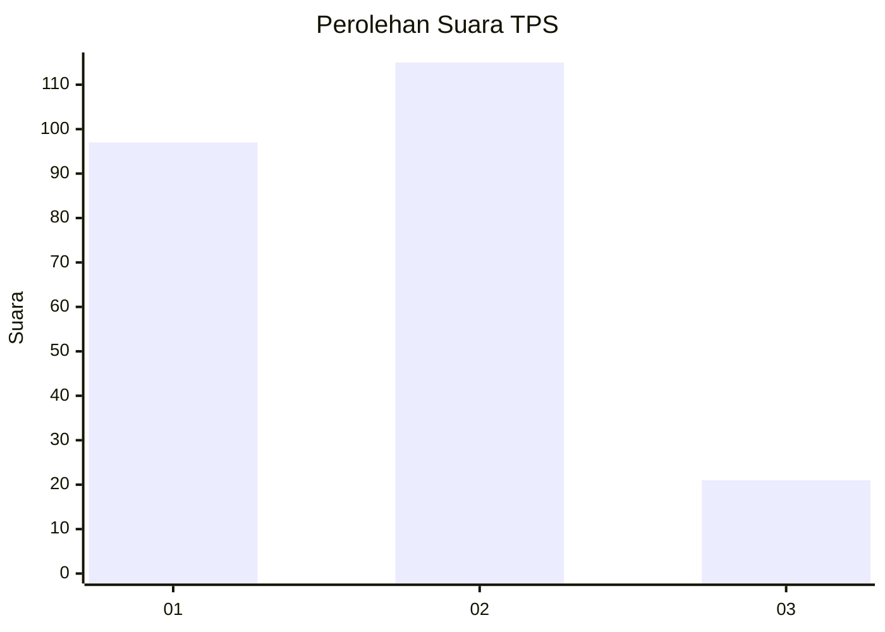
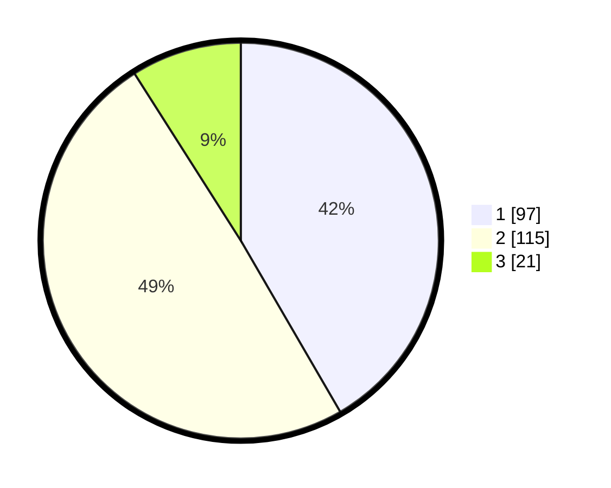

# Hasil

## Grafik

## Tabel

| No. | Nama Paslon    | Suara | Suara (raw) | Persentase |
|:--- |:-------------- | -----:| -----------:| ----------:|
| 1   | ANIES MUHAIMIN | 97    | [97][p-1]   | 41,63      |
| 2   | PRABOWO GIBRAN | 115   | [115][p-2]  | 49,36      |
| 3   | GANJAR MAHFUD  | 21    | [21][p-3]   | 9,01       |

[p-1]: https://github.com/gigit-pemilu/pemilu-2024/blob/main/pilpres/hitung-suara/sub/35-jawa-timur/sub/01-pacitan/sub/04-pacitan/sub/1008-baleharjo/sub/002-tps/sub/paslon-1.txt
[p-2]: https://github.com/gigit-pemilu/pemilu-2024/blob/main/pilpres/hitung-suara/sub/35-jawa-timur/sub/01-pacitan/sub/04-pacitan/sub/1008-baleharjo/sub/002-tps/sub/paslon-2.txt
[p-3]: https://github.com/gigit-pemilu/pemilu-2024/blob/main/pilpres/hitung-suara/sub/35-jawa-timur/sub/01-pacitan/sub/04-pacitan/sub/1008-baleharjo/sub/002-tps/sub/paslon-3.txt

## Foto C Plano

https://sirekap-obj-formc.kpu.go.id/a0b9/pemilu/ppwp/35/01/04/10/08/3501041008002-20240217-134514--4f2a84f9-eac6-4c74-9427-f3433a204b3a.jpg

https://sirekap-obj-formc.kpu.go.id/a0b9/pemilu/ppwp/35/01/04/10/08/3501041008002-20240217-134625--6bc3ba57-6ab3-4f7d-abc5-c57f990b933b.jpg

https://sirekap-obj-formc.kpu.go.id/a0b9/pemilu/ppwp/35/01/04/10/08/3501041008002-20240217-134933--8abe40ab-2f08-4ecd-8d36-dfdf978ce74f.jpg

## Metadata

| Key        | Value               |
| ---------- | ------------------- |
| Time Stamp | 2024-02-17 14:45:18 |

## DATA PEMILIH TETAP

Jumlah pemilih dalam DPT: **265**.
 * L: **140**.
 * P: **125**.

## DATA PENGGUNA HAK PILIH

Jumlah pengguna hak pilih dalam DPT: **218**.
 * L: **116**.
 * P: **102**.

Jumlah pengguna hak pilih dalam DPTb: **21**.
 * L: **17**.
 * P: **4**.

Jumlah pengguna hak pilih dalam DPK: **0**.
 * L: **0**.
 * P: **0**.

Jumlah pengguna hak pilih: **239**.
 * L: **133**.
 * P: **106**.

## JUMLAH SUARA SAH DAN TIDAK SAH

JUMLAH SELURUH SUARA SAH: **233**.

JUMLAH SUARA TIDAK SAH: **6**.

JUMLAH SELURUH SUARA SAH DAN SUARA TIDAK SAH: **239**.

