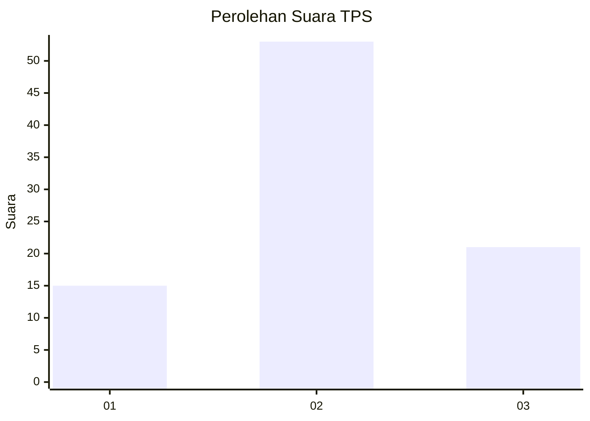
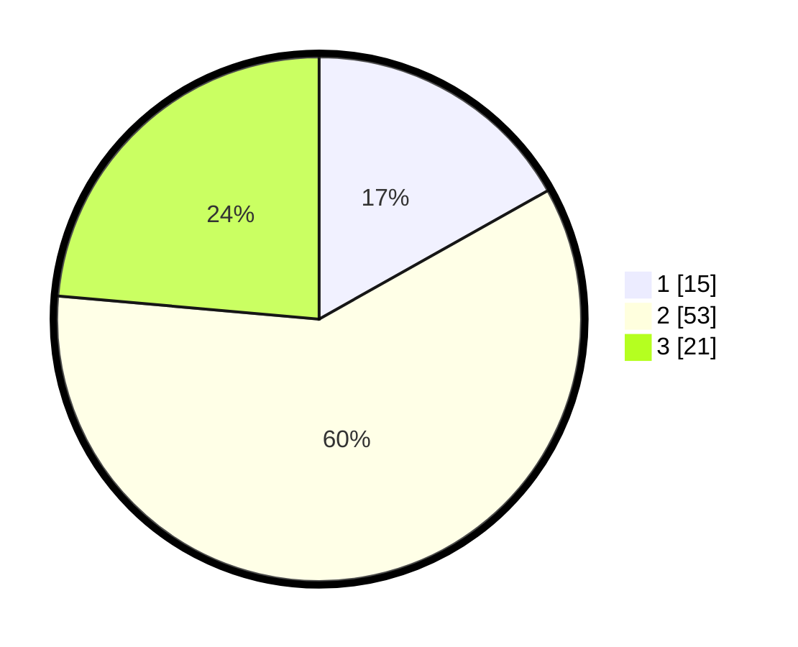

# Hasil

## Grafik

## Tabel

| No. | Nama Paslon    | Suara | Suara (raw) | Persentase |
|:--- |:-------------- | -----:| -----------:| ----------:|
| 1   | ANIES MUHAIMIN | 15    | [15][p-1]   | 16,85      |
| 2   | PRABOWO GIBRAN | 53    | [53][p-2]   | 59,55      |
| 3   | GANJAR MAHFUD  | 21    | [21][p-3]   | 23,60      |

[p-1]: https://github.com/gigit-pemilu/pemilu-2024/blob/main/pilpres/hitung-suara/sub/35-jawa-timur/sub/01-pacitan/sub/04-pacitan/sub/1008-baleharjo/sub/901-tps/sub/paslon-1.txt
[p-2]: https://github.com/gigit-pemilu/pemilu-2024/blob/main/pilpres/hitung-suara/sub/35-jawa-timur/sub/01-pacitan/sub/04-pacitan/sub/1008-baleharjo/sub/901-tps/sub/paslon-2.txt
[p-3]: https://github.com/gigit-pemilu/pemilu-2024/blob/main/pilpres/hitung-suara/sub/35-jawa-timur/sub/01-pacitan/sub/04-pacitan/sub/1008-baleharjo/sub/901-tps/sub/paslon-3.txt

## Foto C Plano

https://sirekap-obj-formc.kpu.go.id/6d83/pemilu/ppwp/35/01/04/10/08/3501041008901-20240216-073807--32bc0eb2-5e9c-4444-88ee-6637a3a7af14.jpg

https://sirekap-obj-formc.kpu.go.id/6d83/pemilu/ppwp/35/01/04/10/08/3501041008901-20240216-125343--542f9143-ca52-433d-80b0-ce12e7b69db0.jpg

https://sirekap-obj-formc.kpu.go.id/6d83/pemilu/ppwp/35/01/04/10/08/3501041008901-20240216-075655--a10123ed-c2cd-4360-b7dd-bf094a76861d.jpg

## Metadata

| Key        | Value               |
| ---------- | ------------------- |
| Time Stamp | 2024-02-16 21:01:00 |

## DATA PEMILIH TETAP

Jumlah pemilih dalam DPT: **89**.
 * L: **84**.
 * P: **5**.

## DATA PENGGUNA HAK PILIH

Jumlah pengguna hak pilih dalam DPT: **65**.
 * L: **60**.
 * P: **5**.

Jumlah pengguna hak pilih dalam DPTb: **24**.
 * L: **21**.
 * P: **3**.

Jumlah pengguna hak pilih dalam DPK: **0**.
 * L: **0**.
 * P: **0**.

Jumlah pengguna hak pilih: **89**.
 * L: **81**.
 * P: **8**.

## JUMLAH SUARA SAH DAN TIDAK SAH

JUMLAH SELURUH SUARA SAH: **89**.

JUMLAH SUARA TIDAK SAH: **0**.

JUMLAH SELURUH SUARA SAH DAN SUARA TIDAK SAH: **89**.

