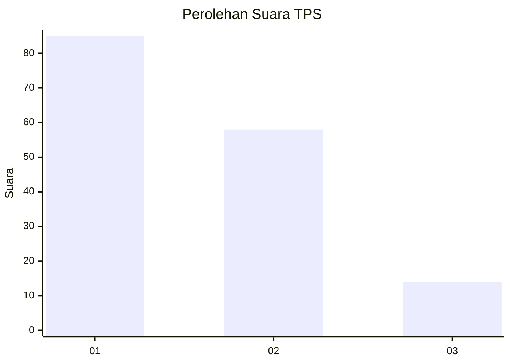
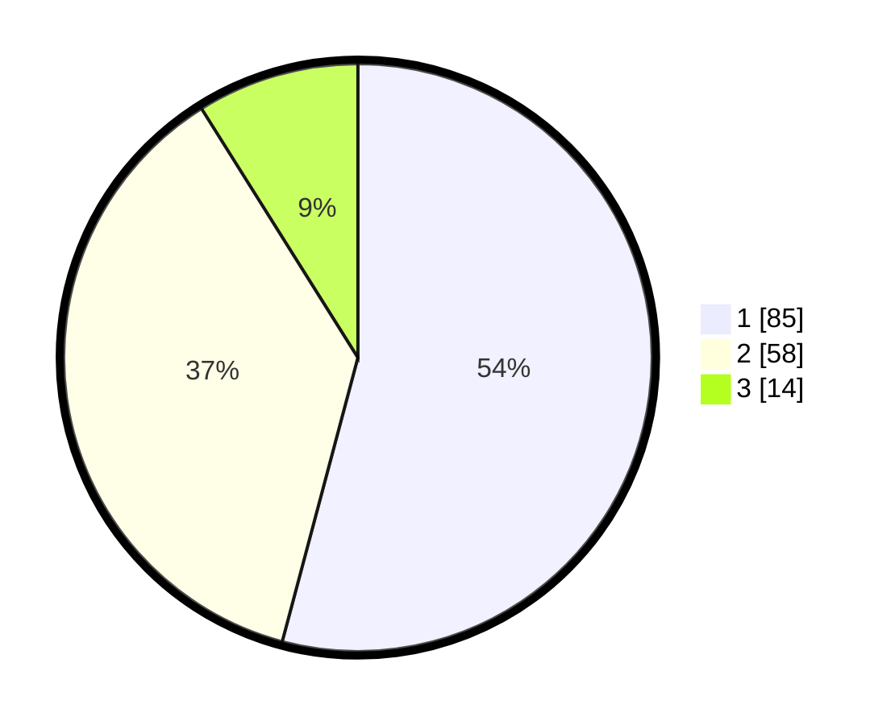

# Hasil

## Grafik

## Tabel

| No. | Nama Paslon    | Suara | Suara (raw) | Persentase |
|:--- |:-------------- | -----:| -----------:| ----------:|
| 1   | ANIES MUHAIMIN | 85    | [85][p-1]   | 54,14      |
| 2   | PRABOWO GIBRAN | 58    | [58][p-2]   | 36,94      |
| 3   | GANJAR MAHFUD  | 14    | [14][p-3]   | 8,92       |

[p-1]: https://github.com/gigit-pemilu/pemilu-2024/blob/main/pilpres/hitung-suara/sub/35-jawa-timur/sub/01-pacitan/sub/04-pacitan/sub/1013-pacitan/sub/001-tps/sub/paslon-1.txt
[p-2]: https://github.com/gigit-pemilu/pemilu-2024/blob/main/pilpres/hitung-suara/sub/35-jawa-timur/sub/01-pacitan/sub/04-pacitan/sub/1013-pacitan/sub/001-tps/sub/paslon-2.txt
[p-3]: https://github.com/gigit-pemilu/pemilu-2024/blob/main/pilpres/hitung-suara/sub/35-jawa-timur/sub/01-pacitan/sub/04-pacitan/sub/1013-pacitan/sub/001-tps/sub/paslon-3.txt

## Foto C Plano

https://sirekap-obj-formc.kpu.go.id/a37d/pemilu/ppwp/35/01/04/10/13/3501041013001-20240214-201411--2a363a79-66db-41a9-8f0b-a2364fe12ff1.jpg

https://sirekap-obj-formc.kpu.go.id/a37d/pemilu/ppwp/35/01/04/10/13/3501041013001-20240216-051637--310ac626-1084-4ddd-a3ec-2ed0fb8ffabc.jpg

https://sirekap-obj-formc.kpu.go.id/a37d/pemilu/ppwp/35/01/04/10/13/3501041013001-20240214-201740--afb141c6-07f7-4c08-b7ff-36896fe3285e.jpg

## Metadata

| Key        | Value               |
| ---------- | ------------------- |
| Time Stamp | 2024-02-16 05:30:26 |

## DATA PEMILIH TETAP

Jumlah pemilih dalam DPT: **200**.
 * L: **87**.
 * P: **113**.

## DATA PENGGUNA HAK PILIH

Jumlah pengguna hak pilih dalam DPT: **149**.
 * L: **59**.
 * P: **90**.

Jumlah pengguna hak pilih dalam DPTb: **9**.
 * L: **2**.
 * P: **7**.

Jumlah pengguna hak pilih dalam DPK: **2**.
 * L: **2**.
 * P: **0**.

Jumlah pengguna hak pilih: **160**.
 * L: **63**.
 * P: **97**.

## JUMLAH SUARA SAH DAN TIDAK SAH

JUMLAH SELURUH SUARA SAH: **157**.

JUMLAH SUARA TIDAK SAH: **3**.

JUMLAH SELURUH SUARA SAH DAN SUARA TIDAK SAH: **160**.

