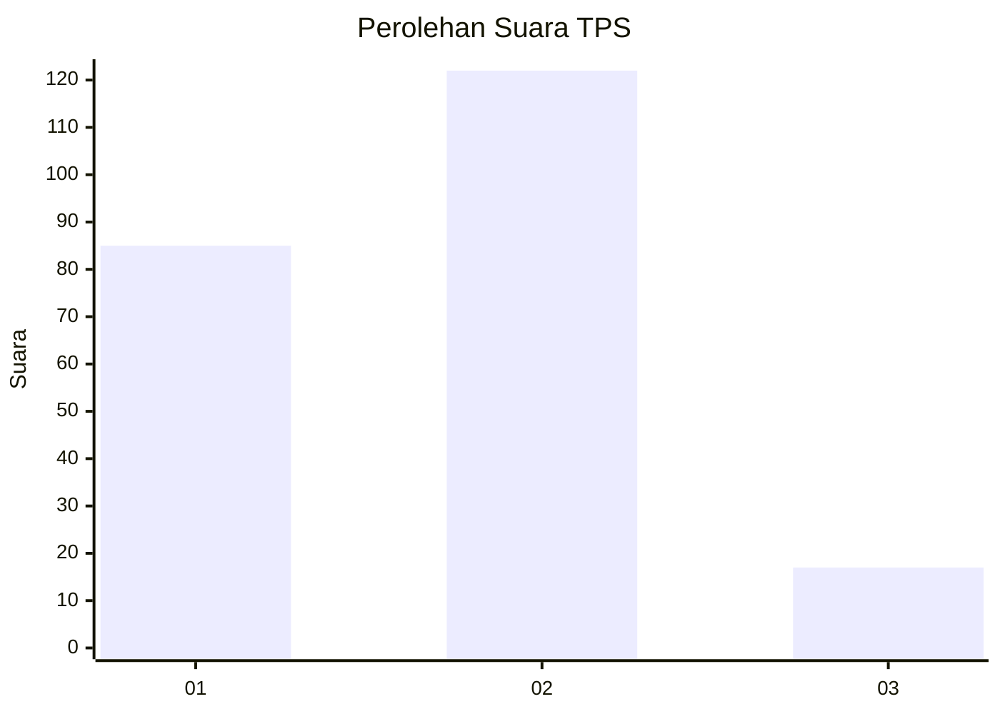
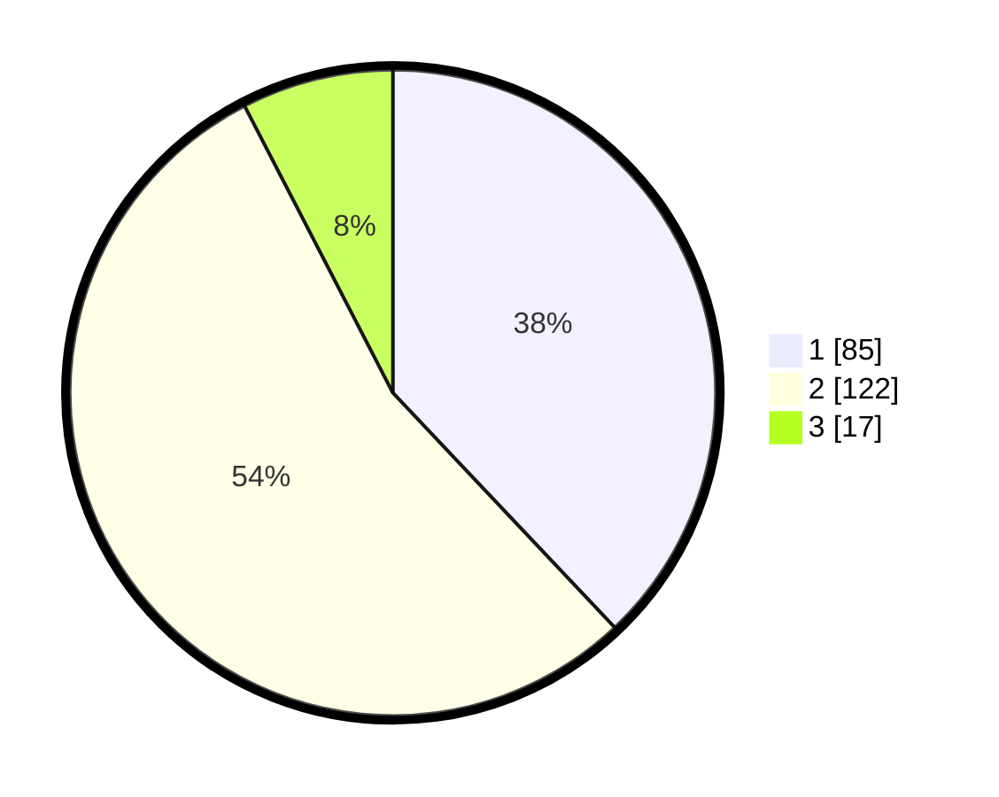

# Hasil

## Grafik

## Tabel

| No. | Nama Paslon    | Suara | Suara (raw) | Persentase |
|:--- |:-------------- | -----:| -----------:| ----------:|
| 1   | ANIES MUHAIMIN | 85    | [85][p-1]   | 37,95      |
| 2   | PRABOWO GIBRAN | 122   | [122][p-2]  | 54,46      |
| 3   | GANJAR MAHFUD  | 17    | [17][p-3]   | 7,59       |

[p-1]: https://github.com/gigit-pemilu/pemilu-2024/blob/main/pilpres/hitung-suara/sub/35-jawa-timur/sub/01-pacitan/sub/04-pacitan/sub/2005-kayen/sub/006-tps/sub/paslon-1.txt
[p-2]: https://github.com/gigit-pemilu/pemilu-2024/blob/main/pilpres/hitung-suara/sub/35-jawa-timur/sub/01-pacitan/sub/04-pacitan/sub/2005-kayen/sub/006-tps/sub/paslon-2.txt
[p-3]: https://github.com/gigit-pemilu/pemilu-2024/blob/main/pilpres/hitung-suara/sub/35-jawa-timur/sub/01-pacitan/sub/04-pacitan/sub/2005-kayen/sub/006-tps/sub/paslon-3.txt

## Foto C Plano

https://sirekap-obj-formc.kpu.go.id/d93e/pemilu/ppwp/35/01/04/20/05/3501042005006-20240214-220652--f19a1171-970e-470b-8dd0-48e39ffb26ae.jpg

https://sirekap-obj-formc.kpu.go.id/d93e/pemilu/ppwp/35/01/04/20/05/3501042005006-20240216-070029--a177f8f9-f595-4dba-8bbc-60cdfcec531e.jpg

## Metadata

| Key        | Value               |
| ---------- | ------------------- |
| Time Stamp | 2024-02-16 12:51:22 |

