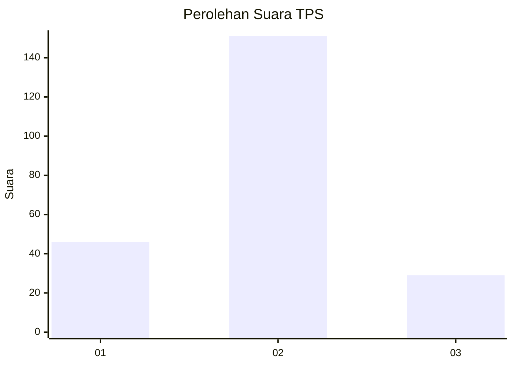
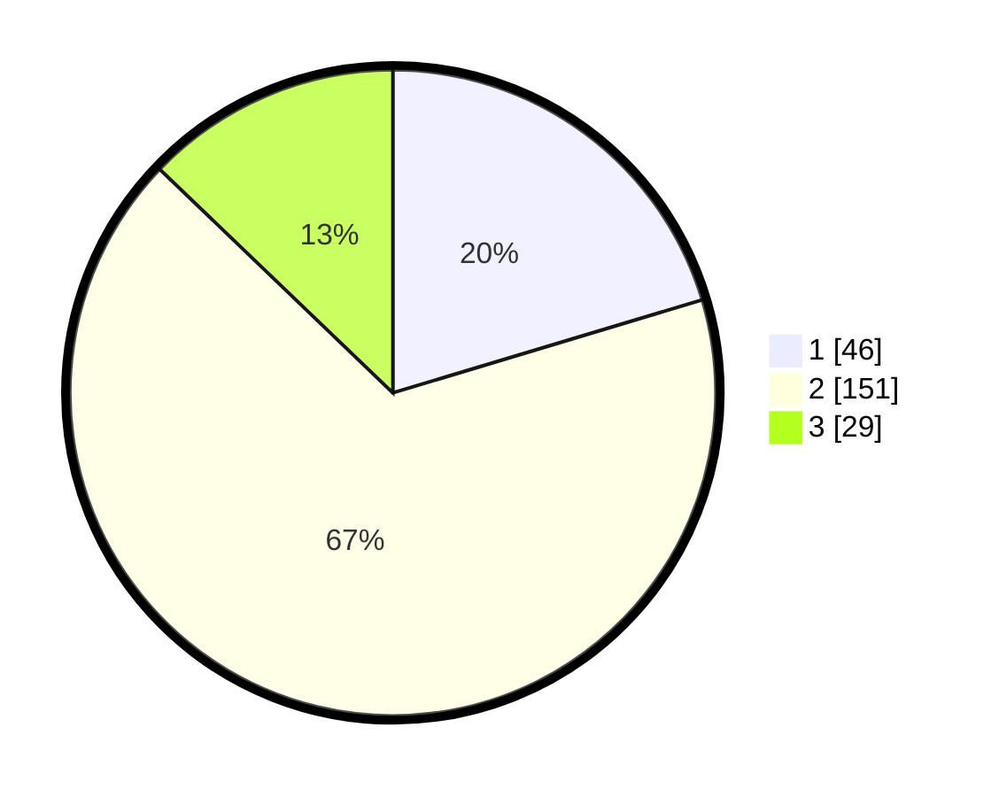

# Hasil

## Grafik

## Tabel

| No. | Nama Paslon    | Suara | Suara (raw) | Persentase |
|:--- |:-------------- | -----:| -----------:| ----------:|
| 1   | ANIES MUHAIMIN | 46    | [46][p-1]   | 20,35      |
| 2   | PRABOWO GIBRAN | 151   | [151][p-2]  | 66,81      |
| 3   | GANJAR MAHFUD  | 29    | [29][p-3]   | 12,83      |

[p-1]: https://github.com/gigit-pemilu/pemilu-2024/blob/main/pilpres/hitung-suara/sub/35-jawa-timur/sub/01-pacitan/sub/04-pacitan/sub/2005-kayen/sub/007-tps/sub/paslon-1.txt
[p-2]: https://github.com/gigit-pemilu/pemilu-2024/blob/main/pilpres/hitung-suara/sub/35-jawa-timur/sub/01-pacitan/sub/04-pacitan/sub/2005-kayen/sub/007-tps/sub/paslon-2.txt
[p-3]: https://github.com/gigit-pemilu/pemilu-2024/blob/main/pilpres/hitung-suara/sub/35-jawa-timur/sub/01-pacitan/sub/04-pacitan/sub/2005-kayen/sub/007-tps/sub/paslon-3.txt

## Foto C Plano

https://sirekap-obj-formc.kpu.go.id/df12/pemilu/ppwp/35/01/04/20/05/3501042005007-20240216-221412--f228462f-98ea-4b70-9ab6-26ac8262ba21.jpg

https://sirekap-obj-formc.kpu.go.id/df12/pemilu/ppwp/35/01/04/20/05/3501042005007-20240216-220834--67829f6f-8d29-4d2f-b3df-cf1b59808fbc.jpg

https://sirekap-obj-formc.kpu.go.id/df12/pemilu/ppwp/35/01/04/20/05/3501042005007-20240216-221855--120561ca-9886-4434-8370-b887df8dcc98.jpg

## Metadata

| Key        | Value               |
| ---------- | ------------------- |
| Time Stamp | 2024-02-19 06:16:00 |

## DATA PEMILIH TETAP

Jumlah pemilih dalam DPT: **269**.
 * L: **832**.
 * P: **432**.

## DATA PENGGUNA HAK PILIH

Jumlah pengguna hak pilih dalam DPT: **225**.
 * L: **809**.
 * P: **846**.

Jumlah pengguna hak pilih dalam DPTb: **9**.
 * L: **889**.
 * P: **885**.

Jumlah pengguna hak pilih dalam DPK: **200**.
 * L: **888**.
 * P: **888**.

Jumlah pengguna hak pilih: **334**.
 * L: **483**.
 * P: **226**.

## JUMLAH SUARA SAH DAN TIDAK SAH

JUMLAH SELURUH SUARA SAH: **226**.

JUMLAH SUARA TIDAK SAH: **8**.

JUMLAH SELURUH SUARA SAH DAN SUARA TIDAK SAH: **234**.

