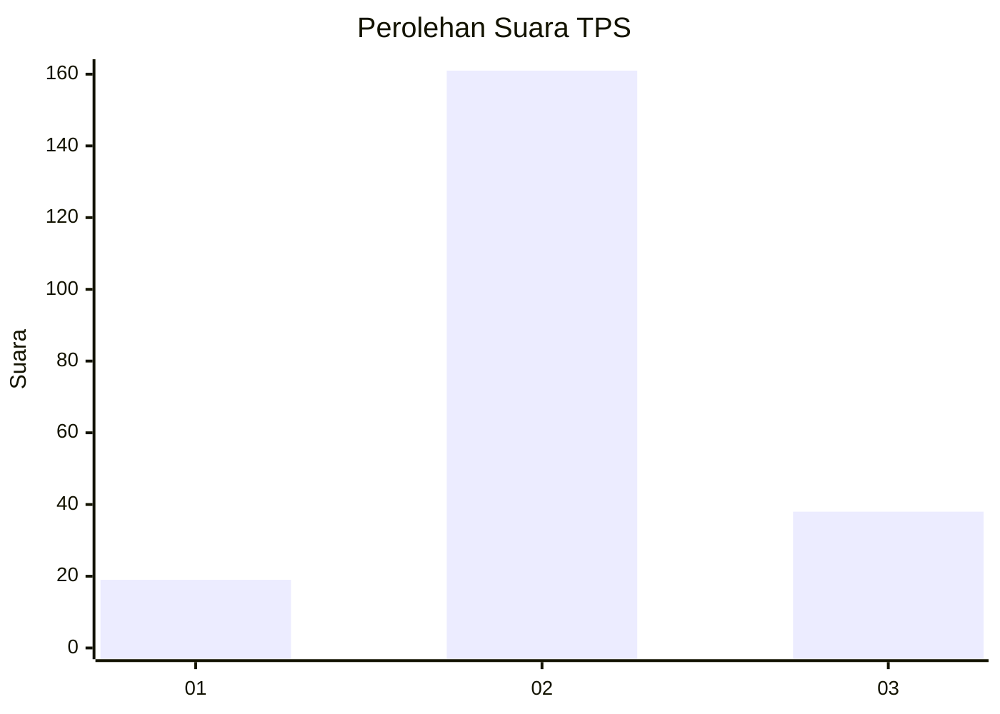
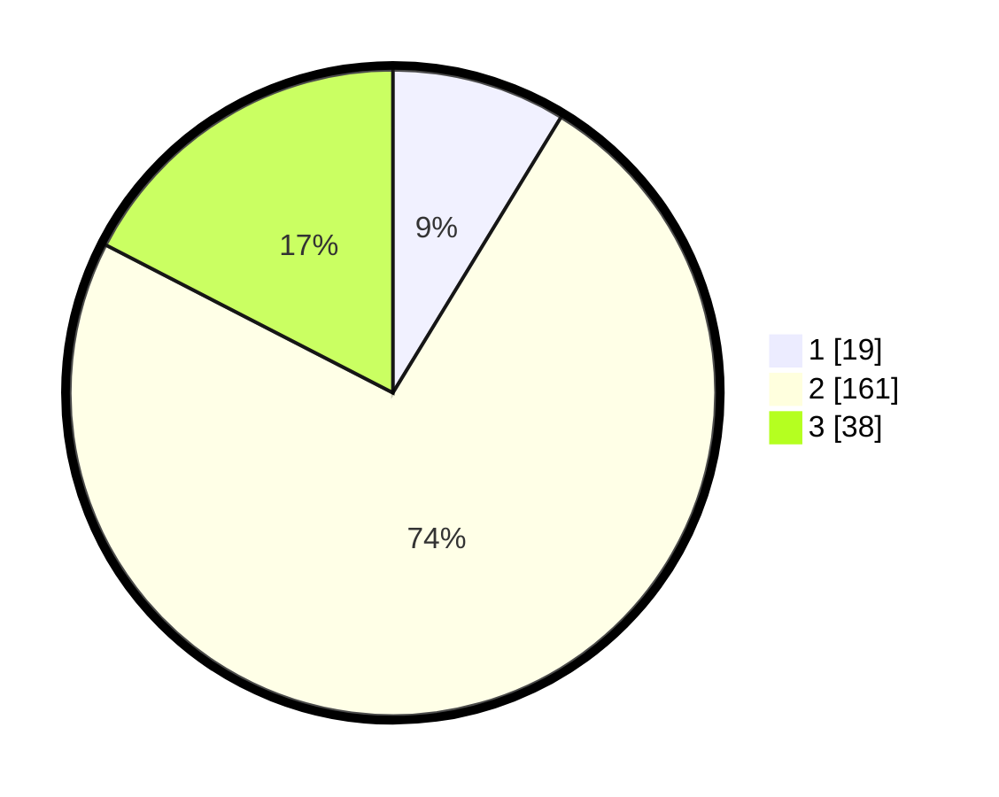

# Hasil

## Grafik

## Tabel

| No. | Nama Paslon    | Suara | Suara (raw) | Persentase |
|:--- |:-------------- | -----:| -----------:| ----------:|
| 1   | ANIES MUHAIMIN | 19    | [19][p-1]   | 8,72       |
| 2   | PRABOWO GIBRAN | 161   | [161][p-2]  | 73,85      |
| 3   | GANJAR MAHFUD  | 38    | [38][p-3]   | 17,43      |

[p-1]: https://github.com/gigit-pemilu/pemilu-2024/blob/main/pilpres/hitung-suara/sub/35-jawa-timur/sub/01-pacitan/sub/04-pacitan/sub/2010-sedeng/sub/009-tps/sub/paslon-1.txt
[p-2]: https://github.com/gigit-pemilu/pemilu-2024/blob/main/pilpres/hitung-suara/sub/35-jawa-timur/sub/01-pacitan/sub/04-pacitan/sub/2010-sedeng/sub/009-tps/sub/paslon-2.txt
[p-3]: https://github.com/gigit-pemilu/pemilu-2024/blob/main/pilpres/hitung-suara/sub/35-jawa-timur/sub/01-pacitan/sub/04-pacitan/sub/2010-sedeng/sub/009-tps/sub/paslon-3.txt

## Foto C Plano

https://sirekap-obj-formc.kpu.go.id/262c/pemilu/ppwp/35/01/04/20/10/3501042010009-20240216-185314--916b4a40-f799-4d53-8c40-a1f75ebd0dad.jpg

https://sirekap-obj-formc.kpu.go.id/262c/pemilu/ppwp/35/01/04/20/10/3501042010009-20240216-213712--6ce38852-636a-4b1a-ae8a-b492e33ea64d.jpg

https://sirekap-obj-formc.kpu.go.id/262c/pemilu/ppwp/35/01/04/20/10/3501042010009-20240216-213841--6ae44937-4ded-4082-a050-5cf362af3457.jpg

## Metadata

| Key        | Value               |
| ---------- | ------------------- |
| Time Stamp | 2024-02-16 22:01:00 |

