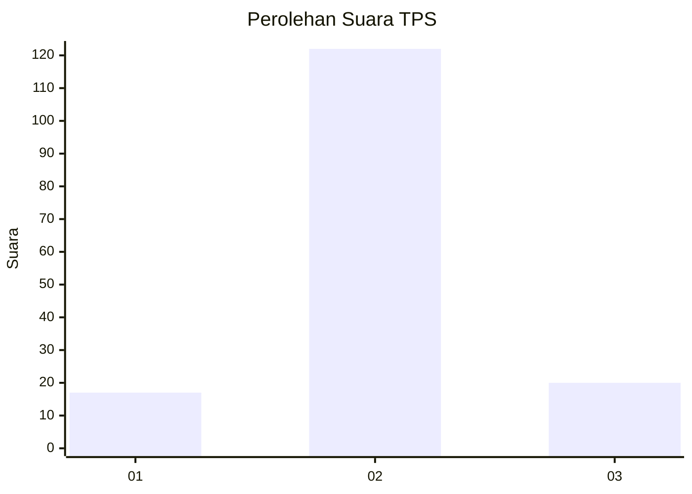
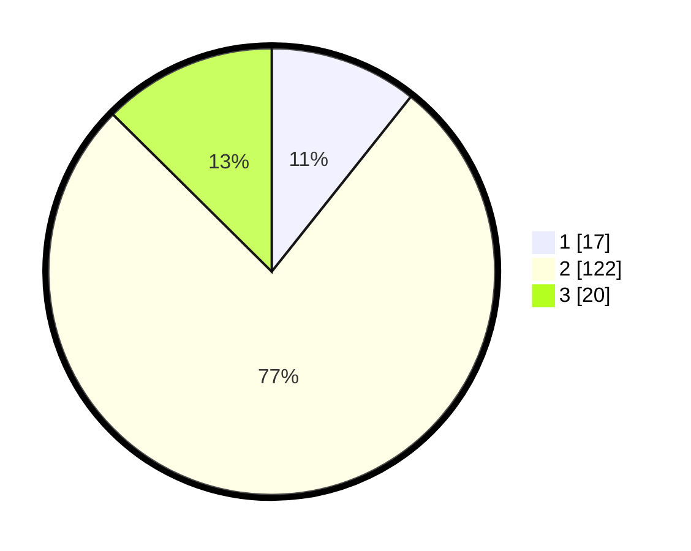

# Hasil

## Grafik

## Tabel

| No. | Nama Paslon    | Suara | Suara (raw) | Persentase |
|:--- |:-------------- | -----:| -----------:| ----------:|
| 1   | ANIES MUHAIMIN | 17    | [17][p-1]   | 10,69      |
| 2   | PRABOWO GIBRAN | 122   | [122][p-2]  | 76,73      |
| 3   | GANJAR MAHFUD  | 20    | [20][p-3]   | 12,58      |

[p-1]: https://github.com/gigit-pemilu/pemilu-2024/blob/main/pilpres/hitung-suara/sub/35-jawa-timur/sub/01-pacitan/sub/05-kebonagung/sub/2001-plumbungan/sub/003-tps/sub/paslon-1.txt
[p-2]: https://github.com/gigit-pemilu/pemilu-2024/blob/main/pilpres/hitung-suara/sub/35-jawa-timur/sub/01-pacitan/sub/05-kebonagung/sub/2001-plumbungan/sub/003-tps/sub/paslon-2.txt
[p-3]: https://github.com/gigit-pemilu/pemilu-2024/blob/main/pilpres/hitung-suara/sub/35-jawa-timur/sub/01-pacitan/sub/05-kebonagung/sub/2001-plumbungan/sub/003-tps/sub/paslon-3.txt

## Foto C Plano

https://sirekap-obj-formc.kpu.go.id/1055/pemilu/ppwp/35/01/05/20/01/3501052001003-20240216-004618--4190702a-93b2-4142-a6d3-8e96ca840eda.jpg

https://sirekap-obj-formc.kpu.go.id/1055/pemilu/ppwp/35/01/05/20/01/3501052001003-20240216-004627--a980d36f-d87e-4d29-b90c-bfaebac9c52c.jpg

https://sirekap-obj-formc.kpu.go.id/1055/pemilu/ppwp/35/01/05/20/01/3501052001003-20240216-004623--a2aca8ec-052d-4253-9b0c-181b0b6cec0e.jpg

## Metadata

| Key        | Value               |
| ---------- | ------------------- |
| Time Stamp | 2024-02-16 06:30:27 |

## DATA PEMILIH TETAP

Jumlah pemilih dalam DPT: **210**.
 * L: **102**.
 * P: **108**.

## DATA PENGGUNA HAK PILIH

Jumlah pengguna hak pilih dalam DPT: **163**.
 * L: **78**.
 * P: **85**.

Jumlah pengguna hak pilih dalam DPTb: **0**.
 * L: **0**.
 * P: **0**.

Jumlah pengguna hak pilih dalam DPK: **0**.
 * L: **0**.
 * P: **0**.

Jumlah pengguna hak pilih: **163**.
 * L: **78**.
 * P: **85**.

## JUMLAH SUARA SAH DAN TIDAK SAH

JUMLAH SELURUH SUARA SAH: **159**.

JUMLAH SUARA TIDAK SAH: **4**.

JUMLAH SELURUH SUARA SAH DAN SUARA TIDAK SAH: **163**.

