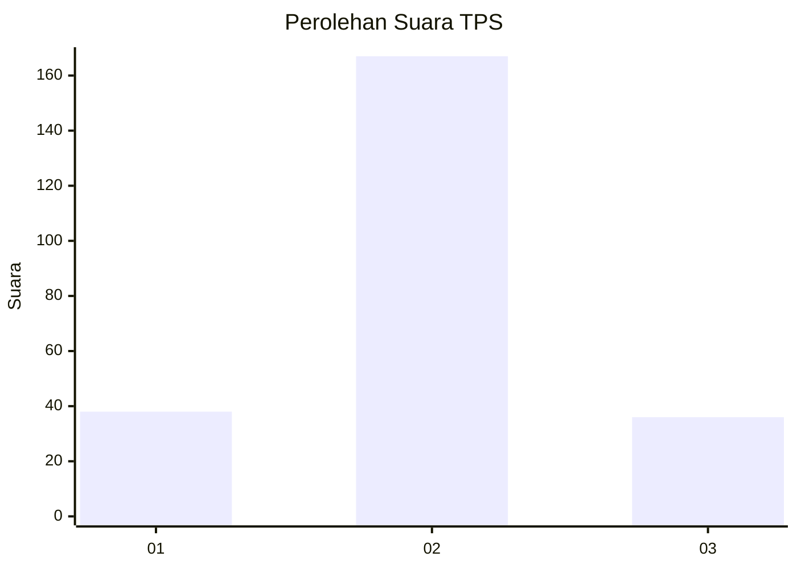

# Hasil

## Grafik

## Tabel

| No. | Nama Paslon    | Suara | Suara (raw) | Persentase |
|:--- |:-------------- | -----:| -----------:| ----------:|
| 1   | ANIES MUHAIMIN | 38    | [38][p-1]   | 15,77      |
| 2   | PRABOWO GIBRAN | 167   | [167][p-2]  | 69,29      |
| 3   | GANJAR MAHFUD  | 36    | [36][p-3]   | 14,94      |

[p-1]: https://github.com/gigit-pemilu/pemilu-2024/blob/main/pilpres/hitung-suara/sub/35-jawa-timur/sub/01-pacitan/sub/05-kebonagung/sub/2002-karangnongko/sub/001-tps/sub/paslon-1.txt
[p-2]: https://github.com/gigit-pemilu/pemilu-2024/blob/main/pilpres/hitung-suara/sub/35-jawa-timur/sub/01-pacitan/sub/05-kebonagung/sub/2002-karangnongko/sub/001-tps/sub/paslon-2.txt
[p-3]: https://github.com/gigit-pemilu/pemilu-2024/blob/main/pilpres/hitung-suara/sub/35-jawa-timur/sub/01-pacitan/sub/05-kebonagung/sub/2002-karangnongko/sub/001-tps/sub/paslon-3.txt

## Foto C Plano

https://sirekap-obj-formc.kpu.go.id/8da5/pemilu/ppwp/35/01/05/20/02/3501052002001-20240215-062714--fac65b80-b95d-47df-9a1d-abaef4563247.jpg

https://sirekap-obj-formc.kpu.go.id/8da5/pemilu/ppwp/35/01/05/20/02/3501052002001-20240215-062742--1fabc9d0-b8df-4a6a-b60a-78be191c4971.jpg

https://sirekap-obj-formc.kpu.go.id/8da5/pemilu/ppwp/35/01/05/20/02/3501052002001-20240215-062724--fc7c0bb4-fa6e-48a8-8967-b7e5904a003a.jpg

## Metadata

| Key        | Value               |
| ---------- | ------------------- |
| Time Stamp | 2024-02-15 09:00:24 |

## DATA PEMILIH TETAP

Jumlah pemilih dalam DPT: **272**.
 * L: **38**.
 * P: **134**.

## DATA PENGGUNA HAK PILIH

Jumlah pengguna hak pilih dalam DPT: **242**.
 * L: **126**.
 * P: **116**.

Jumlah pengguna hak pilih dalam DPTb: **2**.
 * L: **1**.
 * P: **1**.

Jumlah pengguna hak pilih dalam DPK: **3**.
 * L: **1**.
 * P: **2**.

Jumlah pengguna hak pilih: **247**.
 * L: **128**.
 * P: **119**.

## JUMLAH SUARA SAH DAN TIDAK SAH

JUMLAH SELURUH SUARA SAH: **241**.

JUMLAH SUARA TIDAK SAH: **6**.

JUMLAH SELURUH SUARA SAH DAN SUARA TIDAK SAH: **247**.

