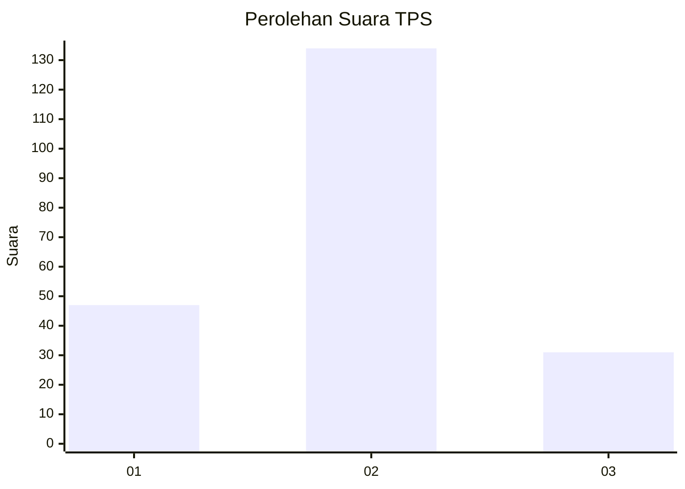
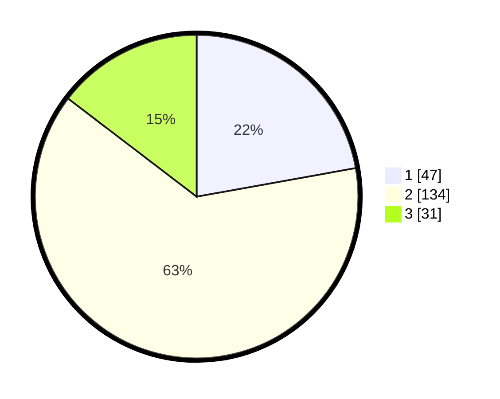

# Hasil

## Grafik

## Tabel

| No. | Nama Paslon    | Suara | Suara (raw) | Persentase |
|:--- |:-------------- | -----:| -----------:| ----------:|
| 1   | ANIES MUHAIMIN | 47    | [47][p-1]   | 22,17      |
| 2   | PRABOWO GIBRAN | 134   | [134][p-2]  | 63,21      |
| 3   | GANJAR MAHFUD  | 31    | [31][p-3]   | 14,62      |

[p-1]: https://github.com/gigit-pemilu/pemilu-2024/blob/main/pilpres/hitung-suara/sub/35-jawa-timur/sub/01-pacitan/sub/05-kebonagung/sub/2002-karangnongko/sub/002-tps/sub/paslon-1.txt
[p-2]: https://github.com/gigit-pemilu/pemilu-2024/blob/main/pilpres/hitung-suara/sub/35-jawa-timur/sub/01-pacitan/sub/05-kebonagung/sub/2002-karangnongko/sub/002-tps/sub/paslon-2.txt
[p-3]: https://github.com/gigit-pemilu/pemilu-2024/blob/main/pilpres/hitung-suara/sub/35-jawa-timur/sub/01-pacitan/sub/05-kebonagung/sub/2002-karangnongko/sub/002-tps/sub/paslon-3.txt

## Foto C Plano

https://sirekap-obj-formc.kpu.go.id/3578/pemilu/ppwp/35/01/05/20/02/3501052002002-20240216-055212--d67c2fef-dacb-49b5-9148-38dc309b96e6.jpg

https://sirekap-obj-formc.kpu.go.id/3578/pemilu/ppwp/35/01/05/20/02/3501052002002-20240216-055216--15c5d3b2-3771-48f7-aa9f-d5b35b26f42f.jpg

https://sirekap-obj-formc.kpu.go.id/3578/pemilu/ppwp/35/01/05/20/02/3501052002002-20240216-055213--4236bbad-7c74-438c-a2c2-d832e6a62d96.jpg

## Metadata

| Key        | Value               |
| ---------- | ------------------- |
| Time Stamp | 2024-02-16 06:30:27 |

## DATA PEMILIH TETAP

Jumlah pemilih dalam DPT: **243**.
 * L: **124**.
 * P: **119**.

## DATA PENGGUNA HAK PILIH

Jumlah pengguna hak pilih dalam DPT: **211**.
 * L: **116**.
 * P: **95**.

Jumlah pengguna hak pilih dalam DPTb: **0**.
 * L: **2**.
 * P: **0**.

Jumlah pengguna hak pilih dalam DPK: **0**.
 * L: **0**.
 * P: **1**.

Jumlah pengguna hak pilih: **214**.
 * L: **118**.
 * P: **96**.

## JUMLAH SUARA SAH DAN TIDAK SAH

JUMLAH SELURUH SUARA SAH: **212**.

JUMLAH SUARA TIDAK SAH: **2**.

JUMLAH SELURUH SUARA SAH DAN SUARA TIDAK SAH: **214**.

