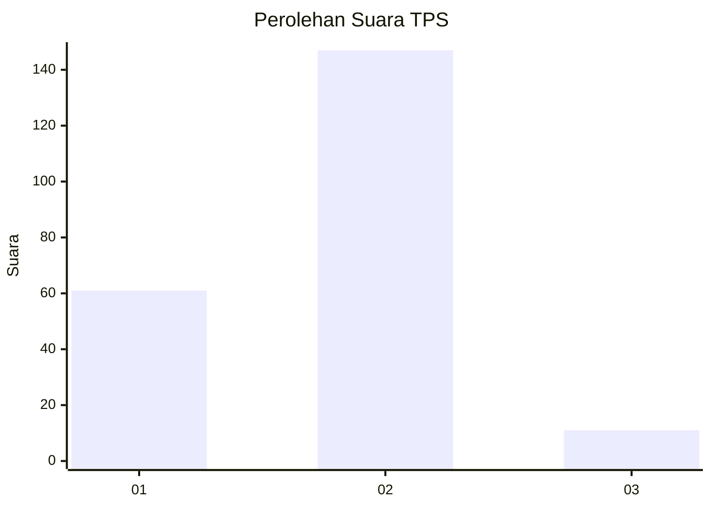
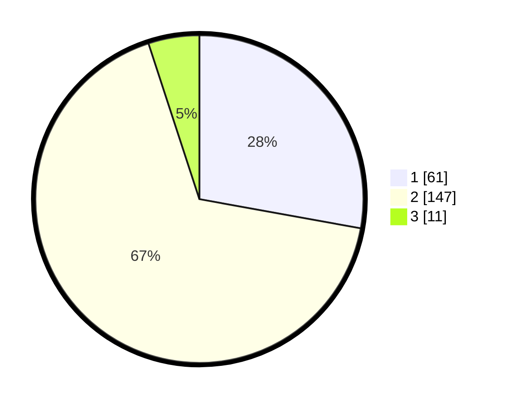

# Hasil

## Grafik

## Tabel

| No. | Nama Paslon    | Suara | Suara (raw) | Persentase |
|:--- |:-------------- | -----:| -----------:| ----------:|
| 1   | ANIES MUHAIMIN | 61    | [61][p-1]   | 27,85      |
| 2   | PRABOWO GIBRAN | 147   | [147][p-2]  | 67,12      |
| 3   | GANJAR MAHFUD  | 11    | [11][p-3]   | 5,02       |

[p-1]: https://github.com/gigit-pemilu/pemilu-2024-35-jawa-timur/blob/main/pilpres/hitung-suara/sub/35-jawa-timur/sub/01-pacitan/sub/05-kebonagung/sub/2007-sidomulyo/sub/004-tps/sub/paslon-1.txt
[p-2]: https://github.com/gigit-pemilu/pemilu-2024-35-jawa-timur/blob/main/pilpres/hitung-suara/sub/35-jawa-timur/sub/01-pacitan/sub/05-kebonagung/sub/2007-sidomulyo/sub/004-tps/sub/paslon-2.txt
[p-3]: https://github.com/gigit-pemilu/pemilu-2024-35-jawa-timur/blob/main/pilpres/hitung-suara/sub/35-jawa-timur/sub/01-pacitan/sub/05-kebonagung/sub/2007-sidomulyo/sub/004-tps/sub/paslon-3.txt

## Foto C Plano

https://sirekap-obj-formc.kpu.go.id/2d14/pemilu/ppwp/35/01/05/20/07/3501052007004-20240216-213747--73755622-6b8d-4e71-9b6f-8950ed9a0f3d.jpg

https://sirekap-obj-formc.kpu.go.id/2d14/pemilu/ppwp/35/01/05/20/07/3501052007004-20240216-214202--8e36c305-6a67-4fca-92c9-a2dcb2446466.jpg

## Metadata

| Key        | Value               |
| ---------- | ------------------- |
| Time Stamp | 2024-02-17 10:00:02 |

