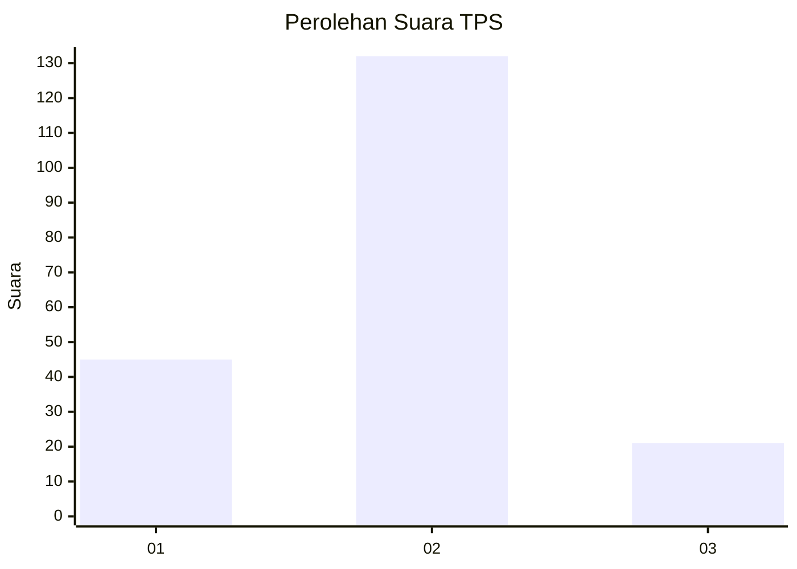
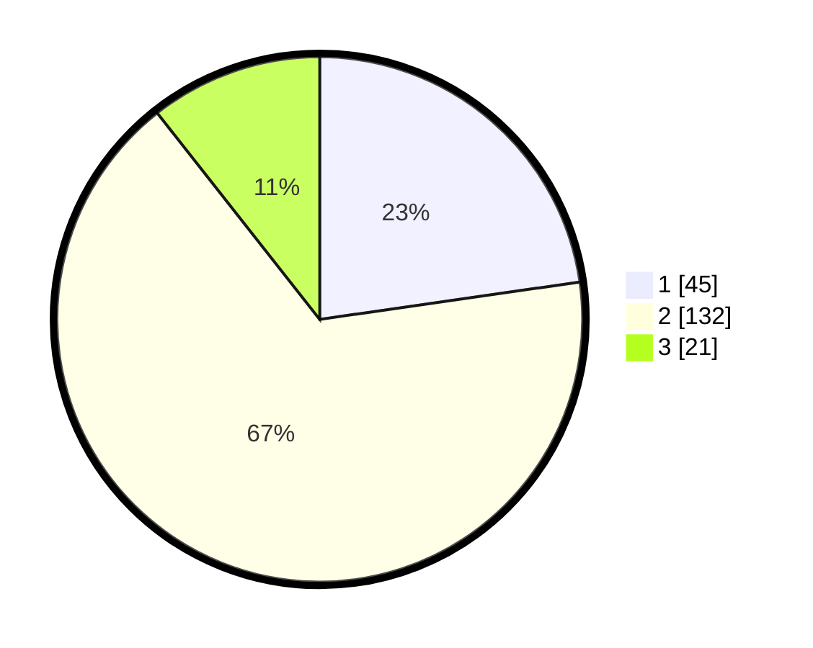

# Hasil

## Grafik

## Tabel

| No. | Nama Paslon    | Suara | Suara (raw) | Persentase |
|:--- |:-------------- | -----:| -----------:| ----------:|
| 1   | ANIES MUHAIMIN | 45    | [45][p-1]   | 22,73      |
| 2   | PRABOWO GIBRAN | 132   | [132][p-2]  | 66,67      |
| 3   | GANJAR MAHFUD  | 21    | [21][p-3]   | 10,61      |

[p-1]: https://github.com/gigit-pemilu/pemilu-2024/blob/main/pilpres/hitung-suara/sub/35-jawa-timur/sub/01-pacitan/sub/05-kebonagung/sub/2013-banjarjo/sub/004-tps/sub/paslon-1.txt
[p-2]: https://github.com/gigit-pemilu/pemilu-2024/blob/main/pilpres/hitung-suara/sub/35-jawa-timur/sub/01-pacitan/sub/05-kebonagung/sub/2013-banjarjo/sub/004-tps/sub/paslon-2.txt
[p-3]: https://github.com/gigit-pemilu/pemilu-2024/blob/main/pilpres/hitung-suara/sub/35-jawa-timur/sub/01-pacitan/sub/05-kebonagung/sub/2013-banjarjo/sub/004-tps/sub/paslon-3.txt

## Foto C Plano

https://sirekap-obj-formc.kpu.go.id/6416/pemilu/ppwp/35/01/05/20/13/3501052013004-20240215-044959--0113ee17-c125-43b6-bc1f-2fde3e4bb21c.jpg

https://sirekap-obj-formc.kpu.go.id/6416/pemilu/ppwp/35/01/05/20/13/3501052013004-20240215-065804--7b857ffb-a774-4074-a60b-71ff5db2f402.jpg

## Metadata

| Key        | Value               |
| ---------- | ------------------- |
| Time Stamp | 2024-02-24 22:31:28 |

