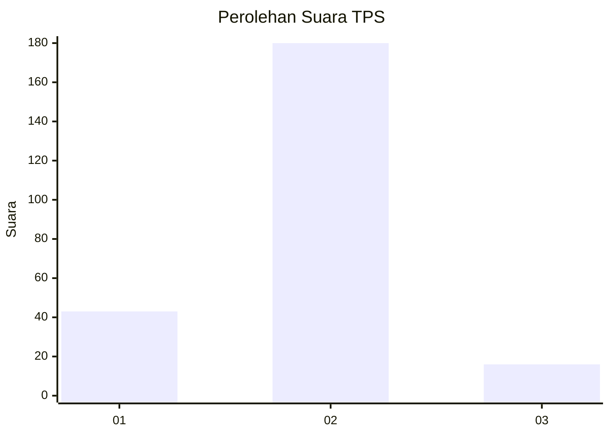
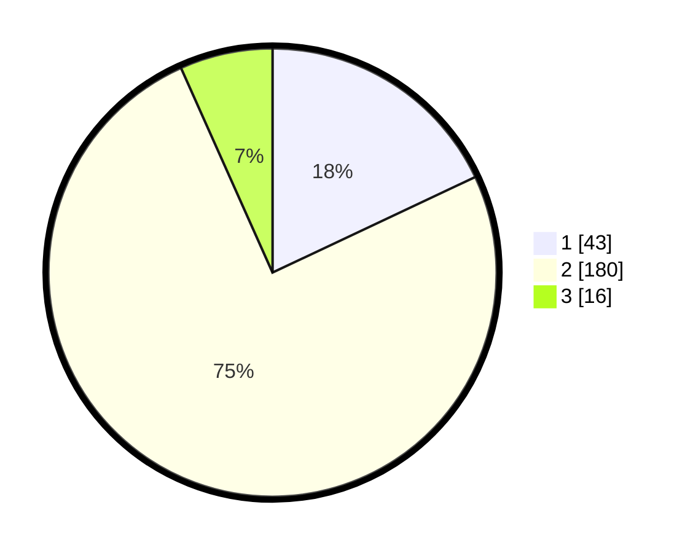

# Hasil

## Grafik

## Tabel

| No. | Nama Paslon    | Suara | Suara (raw) | Persentase |
|:--- |:-------------- | -----:| -----------:| ----------:|
| 1   | ANIES MUHAIMIN | 43    | [43][p-1]   | 17,99      |
| 2   | PRABOWO GIBRAN | 180   | [180][p-2]  | 75,31      |
| 3   | GANJAR MAHFUD  | 16    | [16][p-3]   | 6,69       |

[p-1]: https://github.com/gigit-pemilu/pemilu-2024/blob/main/pilpres/hitung-suara/sub/35-jawa-timur/sub/01-pacitan/sub/06-arjosari/sub/2001-mlati/sub/002-tps/sub/paslon-1.txt
[p-2]: https://github.com/gigit-pemilu/pemilu-2024/blob/main/pilpres/hitung-suara/sub/35-jawa-timur/sub/01-pacitan/sub/06-arjosari/sub/2001-mlati/sub/002-tps/sub/paslon-2.txt
[p-3]: https://github.com/gigit-pemilu/pemilu-2024/blob/main/pilpres/hitung-suara/sub/35-jawa-timur/sub/01-pacitan/sub/06-arjosari/sub/2001-mlati/sub/002-tps/sub/paslon-3.txt

## Foto C Plano

https://sirekap-obj-formc.kpu.go.id/0971/pemilu/ppwp/35/01/06/20/01/3501062001002-20240216-145614--bccd6112-7957-4637-bea3-381a76b46dd3.jpg

https://sirekap-obj-formc.kpu.go.id/0971/pemilu/ppwp/35/01/06/20/01/3501062001002-20240216-145615--5e40f2a9-4f12-43d8-bbc5-454ea0f07e9a.jpg

https://sirekap-obj-formc.kpu.go.id/0971/pemilu/ppwp/35/01/06/20/01/3501062001002-20240216-145614--37e910d8-a00d-4ca5-83f4-2d0efe79bb66.jpg

## Metadata

| Key        | Value               |
| ---------- | ------------------- |
| Time Stamp | 2024-02-16 16:25:10 |

## DATA PEMILIH TETAP

Jumlah pemilih dalam DPT: **284**.
 * L: **136**.
 * P: **148**.

## DATA PENGGUNA HAK PILIH

Jumlah pengguna hak pilih dalam DPT: **228**.
 * L: **93**.
 * P: **135**.

Jumlah pengguna hak pilih dalam DPTb: **14**.
 * L: **14**.
 * P: **0**.

Jumlah pengguna hak pilih dalam DPK: **0**.
 * L: **0**.
 * P: **0**.

Jumlah pengguna hak pilih: **242**.
 * L: **107**.
 * P: **135**.

## JUMLAH SUARA SAH DAN TIDAK SAH

JUMLAH SELURUH SUARA SAH: **239**.

JUMLAH SUARA TIDAK SAH: **3**.

JUMLAH SELURUH SUARA SAH DAN SUARA TIDAK SAH: **242**.

