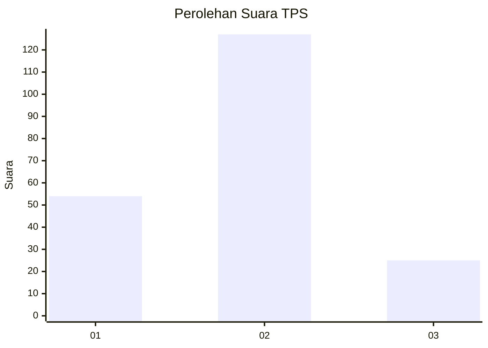
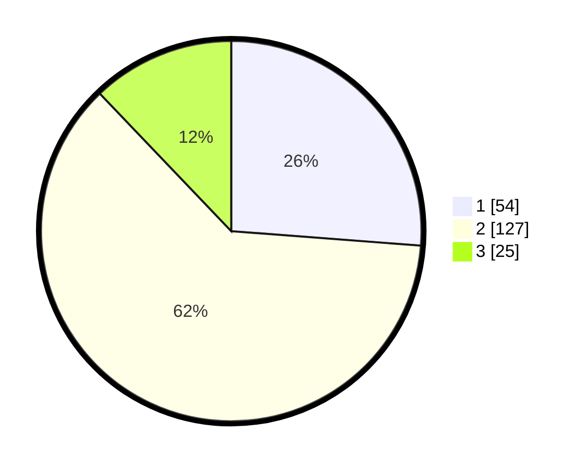

# Hasil

## Grafik

## Tabel

| No. | Nama Paslon    | Suara | Suara (raw) | Persentase |
|:--- |:-------------- | -----:| -----------:| ----------:|
| 1   | ANIES MUHAIMIN | 54    | [54][p-1]   | 26,21      |
| 2   | PRABOWO GIBRAN | 127   | [127][p-2]  | 61,65      |
| 3   | GANJAR MAHFUD  | 25    | [25][p-3]   | 12,14      |

[p-1]: https://github.com/gigit-pemilu/pemilu-2024-35-jawa-timur/blob/main/pilpres/hitung-suara/sub/35-jawa-timur/sub/01-pacitan/sub/06-arjosari/sub/2001-mlati/sub/003-tps/sub/paslon-1.txt
[p-2]: https://github.com/gigit-pemilu/pemilu-2024-35-jawa-timur/blob/main/pilpres/hitung-suara/sub/35-jawa-timur/sub/01-pacitan/sub/06-arjosari/sub/2001-mlati/sub/003-tps/sub/paslon-2.txt
[p-3]: https://github.com/gigit-pemilu/pemilu-2024-35-jawa-timur/blob/main/pilpres/hitung-suara/sub/35-jawa-timur/sub/01-pacitan/sub/06-arjosari/sub/2001-mlati/sub/003-tps/sub/paslon-3.txt

## Foto C Plano

https://sirekap-obj-formc.kpu.go.id/f1df/pemilu/ppwp/35/01/06/20/01/3501062001003-20240216-154117--db724fc6-f2b3-45b6-af20-d03b711ebaed.jpg

https://sirekap-obj-formc.kpu.go.id/f1df/pemilu/ppwp/35/01/06/20/01/3501062001003-20240216-154118--de4c2457-b2ac-400a-801b-df7e9b4e01aa.jpg

https://sirekap-obj-formc.kpu.go.id/f1df/pemilu/ppwp/35/01/06/20/01/3501062001003-20240216-154118--ff39eac8-be02-452c-ba29-3ae15d3fff75.jpg

## Metadata

| Key        | Value               |
| ---------- | ------------------- |
| Time Stamp | 2024-02-16 16:25:10 |

## DATA PEMILIH TETAP

Jumlah pemilih dalam DPT: **251**.
 * L: **135**.
 * P: **116**.

## DATA PENGGUNA HAK PILIH

Jumlah pengguna hak pilih dalam DPT: **195**.
 * L: **95**.
 * P: **100**.

Jumlah pengguna hak pilih dalam DPTb: **16**.
 * L: **13**.
 * P: **3**.

Jumlah pengguna hak pilih dalam DPK: **0**.
 * L: **0**.
 * P: **0**.

Jumlah pengguna hak pilih: **211**.
 * L: **108**.
 * P: **103**.

## JUMLAH SUARA SAH DAN TIDAK SAH

JUMLAH SELURUH SUARA SAH: **206**.

JUMLAH SUARA TIDAK SAH: **5**.

JUMLAH SELURUH SUARA SAH DAN SUARA TIDAK SAH: **211**.

