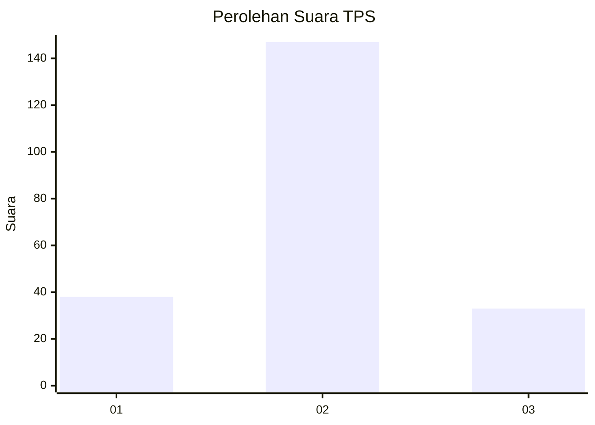
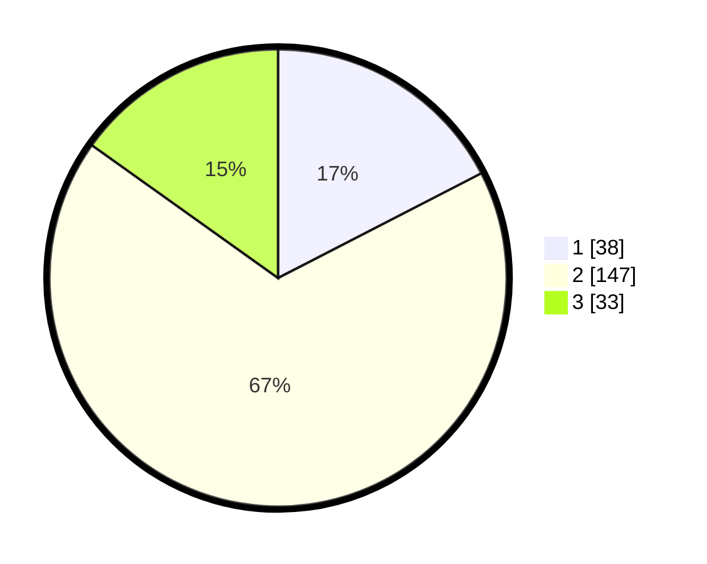

# Hasil

## Grafik

## Tabel

| No. | Nama Paslon    | Suara | Suara (raw) | Persentase |
|:--- |:-------------- | -----:| -----------:| ----------:|
| 1   | ANIES MUHAIMIN | 38    | [38][p-1]   | 17,43      |
| 2   | PRABOWO GIBRAN | 147   | [147][p-2]  | 67,43      |
| 3   | GANJAR MAHFUD  | 33    | [33][p-3]   | 15,14      |

[p-1]: https://github.com/gigit-pemilu/pemilu-2024/blob/main/pilpres/hitung-suara/sub/35-jawa-timur/sub/01-pacitan/sub/06-arjosari/sub/2001-mlati/sub/004-tps/sub/paslon-1.txt
[p-2]: https://github.com/gigit-pemilu/pemilu-2024/blob/main/pilpres/hitung-suara/sub/35-jawa-timur/sub/01-pacitan/sub/06-arjosari/sub/2001-mlati/sub/004-tps/sub/paslon-2.txt
[p-3]: https://github.com/gigit-pemilu/pemilu-2024/blob/main/pilpres/hitung-suara/sub/35-jawa-timur/sub/01-pacitan/sub/06-arjosari/sub/2001-mlati/sub/004-tps/sub/paslon-3.txt

## Foto C Plano

https://sirekap-obj-formc.kpu.go.id/db76/pemilu/ppwp/35/01/06/20/01/3501062001004-20240216-131451--cac16e58-bcc7-43d6-9fa5-149393b5767c.jpg

https://sirekap-obj-formc.kpu.go.id/db76/pemilu/ppwp/35/01/06/20/01/3501062001004-20240216-131452--ede3d103-5fc1-4a6e-9ea3-5a4910fa314f.jpg

https://sirekap-obj-formc.kpu.go.id/db76/pemilu/ppwp/35/01/06/20/01/3501062001004-20240216-131451--0b656a19-e55f-4916-a85d-0bbadcc22fc3.jpg

## Metadata

| Key        | Value               |
| ---------- | ------------------- |
| Time Stamp | 2024-02-16 13:30:32 |

## DATA PEMILIH TETAP

Jumlah pemilih dalam DPT: **291**.
 * L: **142**.
 * P: **149**.

## DATA PENGGUNA HAK PILIH

Jumlah pengguna hak pilih dalam DPT: **224**.
 * L: **102**.
 * P: **122**.

Jumlah pengguna hak pilih dalam DPTb: **5**.
 * L: **2**.
 * P: **3**.

Jumlah pengguna hak pilih dalam DPK: **0**.
 * L: **0**.
 * P: **0**.

Jumlah pengguna hak pilih: **229**.
 * L: **104**.
 * P: **125**.

## JUMLAH SUARA SAH DAN TIDAK SAH

JUMLAH SELURUH SUARA SAH: **218**.

JUMLAH SUARA TIDAK SAH: **11**.

JUMLAH SELURUH SUARA SAH DAN SUARA TIDAK SAH: **229**.

