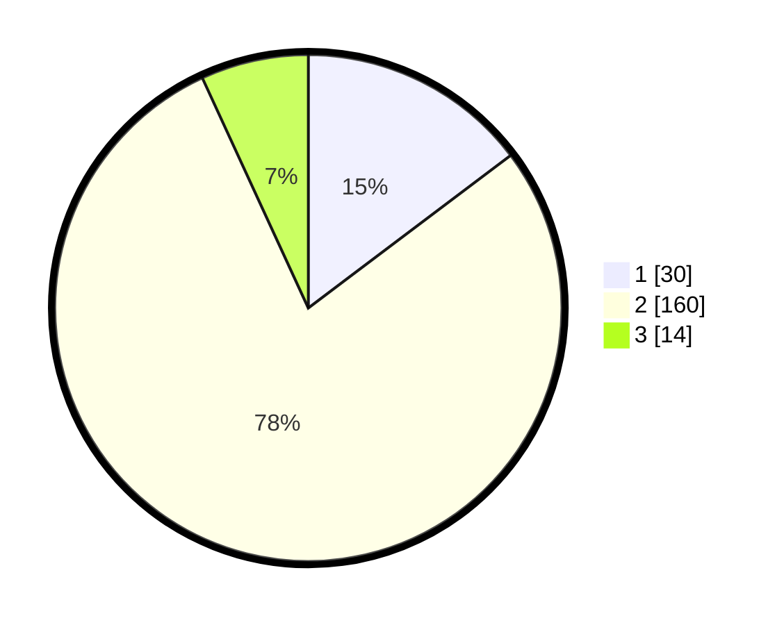

# Hasil

## Grafik

## Tabel

| No. | Nama Paslon    | Suara | Suara (raw) | Persentase |
|:--- |:-------------- | -----:| -----------:| ----------:|
| 1   | ANIES MUHAIMIN | 30    | [30][p-1]   | 14,71      |
| 2   | PRABOWO GIBRAN | 160   | [160][p-2]  | 78,43      |
| 3   | GANJAR MAHFUD  | 14    | [14][p-3]   | 6,86       |

[p-1]: https://github.com/gigit-pemilu/pemilu-2024-35-jawa-timur/blob/main/pilpres/hitung-suara/sub/35-jawa-timur/sub/01-pacitan/sub/06-arjosari/sub/2001-mlati/sub/006-tps/sub/paslon-1.txt
[p-2]: https://github.com/gigit-pemilu/pemilu-2024-35-jawa-timur/blob/main/pilpres/hitung-suara/sub/35-jawa-timur/sub/01-pacitan/sub/06-arjosari/sub/2001-mlati/sub/006-tps/sub/paslon-2.txt
[p-3]: https://github.com/gigit-pemilu/pemilu-2024-35-jawa-timur/blob/main/pilpres/hitung-suara/sub/35-jawa-timur/sub/01-pacitan/sub/06-arjosari/sub/2001-mlati/sub/006-tps/sub/paslon-3.txt

## Foto C Plano

https://sirekap-obj-formc.kpu.go.id/beba/pemilu/ppwp/35/01/06/20/01/3501062001006-20240215-225117--ded0c88f-1c38-48c3-b333-35b9ea7f0026.jpg

https://sirekap-obj-formc.kpu.go.id/beba/pemilu/ppwp/35/01/06/20/01/3501062001006-20240215-225119--0a595a72-30a3-4a24-a8f0-5dbfb20d70ef.jpg

https://sirekap-obj-formc.kpu.go.id/beba/pemilu/ppwp/35/01/06/20/01/3501062001006-20240215-225118--ac3308cb-8e23-496a-8fc3-6c2c6190bced.jpg

## Metadata

| Key        | Value               |
| ---------- | ------------------- |
| Time Stamp | 2024-02-17 13:37:34 |

## DATA PEMILIH TETAP

Jumlah pemilih dalam DPT: **259**.
 * L: **130**.
 * P: **129**.

## DATA PENGGUNA HAK PILIH

Jumlah pengguna hak pilih dalam DPT: **195**.
 * L: **91**.
 * P: **104**.

Jumlah pengguna hak pilih dalam DPTb: **13**.
 * L: **13**.
 * P: **0**.

Jumlah pengguna hak pilih dalam DPK: **0**.
 * L: **0**.
 * P: **0**.

Jumlah pengguna hak pilih: **208**.
 * L: **104**.
 * P: **104**.

## JUMLAH SUARA SAH DAN TIDAK SAH

JUMLAH SELURUH SUARA SAH: **204**.

JUMLAH SUARA TIDAK SAH: **4**.

JUMLAH SELURUH SUARA SAH DAN SUARA TIDAK SAH: **208**.

