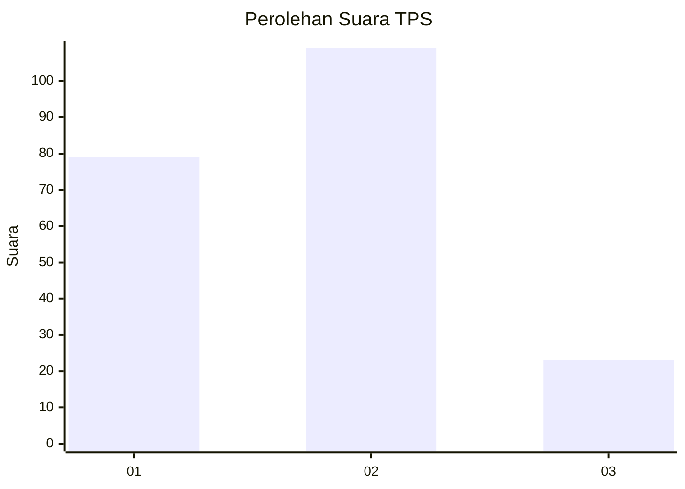
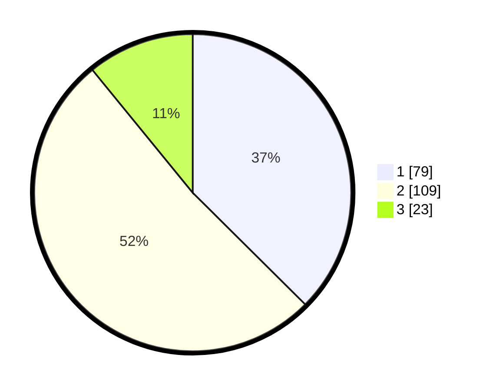

# Hasil

## Grafik

## Tabel

| No. | Nama Paslon    | Suara | Suara (raw) | Persentase |
|:--- |:-------------- | -----:| -----------:| ----------:|
| 1   | ANIES MUHAIMIN | 79    | [79][p-1]   | 37,44      |
| 2   | PRABOWO GIBRAN | 109   | [109][p-2]  | 51,66      |
| 3   | GANJAR MAHFUD  | 23    | [23][p-3]   | 10,90      |

[p-1]: https://github.com/gigit-pemilu/pemilu-2024-35-jawa-timur/blob/main/pilpres/hitung-suara/sub/35-jawa-timur/sub/01-pacitan/sub/06-arjosari/sub/2002-sedayu/sub/004-tps/sub/paslon-1.txt
[p-2]: https://github.com/gigit-pemilu/pemilu-2024-35-jawa-timur/blob/main/pilpres/hitung-suara/sub/35-jawa-timur/sub/01-pacitan/sub/06-arjosari/sub/2002-sedayu/sub/004-tps/sub/paslon-2.txt
[p-3]: https://github.com/gigit-pemilu/pemilu-2024-35-jawa-timur/blob/main/pilpres/hitung-suara/sub/35-jawa-timur/sub/01-pacitan/sub/06-arjosari/sub/2002-sedayu/sub/004-tps/sub/paslon-3.txt

## Foto C Plano

https://sirekap-obj-formc.kpu.go.id/1174/pemilu/ppwp/35/01/06/20/02/3501062002004-20240215-204547--969e954e-2f73-4ff6-8419-7f224fd716a2.jpg

https://sirekap-obj-formc.kpu.go.id/1174/pemilu/ppwp/35/01/06/20/02/3501062002004-20240215-204549--d4a28dae-b676-4dd5-9079-35394cb0fd23.jpg

https://sirekap-obj-formc.kpu.go.id/1174/pemilu/ppwp/35/01/06/20/02/3501062002004-20240215-204548--91a3d800-5d73-41e0-b8c3-aa61a2d735ad.jpg

## Metadata

| Key        | Value               |
| ---------- | ------------------- |
| Time Stamp | 2024-02-15 21:30:27 |

## DATA PEMILIH TETAP

Jumlah pemilih dalam DPT: **259**.
 * L: **125**.
 * P: **134**.

## DATA PENGGUNA HAK PILIH

Jumlah pengguna hak pilih dalam DPT: **206**.
 * L: **92**.
 * P: **114**.

Jumlah pengguna hak pilih dalam DPTb: **13**.
 * L: **2**.
 * P: **11**.

Jumlah pengguna hak pilih dalam DPK: **0**.
 * L: **0**.
 * P: **0**.

Jumlah pengguna hak pilih: **219**.
 * L: **94**.
 * P: **125**.

## JUMLAH SUARA SAH DAN TIDAK SAH

JUMLAH SELURUH SUARA SAH: **211**.

JUMLAH SUARA TIDAK SAH: **8**.

JUMLAH SELURUH SUARA SAH DAN SUARA TIDAK SAH: **219**.

