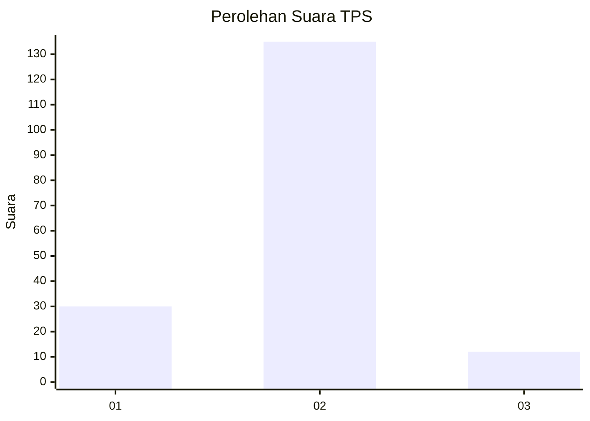
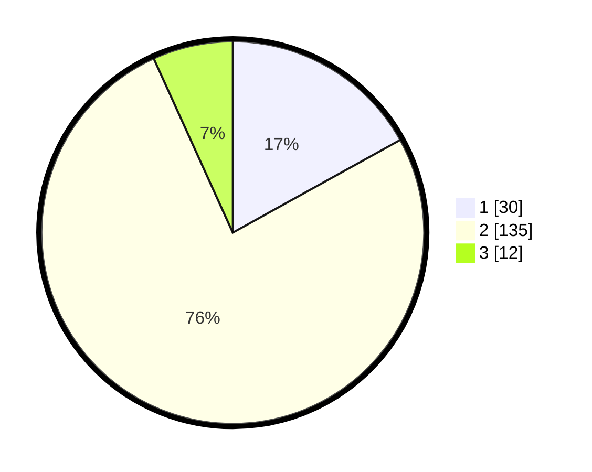

# Hasil

## Grafik

## Tabel

| No. | Nama Paslon    | Suara | Suara (raw) | Persentase |
|:--- |:-------------- | -----:| -----------:| ----------:|
| 1   | ANIES MUHAIMIN | 30    | [30][p-1]   | 16,95      |
| 2   | PRABOWO GIBRAN | 135   | [135][p-2]  | 76,27      |
| 3   | GANJAR MAHFUD  | 12    | [12][p-3]   | 6,78       |

[p-1]: https://github.com/gigit-pemilu/pemilu-2024/blob/main/pilpres/hitung-suara/sub/35-jawa-timur/sub/01-pacitan/sub/06-arjosari/sub/2002-sedayu/sub/006-tps/sub/paslon-1.txt
[p-2]: https://github.com/gigit-pemilu/pemilu-2024/blob/main/pilpres/hitung-suara/sub/35-jawa-timur/sub/01-pacitan/sub/06-arjosari/sub/2002-sedayu/sub/006-tps/sub/paslon-2.txt
[p-3]: https://github.com/gigit-pemilu/pemilu-2024/blob/main/pilpres/hitung-suara/sub/35-jawa-timur/sub/01-pacitan/sub/06-arjosari/sub/2002-sedayu/sub/006-tps/sub/paslon-3.txt

## Foto C Plano

https://sirekap-obj-formc.kpu.go.id/8729/pemilu/ppwp/35/01/06/20/02/3501062002006-20240216-060647--49a07276-697c-4fce-b4f1-0e3eb334c3be.jpg

https://sirekap-obj-formc.kpu.go.id/8729/pemilu/ppwp/35/01/06/20/02/3501062002006-20240216-055237--afb5964b-414a-44d5-ac3d-bba26cfbad76.jpg

https://sirekap-obj-formc.kpu.go.id/8729/pemilu/ppwp/35/01/06/20/02/3501062002006-20240216-060648--8afa3986-db2b-47a0-b0a2-ae663e2c02d7.jpg

## Metadata

| Key        | Value               |
| ---------- | ------------------- |
| Time Stamp | 2024-02-16 08:00:28 |

## DATA PEMILIH TETAP

Jumlah pemilih dalam DPT: **205**.
 * L: **107**.
 * P: **98**.

## DATA PENGGUNA HAK PILIH

Jumlah pengguna hak pilih dalam DPT: **168**.
 * L: **84**.
 * P: **84**.

Jumlah pengguna hak pilih dalam DPTb: **16**.
 * L: **0**.
 * P: **16**.

Jumlah pengguna hak pilih dalam DPK: **2**.
 * L: **0**.
 * P: **2**.

Jumlah pengguna hak pilih: **186**.
 * L: **84**.
 * P: **102**.

## JUMLAH SUARA SAH DAN TIDAK SAH

JUMLAH SELURUH SUARA SAH: **177**.

JUMLAH SUARA TIDAK SAH: **9**.

JUMLAH SELURUH SUARA SAH DAN SUARA TIDAK SAH: **186**.

