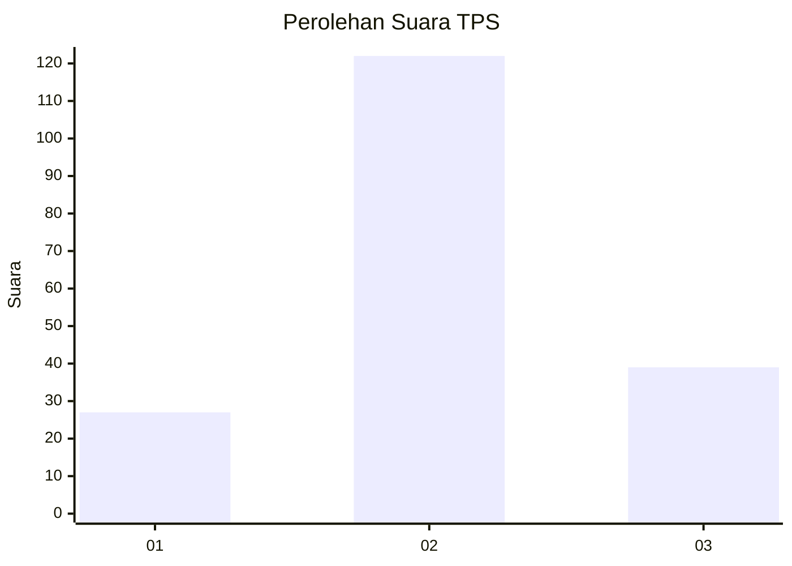
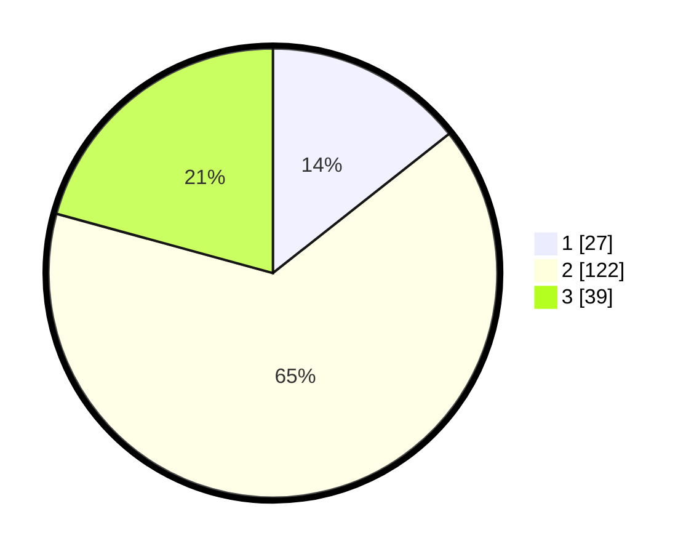

# Hasil

## Grafik

## Tabel

| No. | Nama Paslon    | Suara | Suara (raw) | Persentase |
|:--- |:-------------- | -----:| -----------:| ----------:|
| 1   | ANIES MUHAIMIN | 27    | [27][p-1]   | 14,36      |
| 2   | PRABOWO GIBRAN | 122   | [122][p-2]  | 64,89      |
| 3   | GANJAR MAHFUD  | 39    | [39][p-3]   | 20,74      |

[p-1]: https://github.com/gigit-pemilu/pemilu-2024-35-jawa-timur/blob/main/pilpres/hitung-suara/sub/35-jawa-timur/sub/01-pacitan/sub/06-arjosari/sub/2003-tremas/sub/902-tps/sub/paslon-1.txt
[p-2]: https://github.com/gigit-pemilu/pemilu-2024-35-jawa-timur/blob/main/pilpres/hitung-suara/sub/35-jawa-timur/sub/01-pacitan/sub/06-arjosari/sub/2003-tremas/sub/902-tps/sub/paslon-2.txt
[p-3]: https://github.com/gigit-pemilu/pemilu-2024-35-jawa-timur/blob/main/pilpres/hitung-suara/sub/35-jawa-timur/sub/01-pacitan/sub/06-arjosari/sub/2003-tremas/sub/902-tps/sub/paslon-3.txt

## Foto C Plano

https://sirekap-obj-formc.kpu.go.id/be49/pemilu/ppwp/35/01/06/20/03/3501062003902-20240216-032633--38143f56-4766-4458-bf75-f939d4027198.jpg

https://sirekap-obj-formc.kpu.go.id/be49/pemilu/ppwp/35/01/06/20/03/3501062003902-20240216-033135--6c4a4ef5-8b8b-4fd7-a633-c866d8525d1a.jpg

https://sirekap-obj-formc.kpu.go.id/be49/pemilu/ppwp/35/01/06/20/03/3501062003902-20240216-033127--4897a148-7591-4ee7-a0c1-148a6ac15b22.jpg

## Metadata

| Key        | Value               |
| ---------- | ------------------- |
| Time Stamp | 2024-02-16 08:00:28 |

## DATA PEMILIH TETAP

Jumlah pemilih dalam DPT: **210**.
 * L: **123**.
 * P: **87**.

## DATA PENGGUNA HAK PILIH

Jumlah pengguna hak pilih dalam DPT: **171**.
 * L: **89**.
 * P: **82**.

Jumlah pengguna hak pilih dalam DPTb: **22**.
 * L: **8**.
 * P: **14**.

Jumlah pengguna hak pilih dalam DPK: **0**.
 * L: **0**.
 * P: **0**.

Jumlah pengguna hak pilih: **193**.
 * L: **97**.
 * P: **96**.

## JUMLAH SUARA SAH DAN TIDAK SAH

JUMLAH SELURUH SUARA SAH: **188**.

JUMLAH SUARA TIDAK SAH: **5**.

JUMLAH SELURUH SUARA SAH DAN SUARA TIDAK SAH: **193**.

