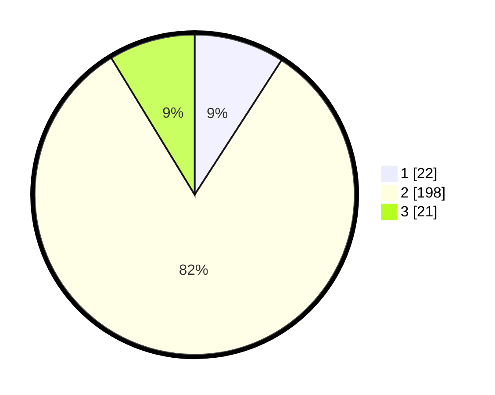

# Hasil

## Grafik

## Tabel

| No. | Nama Paslon    | Suara | Suara (raw) | Persentase |
|:--- |:-------------- | -----:| -----------:| ----------:|
| 1   | ANIES MUHAIMIN | 22    | [22][p-1]   | 9,13       |
| 2   | PRABOWO GIBRAN | 198   | [198][p-2]  | 82,16      |
| 3   | GANJAR MAHFUD  | 21    | [21][p-3]   | 8,71       |

[p-1]: https://github.com/gigit-pemilu/pemilu-2024/blob/main/pilpres/hitung-suara/sub/35-jawa-timur/sub/01-pacitan/sub/06-arjosari/sub/2006-pagutan/sub/002-tps/sub/paslon-1.txt
[p-2]: https://github.com/gigit-pemilu/pemilu-2024/blob/main/pilpres/hitung-suara/sub/35-jawa-timur/sub/01-pacitan/sub/06-arjosari/sub/2006-pagutan/sub/002-tps/sub/paslon-2.txt
[p-3]: https://github.com/gigit-pemilu/pemilu-2024/blob/main/pilpres/hitung-suara/sub/35-jawa-timur/sub/01-pacitan/sub/06-arjosari/sub/2006-pagutan/sub/002-tps/sub/paslon-3.txt

## Foto C Plano

https://sirekap-obj-formc.kpu.go.id/ace5/pemilu/ppwp/35/01/06/20/06/3501062006002-20240215-214732--d7655a4b-5e77-4bce-8cf6-301eb328eaf1.jpg

https://sirekap-obj-formc.kpu.go.id/ace5/pemilu/ppwp/35/01/06/20/06/3501062006002-20240215-214734--f9749879-9900-447f-bb76-7d8ad89fbdde.jpg

https://sirekap-obj-formc.kpu.go.id/ace5/pemilu/ppwp/35/01/06/20/06/3501062006002-20240215-214733--972bd40a-cade-496f-aef6-d6de1b21da2f.jpg

## Metadata

| Key        | Value               |
| ---------- | ------------------- |
| Time Stamp | 2024-02-19 13:00:00 |

## DATA PEMILIH TETAP

Jumlah pemilih dalam DPT: **276**.
 * L: **130**.
 * P: **146**.

## DATA PENGGUNA HAK PILIH

Jumlah pengguna hak pilih dalam DPT: **276**.
 * L: **130**.
 * P: **146**.

Jumlah pengguna hak pilih dalam DPTb: **14**.
 * L: **12**.
 * P: **2**.

Jumlah pengguna hak pilih dalam DPK: **1**.
 * L: **0**.
 * P: **1**.

Jumlah pengguna hak pilih: **242**.
 * L: **120**.
 * P: **122**.

## JUMLAH SUARA SAH DAN TIDAK SAH

JUMLAH SELURUH SUARA SAH: **241**.

JUMLAH SUARA TIDAK SAH: **1**.

JUMLAH SELURUH SUARA SAH DAN SUARA TIDAK SAH: **242**.

