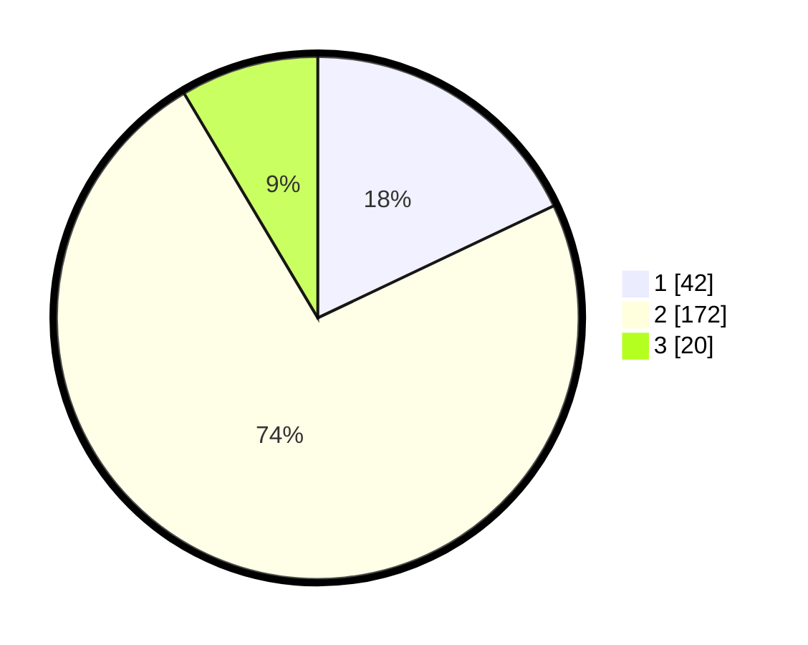

# Hasil

## Grafik

## Tabel

| No. | Nama Paslon    | Suara | Suara (raw) | Persentase |
|:--- |:-------------- | -----:| -----------:| ----------:|
| 1   | ANIES MUHAIMIN | 42    | [42][p-1]   | 17,95      |
| 2   | PRABOWO GIBRAN | 172   | [172][p-2]  | 73,50      |
| 3   | GANJAR MAHFUD  | 20    | [20][p-3]   | 8,55       |

[p-1]: https://github.com/gigit-pemilu/pemilu-2024/blob/main/pilpres/hitung-suara/sub/35-jawa-timur/sub/01-pacitan/sub/06-arjosari/sub/2008-borang/sub/001-tps/sub/paslon-1.txt
[p-2]: https://github.com/gigit-pemilu/pemilu-2024/blob/main/pilpres/hitung-suara/sub/35-jawa-timur/sub/01-pacitan/sub/06-arjosari/sub/2008-borang/sub/001-tps/sub/paslon-2.txt
[p-3]: https://github.com/gigit-pemilu/pemilu-2024/blob/main/pilpres/hitung-suara/sub/35-jawa-timur/sub/01-pacitan/sub/06-arjosari/sub/2008-borang/sub/001-tps/sub/paslon-3.txt

## Foto C Plano

https://sirekap-obj-formc.kpu.go.id/802d/pemilu/ppwp/35/01/06/20/08/3501062008001-20240216-071221--d7ae15d2-8682-4763-b84c-255550f17eef.jpg

https://sirekap-obj-formc.kpu.go.id/802d/pemilu/ppwp/35/01/06/20/08/3501062008001-20240216-071235--e9b6d5f3-19ee-45d2-a9db-437cb7b3da54.jpg

https://sirekap-obj-formc.kpu.go.id/802d/pemilu/ppwp/35/01/06/20/08/3501062008001-20240216-071228--94c720b6-0e4a-45f0-b0b3-0163a524352b.jpg

## Metadata

| Key        | Value               |
| ---------- | ------------------- |
| Time Stamp | 2024-02-17 16:36:25 |

## DATA PEMILIH TETAP

Jumlah pemilih dalam DPT: **289**.
 * L: **134**.
 * P: **155**.

## DATA PENGGUNA HAK PILIH

Jumlah pengguna hak pilih dalam DPT: **231**.
 * L: **100**.
 * P: **131**.

Jumlah pengguna hak pilih dalam DPTb: **5**.
 * L: **4**.
 * P: **1**.

Jumlah pengguna hak pilih dalam DPK: **0**.
 * L: **104**.
 * P: **132**.

Jumlah pengguna hak pilih: **236**.
 * L: **104**.
 * P: **132**.

## JUMLAH SUARA SAH DAN TIDAK SAH

JUMLAH SELURUH SUARA SAH: **234**.

JUMLAH SUARA TIDAK SAH: **2**.

JUMLAH SELURUH SUARA SAH DAN SUARA TIDAK SAH: **236**.

