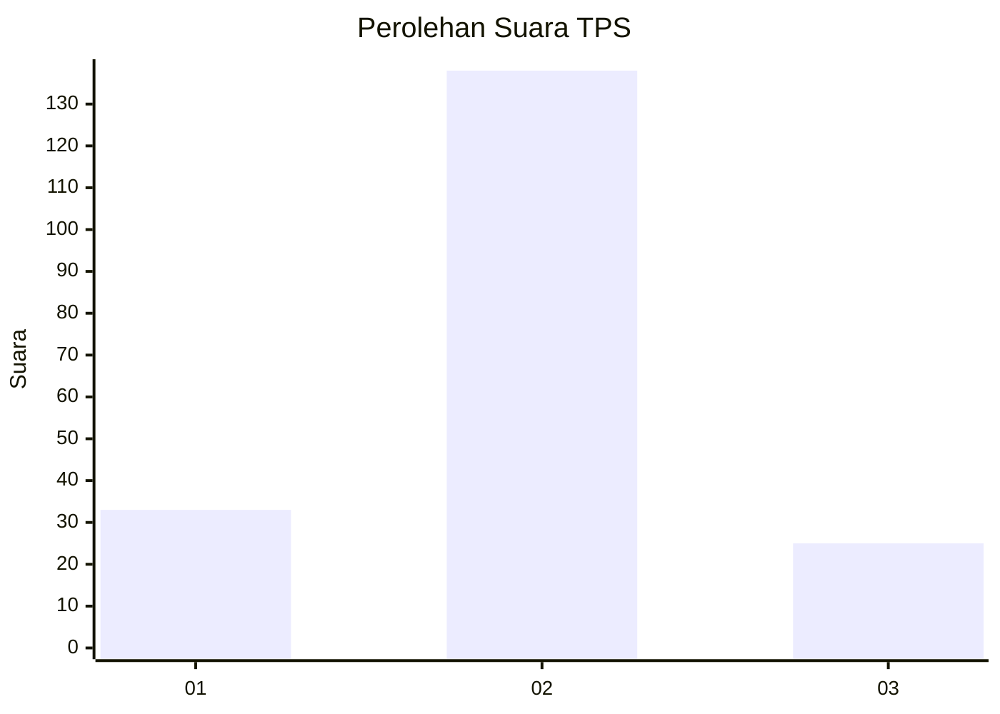
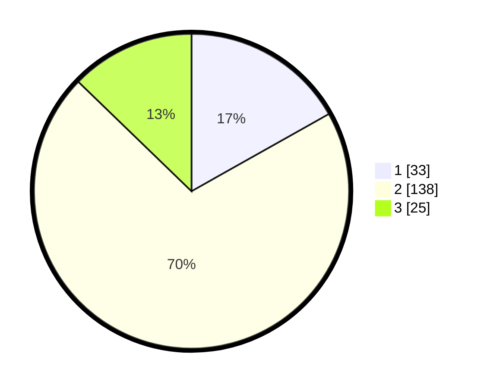

# Hasil

## Grafik

## Tabel

| No. | Nama Paslon    | Suara | Suara (raw) | Persentase |
|:--- |:-------------- | -----:| -----------:| ----------:|
| 1   | ANIES MUHAIMIN | 33    | [33][p-1]   | 16,84      |
| 2   | PRABOWO GIBRAN | 138   | [138][p-2]  | 70,41      |
| 3   | GANJAR MAHFUD  | 25    | [25][p-3]   | 12,76      |

[p-1]: https://github.com/gigit-pemilu/pemilu-2024/blob/main/pilpres/hitung-suara/sub/35-jawa-timur/sub/01-pacitan/sub/06-arjosari/sub/2015-gayuhan/sub/004-tps/sub/paslon-1.txt
[p-2]: https://github.com/gigit-pemilu/pemilu-2024/blob/main/pilpres/hitung-suara/sub/35-jawa-timur/sub/01-pacitan/sub/06-arjosari/sub/2015-gayuhan/sub/004-tps/sub/paslon-2.txt
[p-3]: https://github.com/gigit-pemilu/pemilu-2024/blob/main/pilpres/hitung-suara/sub/35-jawa-timur/sub/01-pacitan/sub/06-arjosari/sub/2015-gayuhan/sub/004-tps/sub/paslon-3.txt

## Foto C Plano

https://sirekap-obj-formc.kpu.go.id/495a/pemilu/ppwp/35/01/06/20/15/3501062015004-20240216-122643--cda516bf-e39f-4016-a45d-1a2be67299c5.jpg

https://sirekap-obj-formc.kpu.go.id/495a/pemilu/ppwp/35/01/06/20/15/3501062015004-20240216-122645--a1848b30-65cc-4310-90a5-56b54ecbc383.jpg

https://sirekap-obj-formc.kpu.go.id/495a/pemilu/ppwp/35/01/06/20/15/3501062015004-20240216-122644--b7d24dc9-06aa-4791-b66e-8472b8d8fb4b.jpg

## Metadata

| Key        | Value               |
| ---------- | ------------------- |
| Time Stamp | 2024-02-16 13:30:32 |

## DATA PEMILIH TETAP

Jumlah pemilih dalam DPT: **225**.
 * L: **107**.
 * P: **118**.

## DATA PENGGUNA HAK PILIH

Jumlah pengguna hak pilih dalam DPT: **189**.
 * L: **82**.
 * P: **107**.

Jumlah pengguna hak pilih dalam DPTb: **9**.
 * L: **9**.
 * P: **0**.

Jumlah pengguna hak pilih dalam DPK: **0**.
 * L: **0**.
 * P: **0**.

Jumlah pengguna hak pilih: **198**.
 * L: **91**.
 * P: **107**.

## JUMLAH SUARA SAH DAN TIDAK SAH

JUMLAH SELURUH SUARA SAH: **196**.

JUMLAH SUARA TIDAK SAH: **2**.

JUMLAH SELURUH SUARA SAH DAN SUARA TIDAK SAH: **198**.

