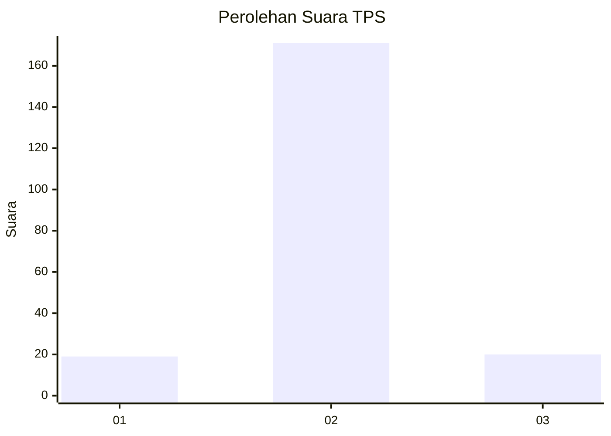
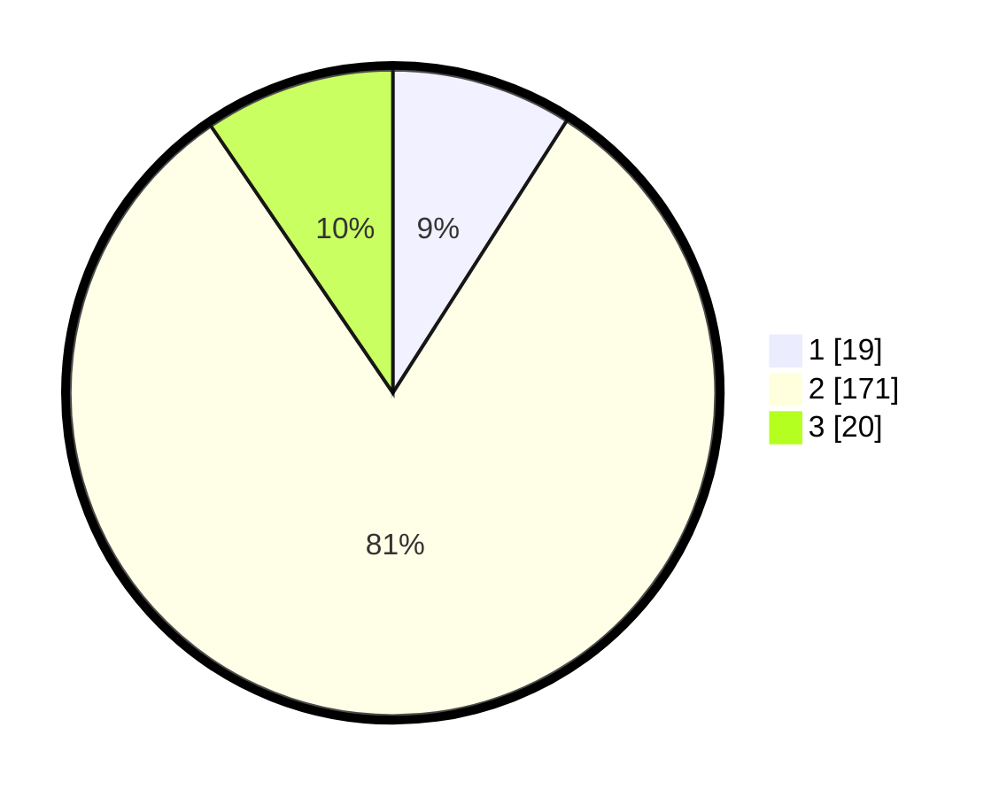

# Hasil

## Grafik

## Tabel

| No. | Nama Paslon    | Suara | Suara (raw) | Persentase |
|:--- |:-------------- | -----:| -----------:| ----------:|
| 1   | ANIES MUHAIMIN | 19    | [19][p-1]   | 9,05       |
| 2   | PRABOWO GIBRAN | 171   | [171][p-2]  | 81,43      |
| 3   | GANJAR MAHFUD  | 20    | [20][p-3]   | 9,52       |

[p-1]: https://github.com/gigit-pemilu/pemilu-2024-35-jawa-timur/blob/main/pilpres/hitung-suara/sub/35-jawa-timur/sub/01-pacitan/sub/06-arjosari/sub/2017-jatimalang/sub/004-tps/sub/paslon-1.txt
[p-2]: https://github.com/gigit-pemilu/pemilu-2024-35-jawa-timur/blob/main/pilpres/hitung-suara/sub/35-jawa-timur/sub/01-pacitan/sub/06-arjosari/sub/2017-jatimalang/sub/004-tps/sub/paslon-2.txt
[p-3]: https://github.com/gigit-pemilu/pemilu-2024-35-jawa-timur/blob/main/pilpres/hitung-suara/sub/35-jawa-timur/sub/01-pacitan/sub/06-arjosari/sub/2017-jatimalang/sub/004-tps/sub/paslon-3.txt

## Foto C Plano

https://sirekap-obj-formc.kpu.go.id/97cf/pemilu/ppwp/35/01/06/20/17/3501062017004-20240215-205628--fc9e3d75-a9e5-4eb6-8703-9cafc28fa139.jpg

https://sirekap-obj-formc.kpu.go.id/97cf/pemilu/ppwp/35/01/06/20/17/3501062017004-20240215-205630--b6308280-af73-4657-a439-840820bb61a5.jpg

https://sirekap-obj-formc.kpu.go.id/97cf/pemilu/ppwp/35/01/06/20/17/3501062017004-20240215-205629--e9190441-a47b-4493-a347-7d76a15b934a.jpg

## Metadata

| Key        | Value               |
| ---------- | ------------------- |
| Time Stamp | 2024-02-15 21:30:27 |

## DATA PEMILIH TETAP

Jumlah pemilih dalam DPT: **241**.
 * L: **126**.
 * P: **115**.

## DATA PENGGUNA HAK PILIH

Jumlah pengguna hak pilih dalam DPT: **192**.
 * L: **101**.
 * P: **91**.

Jumlah pengguna hak pilih dalam DPTb: **22**.
 * L: **2**.
 * P: **20**.

Jumlah pengguna hak pilih dalam DPK: **2**.
 * L: **1**.
 * P: **1**.

Jumlah pengguna hak pilih: **216**.
 * L: **104**.
 * P: **112**.

## JUMLAH SUARA SAH DAN TIDAK SAH

JUMLAH SELURUH SUARA SAH: **210**.

JUMLAH SUARA TIDAK SAH: **6**.

JUMLAH SELURUH SUARA SAH DAN SUARA TIDAK SAH: **216**.

