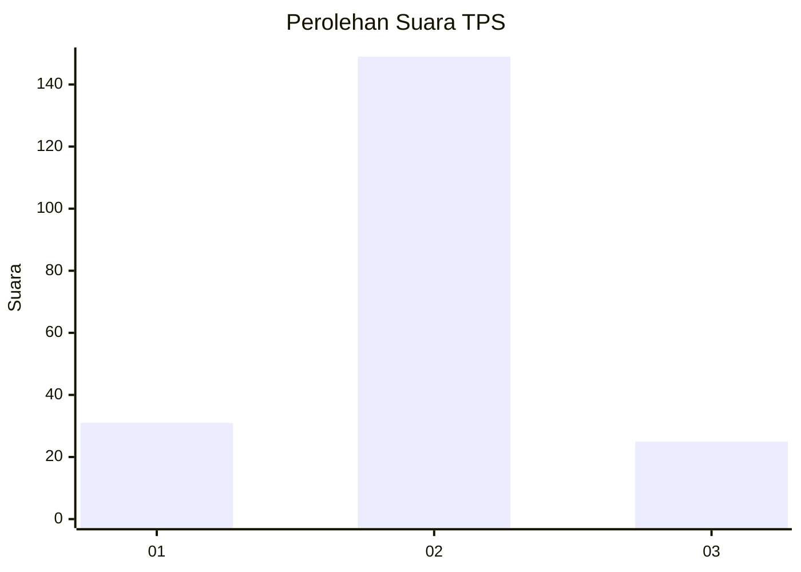
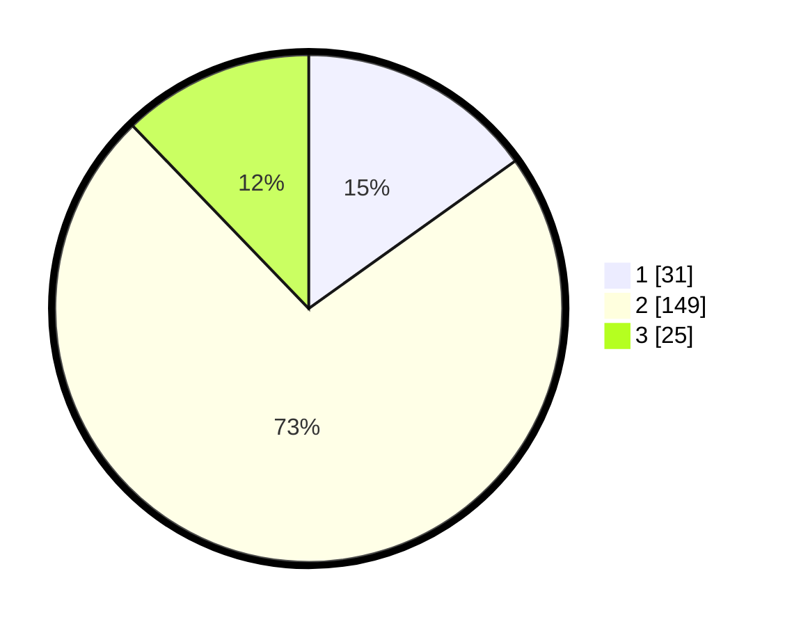

# Hasil

## Grafik

## Tabel

| No. | Nama Paslon    | Suara | Suara (raw) | Persentase |
|:--- |:-------------- | -----:| -----------:| ----------:|
| 1   | ANIES MUHAIMIN | 31    | [31][p-1]   | 15,12      |
| 2   | PRABOWO GIBRAN | 149   | [149][p-2]  | 72,68      |
| 3   | GANJAR MAHFUD  | 25    | [25][p-3]   | 12,20      |

[p-1]: https://github.com/gigit-pemilu/pemilu-2024-35-jawa-timur/blob/main/pilpres/hitung-suara/sub/35-jawa-timur/sub/01-pacitan/sub/07-nawangan/sub/2001-gondang/sub/001-tps/sub/paslon-1.txt
[p-2]: https://github.com/gigit-pemilu/pemilu-2024-35-jawa-timur/blob/main/pilpres/hitung-suara/sub/35-jawa-timur/sub/01-pacitan/sub/07-nawangan/sub/2001-gondang/sub/001-tps/sub/paslon-2.txt
[p-3]: https://github.com/gigit-pemilu/pemilu-2024-35-jawa-timur/blob/main/pilpres/hitung-suara/sub/35-jawa-timur/sub/01-pacitan/sub/07-nawangan/sub/2001-gondang/sub/001-tps/sub/paslon-3.txt

## Foto C Plano

https://sirekap-obj-formc.kpu.go.id/b98b/pemilu/ppwp/35/01/07/20/01/3501072001001-20240216-133131--24f76d57-3a0a-47aa-bea9-b1e354824805.jpg

https://sirekap-obj-formc.kpu.go.id/b98b/pemilu/ppwp/35/01/07/20/01/3501072001001-20240216-133132--de6bf28b-d49a-4259-9436-cb3d4b8ef90d.jpg

https://sirekap-obj-formc.kpu.go.id/b98b/pemilu/ppwp/35/01/07/20/01/3501072001001-20240216-133131--bc6cb909-517a-49de-9199-8b6a3335b224.jpg

## Metadata

| Key        | Value               |
| ---------- | ------------------- |
| Time Stamp | 2024-02-16 16:25:10 |

## DATA PEMILIH TETAP

Jumlah pemilih dalam DPT: **268**.
 * L: **131**.
 * P: **137**.

## DATA PENGGUNA HAK PILIH

Jumlah pengguna hak pilih dalam DPT: **202**.
 * L: **85**.
 * P: **117**.

Jumlah pengguna hak pilih dalam DPTb: **4**.
 * L: **4**.
 * P: **0**.

Jumlah pengguna hak pilih dalam DPK: **1**.
 * L: **0**.
 * P: **1**.

Jumlah pengguna hak pilih: **207**.
 * L: **89**.
 * P: **118**.

## JUMLAH SUARA SAH DAN TIDAK SAH

JUMLAH SELURUH SUARA SAH: **205**.

JUMLAH SUARA TIDAK SAH: **2**.

JUMLAH SELURUH SUARA SAH DAN SUARA TIDAK SAH: **207**.

