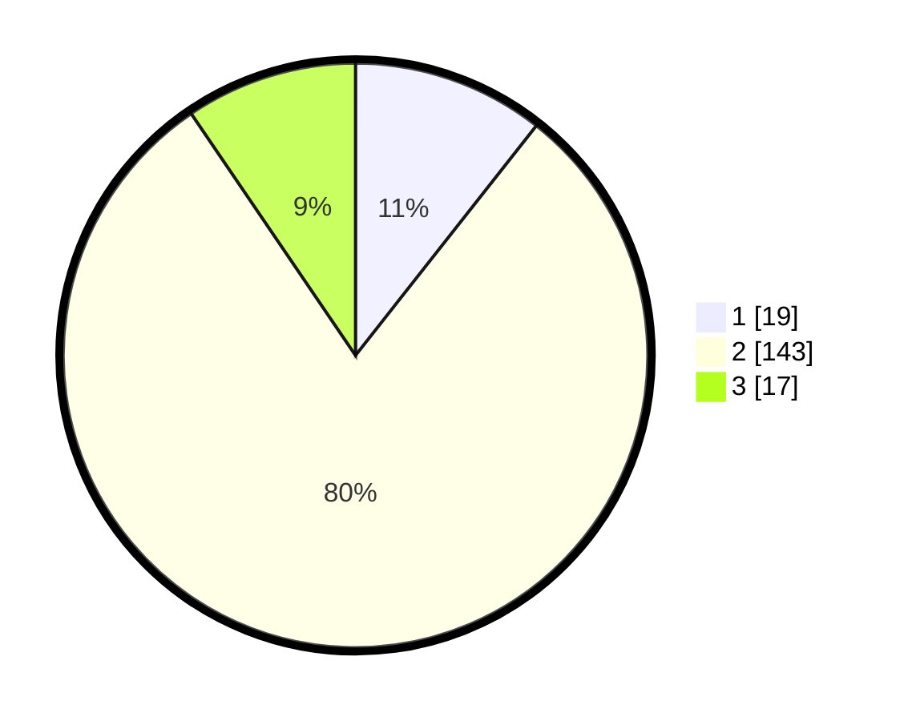

# Hasil

## Grafik

## Tabel

| No. | Nama Paslon    | Suara | Suara (raw) | Persentase |
|:--- |:-------------- | -----:| -----------:| ----------:|
| 1   | ANIES MUHAIMIN | 19    | [19][p-1]   | 10,61      |
| 2   | PRABOWO GIBRAN | 143   | [143][p-2]  | 79,89      |
| 3   | GANJAR MAHFUD  | 17    | [17][p-3]   | 9,50       |

[p-1]: https://github.com/gigit-pemilu/pemilu-2024/blob/main/pilpres/hitung-suara/sub/35-jawa-timur/sub/01-pacitan/sub/07-nawangan/sub/2001-gondang/sub/004-tps/sub/paslon-1.txt
[p-2]: https://github.com/gigit-pemilu/pemilu-2024/blob/main/pilpres/hitung-suara/sub/35-jawa-timur/sub/01-pacitan/sub/07-nawangan/sub/2001-gondang/sub/004-tps/sub/paslon-2.txt
[p-3]: https://github.com/gigit-pemilu/pemilu-2024/blob/main/pilpres/hitung-suara/sub/35-jawa-timur/sub/01-pacitan/sub/07-nawangan/sub/2001-gondang/sub/004-tps/sub/paslon-3.txt

## Foto C Plano

https://sirekap-obj-formc.kpu.go.id/17f3/pemilu/ppwp/35/01/07/20/01/3501072001004-20240216-013805--f473cfce-aa62-4acf-8e80-02bc733ba00b.jpg

https://sirekap-obj-formc.kpu.go.id/17f3/pemilu/ppwp/35/01/07/20/01/3501072001004-20240216-013807--1ec6e29f-e02f-42de-86ca-e7ae60138ed6.jpg

https://sirekap-obj-formc.kpu.go.id/17f3/pemilu/ppwp/35/01/07/20/01/3501072001004-20240216-013806--6d101bad-727e-4828-b9ec-4d7bf94f748a.jpg

## Metadata

| Key        | Value               |
| ---------- | ------------------- |
| Time Stamp | 2024-02-16 16:25:10 |

## DATA PEMILIH TETAP

Jumlah pemilih dalam DPT: **274**.
 * L: **142**.
 * P: **132**.

## DATA PENGGUNA HAK PILIH

Jumlah pengguna hak pilih dalam DPT: **178**.
 * L: **84**.
 * P: **94**.

Jumlah pengguna hak pilih dalam DPTb: **1**.
 * L: **1**.
 * P: **0**.

Jumlah pengguna hak pilih dalam DPK: **1**.
 * L: **1**.
 * P: **0**.

Jumlah pengguna hak pilih: **180**.
 * L: **86**.
 * P: **94**.

## JUMLAH SUARA SAH DAN TIDAK SAH

JUMLAH SELURUH SUARA SAH: **179**.

JUMLAH SUARA TIDAK SAH: **1**.

JUMLAH SELURUH SUARA SAH DAN SUARA TIDAK SAH: **180**.

