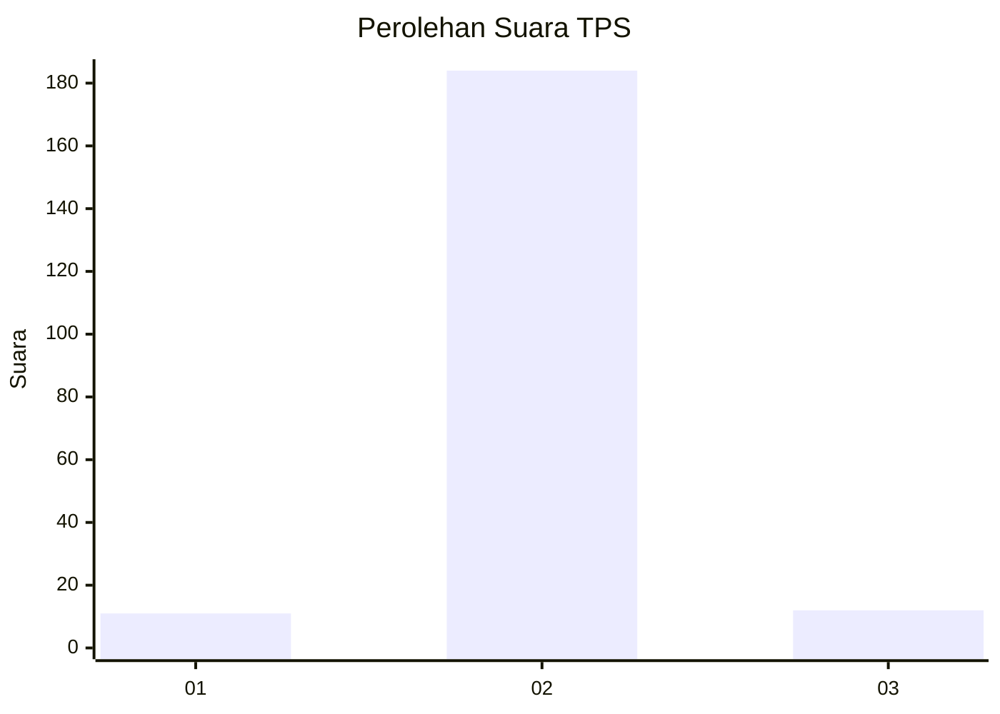
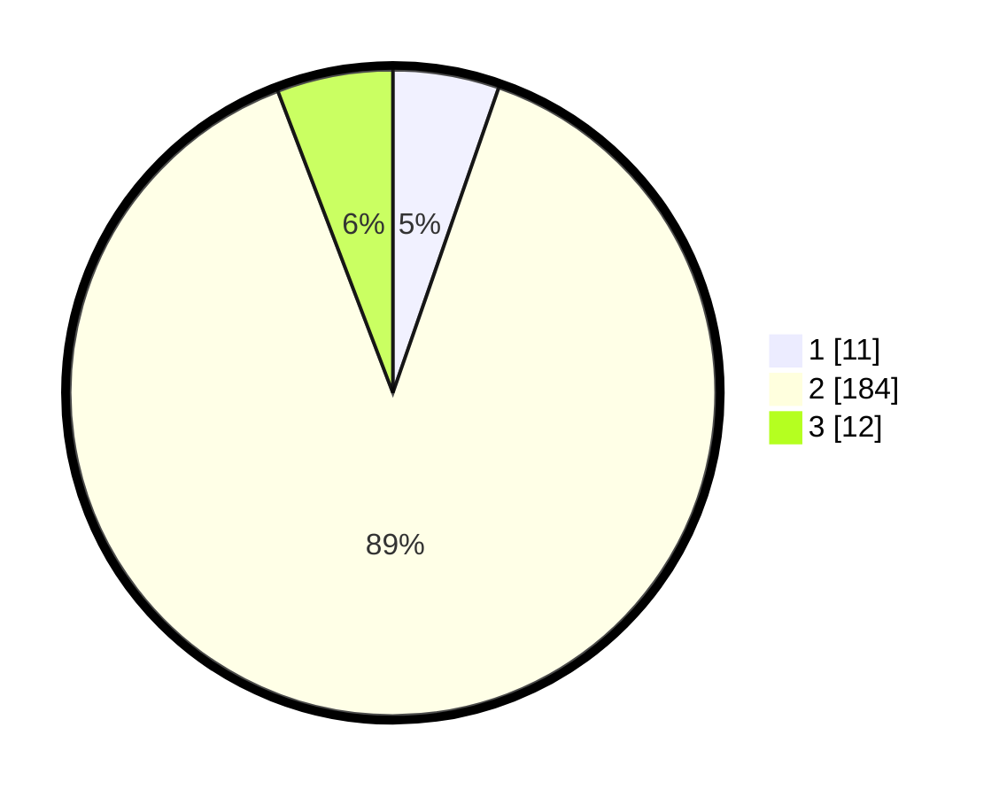

# Hasil

## Grafik

## Tabel

| No. | Nama Paslon    | Suara | Suara (raw) | Persentase |
|:--- |:-------------- | -----:| -----------:| ----------:|
| 1   | ANIES MUHAIMIN | 11    | [11][p-1]   | 5,31       |
| 2   | PRABOWO GIBRAN | 184   | [184][p-2]  | 88,89      |
| 3   | GANJAR MAHFUD  | 12    | [12][p-3]   | 5,80       |

[p-1]: https://github.com/gigit-pemilu/pemilu-2024/blob/main/pilpres/hitung-suara/sub/35-jawa-timur/sub/01-pacitan/sub/07-nawangan/sub/2007-penggung/sub/001-tps/sub/paslon-1.txt
[p-2]: https://github.com/gigit-pemilu/pemilu-2024/blob/main/pilpres/hitung-suara/sub/35-jawa-timur/sub/01-pacitan/sub/07-nawangan/sub/2007-penggung/sub/001-tps/sub/paslon-2.txt
[p-3]: https://github.com/gigit-pemilu/pemilu-2024/blob/main/pilpres/hitung-suara/sub/35-jawa-timur/sub/01-pacitan/sub/07-nawangan/sub/2007-penggung/sub/001-tps/sub/paslon-3.txt

## Foto C Plano

https://sirekap-obj-formc.kpu.go.id/9bb3/pemilu/ppwp/35/01/07/20/07/3501072007001-20240216-172017--0750204a-055e-4b62-ab77-a1eb08c93d0e.jpg

https://sirekap-obj-formc.kpu.go.id/9bb3/pemilu/ppwp/35/01/07/20/07/3501072007001-20240216-202824--bd09221d-4fb8-4d8f-9b0f-8fb8d68744f7.jpg

https://sirekap-obj-formc.kpu.go.id/9bb3/pemilu/ppwp/35/01/07/20/07/3501072007001-20240216-214704--080a18de-6eac-4045-a92c-ce382befde8e.jpg

## Metadata

| Key        | Value               |
| ---------- | ------------------- |
| Time Stamp | 2024-02-17 13:37:34 |

