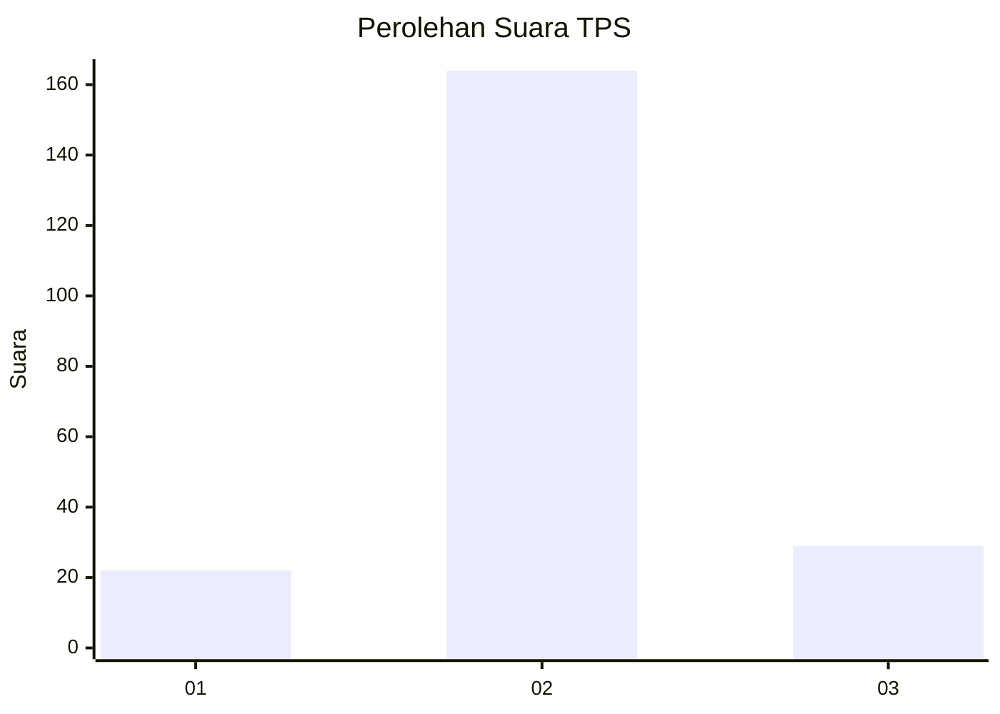
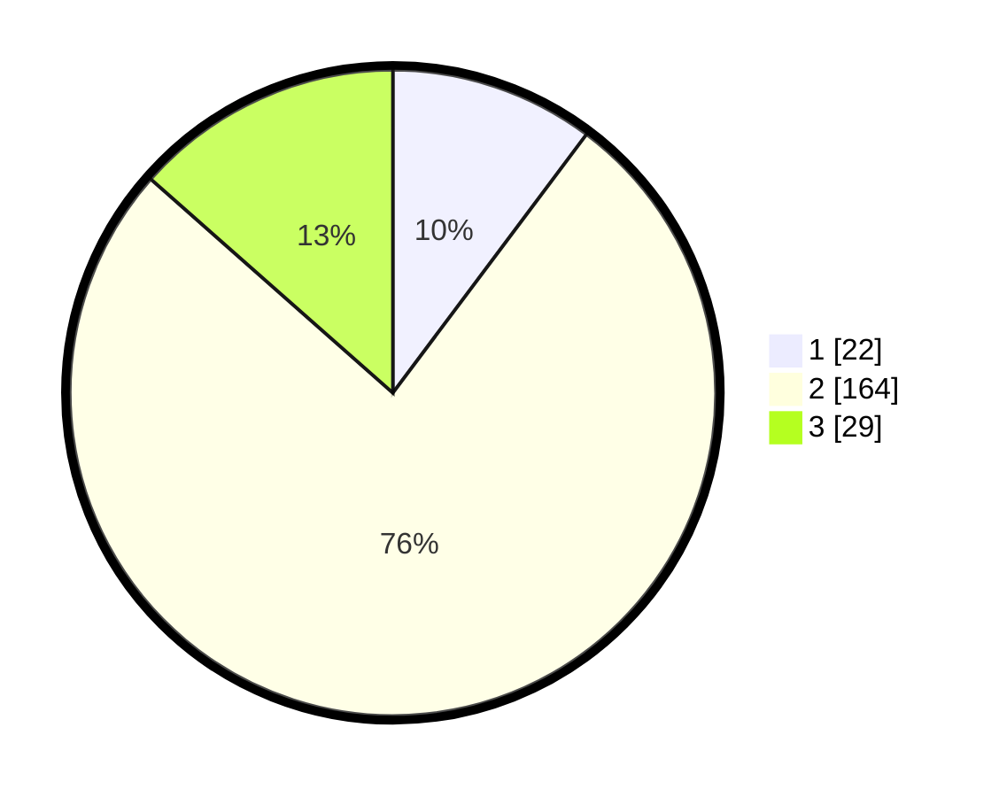

# Hasil

## Grafik

## Tabel

| No. | Nama Paslon    | Suara | Suara (raw) | Persentase |
|:--- |:-------------- | -----:| -----------:| ----------:|
| 1   | ANIES MUHAIMIN | 22    | [22][p-1]   | 10,23      |
| 2   | PRABOWO GIBRAN | 164   | [164][p-2]  | 76,28      |
| 3   | GANJAR MAHFUD  | 29    | [29][p-3]   | 13,49      |

[p-1]: https://github.com/gigit-pemilu/pemilu-2024/blob/main/pilpres/hitung-suara/sub/35-jawa-timur/sub/01-pacitan/sub/07-nawangan/sub/2007-penggung/sub/002-tps/sub/paslon-1.txt
[p-2]: https://github.com/gigit-pemilu/pemilu-2024/blob/main/pilpres/hitung-suara/sub/35-jawa-timur/sub/01-pacitan/sub/07-nawangan/sub/2007-penggung/sub/002-tps/sub/paslon-2.txt
[p-3]: https://github.com/gigit-pemilu/pemilu-2024/blob/main/pilpres/hitung-suara/sub/35-jawa-timur/sub/01-pacitan/sub/07-nawangan/sub/2007-penggung/sub/002-tps/sub/paslon-3.txt

## Foto C Plano

https://sirekap-obj-formc.kpu.go.id/0e67/pemilu/ppwp/35/01/07/20/07/3501072007002-20240214-200453--4161688a-6013-4959-8f18-02d81f27e585.jpg

https://sirekap-obj-formc.kpu.go.id/0e67/pemilu/ppwp/35/01/07/20/07/3501072007002-20240214-195714--d5a46acc-dcb4-4302-9544-ec88e631391b.jpg

## Metadata

| Key        | Value               |
| ---------- | ------------------- |
| Time Stamp | 2024-02-15 07:00:44 |

