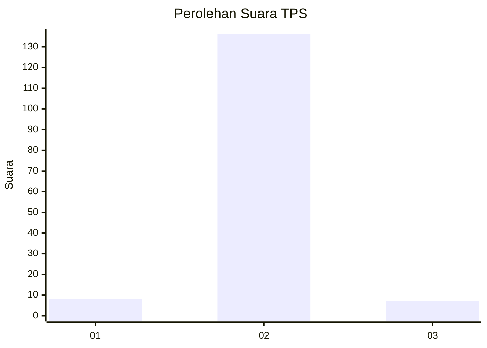
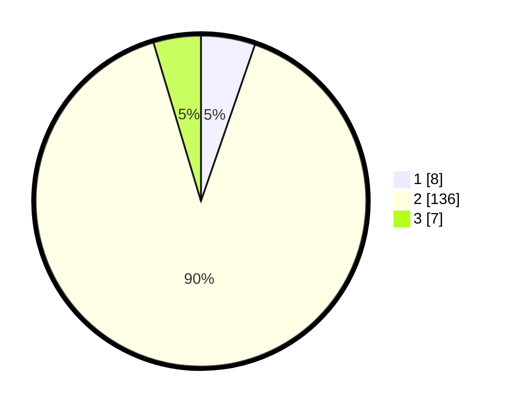

# Hasil

## Grafik

## Tabel

| No. | Nama Paslon    | Suara | Suara (raw) | Persentase |
|:--- |:-------------- | -----:| -----------:| ----------:|
| 1   | ANIES MUHAIMIN | 8     | [8][p-1]    | 5,30       |
| 2   | PRABOWO GIBRAN | 136   | [136][p-2]  | 90,07      |
| 3   | GANJAR MAHFUD  | 7     | [7][p-3]    | 4,64       |

[p-1]: https://github.com/gigit-pemilu/pemilu-2024/blob/main/pilpres/hitung-suara/sub/35-jawa-timur/sub/01-pacitan/sub/08-bandar/sub/2001-petungsinarang/sub/004-tps/sub/paslon-1.txt
[p-2]: https://github.com/gigit-pemilu/pemilu-2024/blob/main/pilpres/hitung-suara/sub/35-jawa-timur/sub/01-pacitan/sub/08-bandar/sub/2001-petungsinarang/sub/004-tps/sub/paslon-2.txt
[p-3]: https://github.com/gigit-pemilu/pemilu-2024/blob/main/pilpres/hitung-suara/sub/35-jawa-timur/sub/01-pacitan/sub/08-bandar/sub/2001-petungsinarang/sub/004-tps/sub/paslon-3.txt

## Foto C Plano

https://sirekap-obj-formc.kpu.go.id/996a/pemilu/ppwp/35/01/08/20/01/3501082001004-20240214-202654--94e817f5-3e14-4369-b699-ba26e5cf205c.jpg

https://sirekap-obj-formc.kpu.go.id/996a/pemilu/ppwp/35/01/08/20/01/3501082001004-20240216-190822--11dd5381-860e-4ecb-8f0c-5beeaa3a40bb.jpg

https://sirekap-obj-formc.kpu.go.id/996a/pemilu/ppwp/35/01/08/20/01/3501082001004-20240215-213103--4ce169ab-dbab-4d3c-924f-81c3f6e7807b.jpg

## Metadata

| Key        | Value               |
| ---------- | ------------------- |
| Time Stamp | 2024-02-16 22:01:00 |

## DATA PEMILIH TETAP

Jumlah pemilih dalam DPT: **201**.
 * L: **103**.
 * P: **98**.

## DATA PENGGUNA HAK PILIH

Jumlah pengguna hak pilih dalam DPT: **151**.
 * L: **71**.
 * P: **80**.

Jumlah pengguna hak pilih dalam DPTb: **1**.
 * L: **0**.
 * P: **1**.

Jumlah pengguna hak pilih dalam DPK: **0**.
 * L: **0**.
 * P: **0**.

Jumlah pengguna hak pilih: **152**.
 * L: **71**.
 * P: **81**.

## JUMLAH SUARA SAH DAN TIDAK SAH

JUMLAH SELURUH SUARA SAH: **151**.

JUMLAH SUARA TIDAK SAH: **1**.

JUMLAH SELURUH SUARA SAH DAN SUARA TIDAK SAH: **152**.

