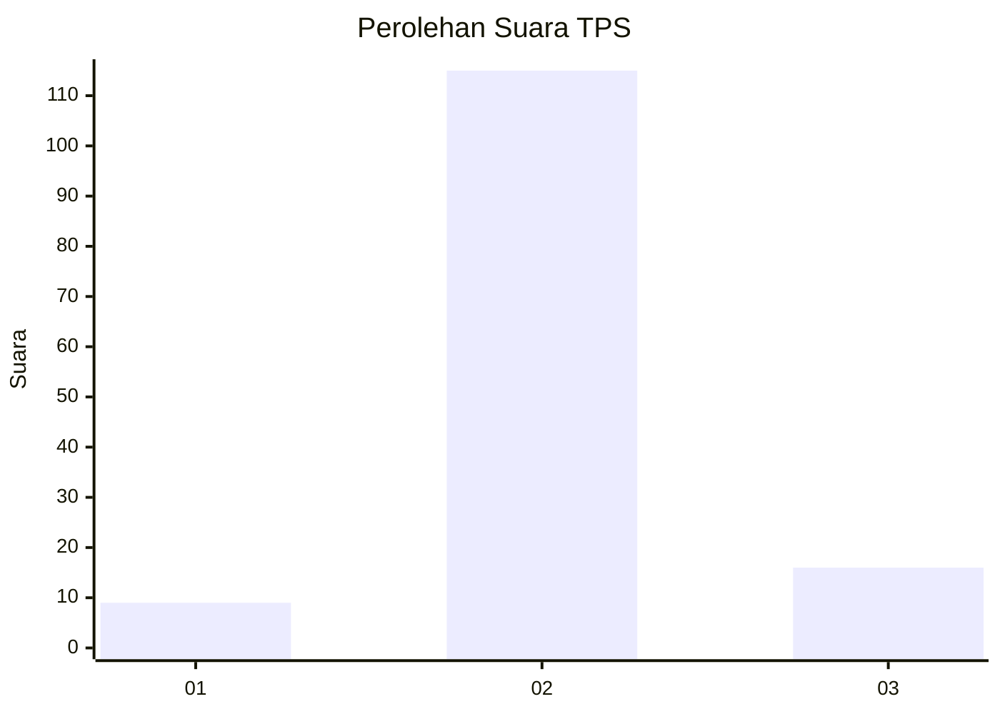
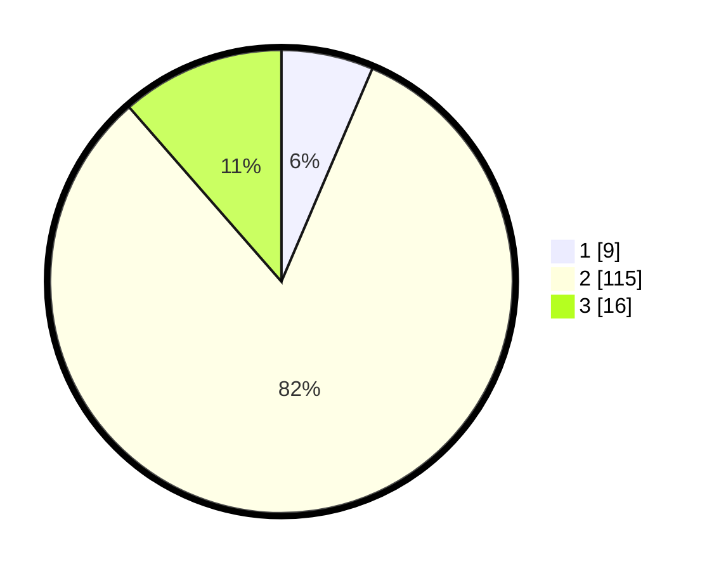

# Hasil

## Grafik

## Tabel

| No. | Nama Paslon    | Suara | Suara (raw) | Persentase |
|:--- |:-------------- | -----:| -----------:| ----------:|
| 1   | ANIES MUHAIMIN | 9     | [9][p-1]    | 6,43       |
| 2   | PRABOWO GIBRAN | 115   | [115][p-2]  | 82,14      |
| 3   | GANJAR MAHFUD  | 16    | [16][p-3]   | 11,43      |

[p-1]: https://github.com/gigit-pemilu/pemilu-2024-35-jawa-timur/blob/main/pilpres/hitung-suara/sub/35-jawa-timur/sub/01-pacitan/sub/08-bandar/sub/2001-petungsinarang/sub/005-tps/sub/paslon-1.txt
[p-2]: https://github.com/gigit-pemilu/pemilu-2024-35-jawa-timur/blob/main/pilpres/hitung-suara/sub/35-jawa-timur/sub/01-pacitan/sub/08-bandar/sub/2001-petungsinarang/sub/005-tps/sub/paslon-2.txt
[p-3]: https://github.com/gigit-pemilu/pemilu-2024-35-jawa-timur/blob/main/pilpres/hitung-suara/sub/35-jawa-timur/sub/01-pacitan/sub/08-bandar/sub/2001-petungsinarang/sub/005-tps/sub/paslon-3.txt

## Foto C Plano

https://sirekap-obj-formc.kpu.go.id/2a11/pemilu/ppwp/35/01/08/20/01/3501082001005-20240216-224648--f74f337c-31de-4875-bacf-464414ef5b1a.jpg

https://sirekap-obj-formc.kpu.go.id/2a11/pemilu/ppwp/35/01/08/20/01/3501082001005-20240216-224801--f45f9da1-209a-446c-b420-3eb5eb49c79e.jpg

https://sirekap-obj-formc.kpu.go.id/2a11/pemilu/ppwp/35/01/08/20/01/3501082001005-20240216-224909--41d6476a-7831-4c7d-b30c-8c9f0f392916.jpg

## Metadata

| Key        | Value               |
| ---------- | ------------------- |
| Time Stamp | 2024-02-16 23:30:00 |

## DATA PEMILIH TETAP

Jumlah pemilih dalam DPT: **224**.
 * L: **104**.
 * P: **120**.

## DATA PENGGUNA HAK PILIH

Jumlah pengguna hak pilih dalam DPT: **146**.
 * L: **67**.
 * P: **79**.

Jumlah pengguna hak pilih dalam DPTb: **1**.
 * L: **1**.
 * P: **0**.

Jumlah pengguna hak pilih dalam DPK: **1**.
 * L: **0**.
 * P: **1**.

Jumlah pengguna hak pilih: **148**.
 * L: **68**.
 * P: **80**.

## JUMLAH SUARA SAH DAN TIDAK SAH

JUMLAH SELURUH SUARA SAH: **140**.

JUMLAH SUARA TIDAK SAH: **8**.

JUMLAH SELURUH SUARA SAH DAN SUARA TIDAK SAH: **148**.

