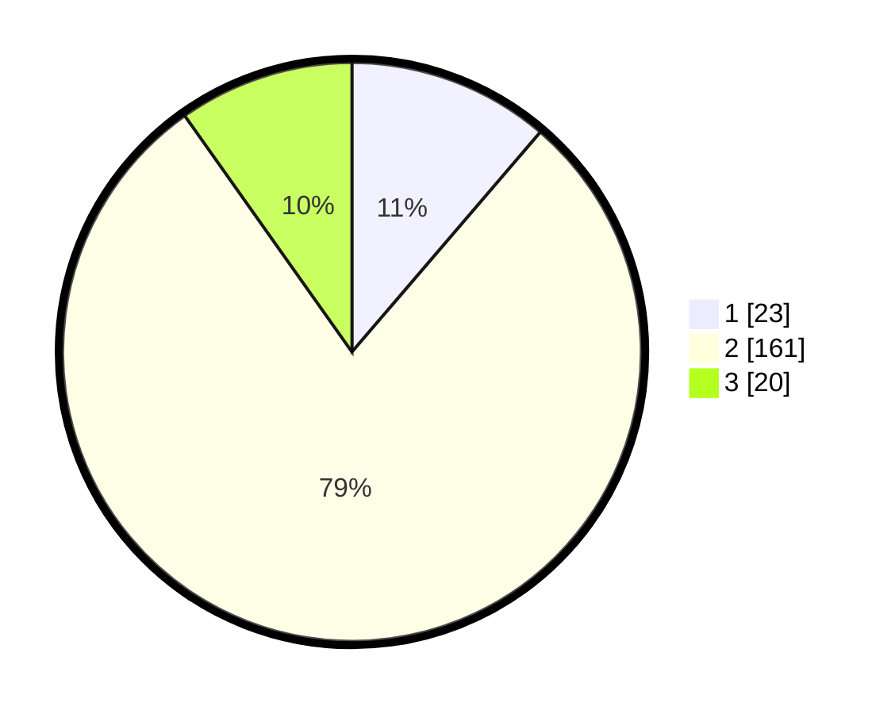

# Hasil

## Grafik

## Tabel

| No. | Nama Paslon    | Suara | Suara (raw) | Persentase |
|:--- |:-------------- | -----:| -----------:| ----------:|
| 1   | ANIES MUHAIMIN | 23    | [23][p-1]   | 11,27      |
| 2   | PRABOWO GIBRAN | 161   | [161][p-2]  | 78,92      |
| 3   | GANJAR MAHFUD  | 20    | [20][p-3]   | 9,80       |

[p-1]: https://github.com/gigit-pemilu/pemilu-2024/blob/main/pilpres/hitung-suara/sub/35-jawa-timur/sub/01-pacitan/sub/08-bandar/sub/2001-petungsinarang/sub/006-tps/sub/paslon-1.txt
[p-2]: https://github.com/gigit-pemilu/pemilu-2024/blob/main/pilpres/hitung-suara/sub/35-jawa-timur/sub/01-pacitan/sub/08-bandar/sub/2001-petungsinarang/sub/006-tps/sub/paslon-2.txt
[p-3]: https://github.com/gigit-pemilu/pemilu-2024/blob/main/pilpres/hitung-suara/sub/35-jawa-timur/sub/01-pacitan/sub/08-bandar/sub/2001-petungsinarang/sub/006-tps/sub/paslon-3.txt

## Foto C Plano

https://sirekap-obj-formc.kpu.go.id/8f57/pemilu/ppwp/35/01/08/20/01/3501082001006-20240216-094908--2c9c3abf-5fdd-4314-b398-0f2ff005ba06.jpg

https://sirekap-obj-formc.kpu.go.id/8f57/pemilu/ppwp/35/01/08/20/01/3501082001006-20240216-095106--5e570969-cb85-45d8-954a-dc12e97d58c9.jpg

https://sirekap-obj-formc.kpu.go.id/8f57/pemilu/ppwp/35/01/08/20/01/3501082001006-20240215-194443--c52bba33-d074-4206-9cd9-11bf8b294d87.jpg

## Metadata

| Key        | Value               |
| ---------- | ------------------- |
| Time Stamp | 2024-02-16 11:00:29 |

## DATA PEMILIH TETAP

Jumlah pemilih dalam DPT: **282**.
 * L: **142**.
 * P: **140**.

## DATA PENGGUNA HAK PILIH

Jumlah pengguna hak pilih dalam DPT: **211**.
 * L: **98**.
 * P: **113**.

Jumlah pengguna hak pilih dalam DPTb: **0**.
 * L: **0**.
 * P: **0**.

Jumlah pengguna hak pilih dalam DPK: **0**.
 * L: **0**.
 * P: **0**.

Jumlah pengguna hak pilih: **211**.
 * L: **98**.
 * P: **113**.

## JUMLAH SUARA SAH DAN TIDAK SAH

JUMLAH SELURUH SUARA SAH: **204**.

JUMLAH SUARA TIDAK SAH: **7**.

JUMLAH SELURUH SUARA SAH DAN SUARA TIDAK SAH: **211**.

