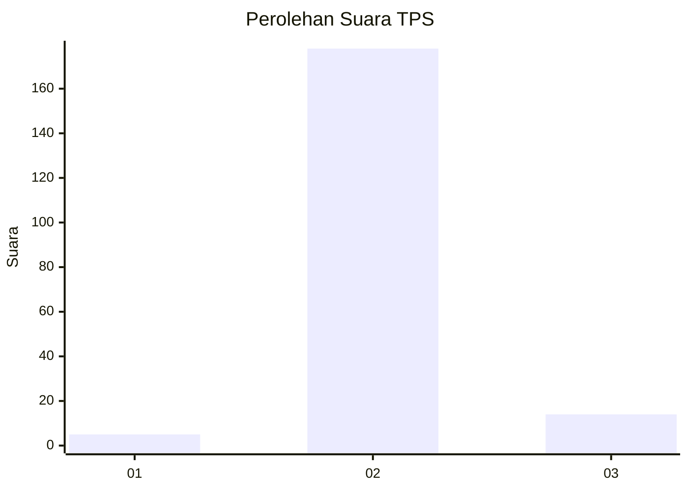
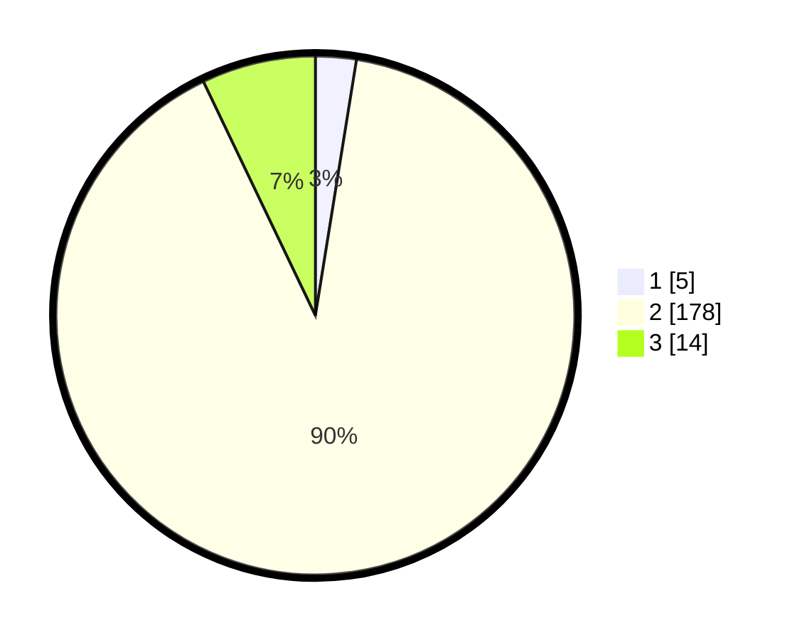

# Hasil

## Grafik

## Tabel

| No. | Nama Paslon    | Suara | Suara (raw) | Persentase |
|:--- |:-------------- | -----:| -----------:| ----------:|
| 1   | ANIES MUHAIMIN | 5     | [5][p-1]    | 2,54       |
| 2   | PRABOWO GIBRAN | 178   | [178][p-2]  | 90,36      |
| 3   | GANJAR MAHFUD  | 14    | [14][p-3]   | 7,11       |

[p-1]: https://github.com/gigit-pemilu/pemilu-2024-35-jawa-timur/blob/main/pilpres/hitung-suara/sub/35-jawa-timur/sub/01-pacitan/sub/08-bandar/sub/2001-petungsinarang/sub/015-tps/sub/paslon-1.txt
[p-2]: https://github.com/gigit-pemilu/pemilu-2024-35-jawa-timur/blob/main/pilpres/hitung-suara/sub/35-jawa-timur/sub/01-pacitan/sub/08-bandar/sub/2001-petungsinarang/sub/015-tps/sub/paslon-2.txt
[p-3]: https://github.com/gigit-pemilu/pemilu-2024-35-jawa-timur/blob/main/pilpres/hitung-suara/sub/35-jawa-timur/sub/01-pacitan/sub/08-bandar/sub/2001-petungsinarang/sub/015-tps/sub/paslon-3.txt

## Foto C Plano

https://sirekap-obj-formc.kpu.go.id/e5de/pemilu/ppwp/35/01/08/20/01/3501082001015-20240215-160836--319bd843-437e-451d-9b3f-7bed04b9d784.jpg

https://sirekap-obj-formc.kpu.go.id/e5de/pemilu/ppwp/35/01/08/20/01/3501082001015-20240215-021633--1a06d5e1-a1ae-4fe4-81e5-41c034cdd165.jpg

https://sirekap-obj-formc.kpu.go.id/e5de/pemilu/ppwp/35/01/08/20/01/3501082001015-20240215-161155--185aad62-220e-46f3-96ec-545308f884e2.jpg

## Metadata

| Key        | Value               |
| ---------- | ------------------- |
| Time Stamp | 2024-02-15 20:00:44 |

