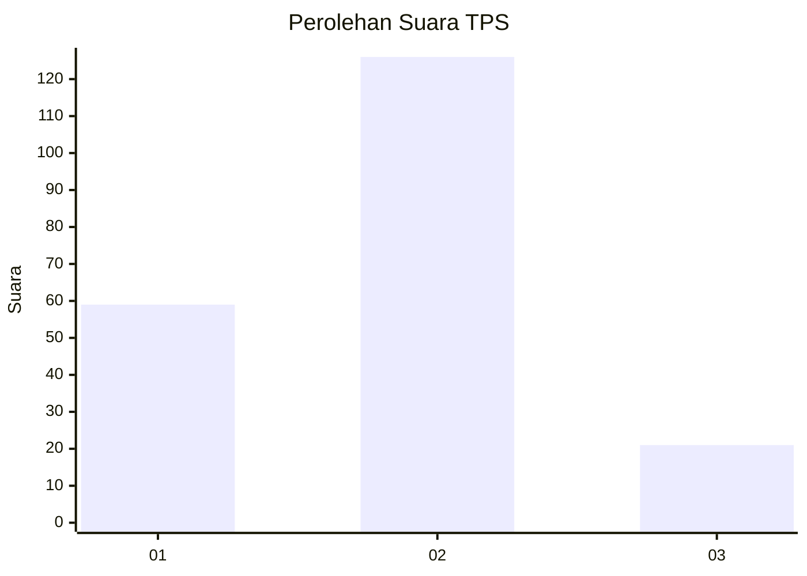
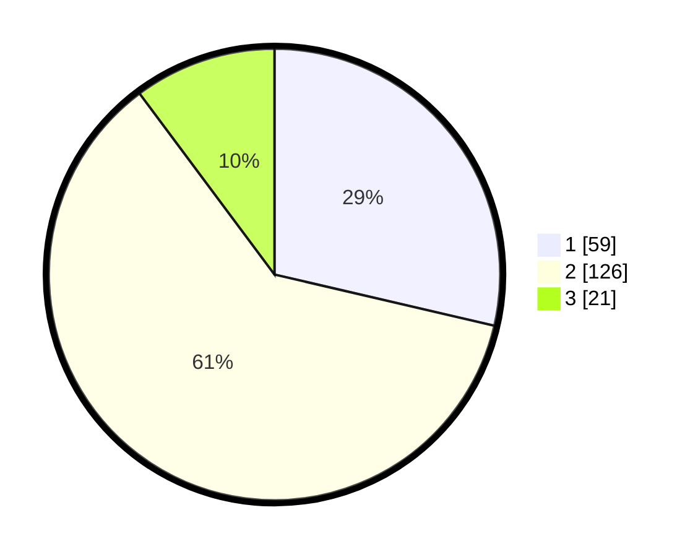

# Hasil

## Grafik

## Tabel

| No. | Nama Paslon    | Suara | Suara (raw) | Persentase |
|:--- |:-------------- | -----:| -----------:| ----------:|
| 1   | ANIES MUHAIMIN | 59    | [59][p-1]   | 28,64      |
| 2   | PRABOWO GIBRAN | 126   | [126][p-2]  | 61,17      |
| 3   | GANJAR MAHFUD  | 21    | [21][p-3]   | 10,19      |

[p-1]: https://github.com/gigit-pemilu/pemilu-2024-35-jawa-timur/blob/main/pilpres/hitung-suara/sub/35-jawa-timur/sub/01-pacitan/sub/09-tegalombo/sub/2001-kebondalem/sub/001-tps/sub/paslon-1.txt
[p-2]: https://github.com/gigit-pemilu/pemilu-2024-35-jawa-timur/blob/main/pilpres/hitung-suara/sub/35-jawa-timur/sub/01-pacitan/sub/09-tegalombo/sub/2001-kebondalem/sub/001-tps/sub/paslon-2.txt
[p-3]: https://github.com/gigit-pemilu/pemilu-2024-35-jawa-timur/blob/main/pilpres/hitung-suara/sub/35-jawa-timur/sub/01-pacitan/sub/09-tegalombo/sub/2001-kebondalem/sub/001-tps/sub/paslon-3.txt

## Foto C Plano

https://sirekap-obj-formc.kpu.go.id/3431/pemilu/ppwp/35/01/09/20/01/3501092001001-20240214-235147--d66885ee-8200-4375-9647-25d2e7550ef3.jpg

https://sirekap-obj-formc.kpu.go.id/3431/pemilu/ppwp/35/01/09/20/01/3501092001001-20240217-103328--16325b7e-9195-48e2-8813-472355b9eeb9.jpg

https://sirekap-obj-formc.kpu.go.id/3431/pemilu/ppwp/35/01/09/20/01/3501092001001-20240215-005218--bf02e3b5-c486-4037-9e77-d953aa0ded42.jpg

## Metadata

| Key        | Value               |
| ---------- | ------------------- |
| Time Stamp | 2024-02-17 11:00:02 |

