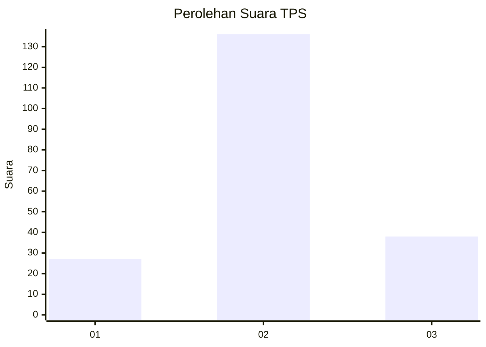
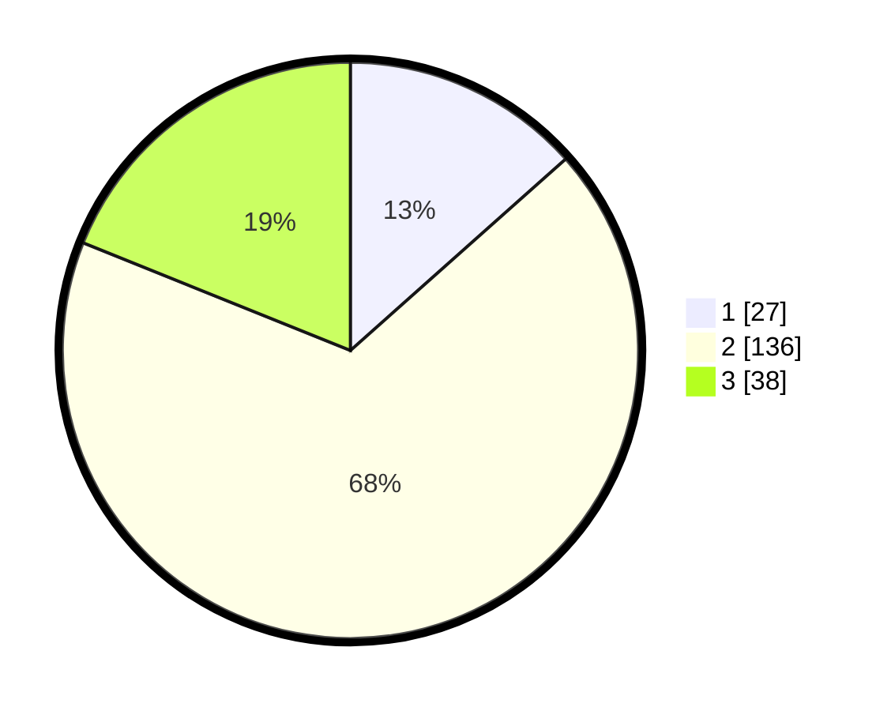

# Hasil

## Grafik

## Tabel

| No. | Nama Paslon    | Suara | Suara (raw) | Persentase |
|:--- |:-------------- | -----:| -----------:| ----------:|
| 1   | ANIES MUHAIMIN | 27    | [27][p-1]   | 13,43      |
| 2   | PRABOWO GIBRAN | 136   | [136][p-2]  | 67,66      |
| 3   | GANJAR MAHFUD  | 38    | [38][p-3]   | 18,91      |

[p-1]: https://github.com/gigit-pemilu/pemilu-2024-35-jawa-timur/blob/main/pilpres/hitung-suara/sub/35-jawa-timur/sub/01-pacitan/sub/09-tegalombo/sub/2002-gedangan/sub/003-tps/sub/paslon-1.txt
[p-2]: https://github.com/gigit-pemilu/pemilu-2024-35-jawa-timur/blob/main/pilpres/hitung-suara/sub/35-jawa-timur/sub/01-pacitan/sub/09-tegalombo/sub/2002-gedangan/sub/003-tps/sub/paslon-2.txt
[p-3]: https://github.com/gigit-pemilu/pemilu-2024-35-jawa-timur/blob/main/pilpres/hitung-suara/sub/35-jawa-timur/sub/01-pacitan/sub/09-tegalombo/sub/2002-gedangan/sub/003-tps/sub/paslon-3.txt

## Foto C Plano

https://sirekap-obj-formc.kpu.go.id/8cbd/pemilu/ppwp/35/01/09/20/02/3501092002003-20240214-213929--989595bb-42a1-454d-ab11-82e596f3ff38.jpg

https://sirekap-obj-formc.kpu.go.id/8cbd/pemilu/ppwp/35/01/09/20/02/3501092002003-20240214-235446--9e862bde-14b3-45d0-aeb3-be3561dbd2b4.jpg

## Metadata

| Key        | Value               |
| ---------- | ------------------- |
| Time Stamp | 2024-02-15 23:29:50 |

