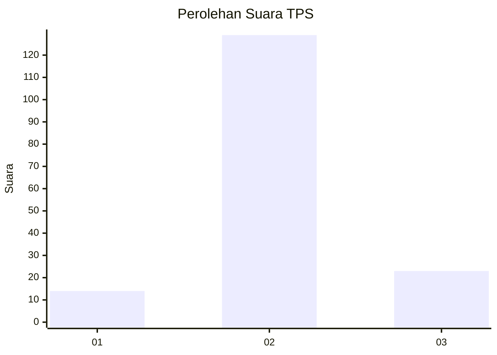
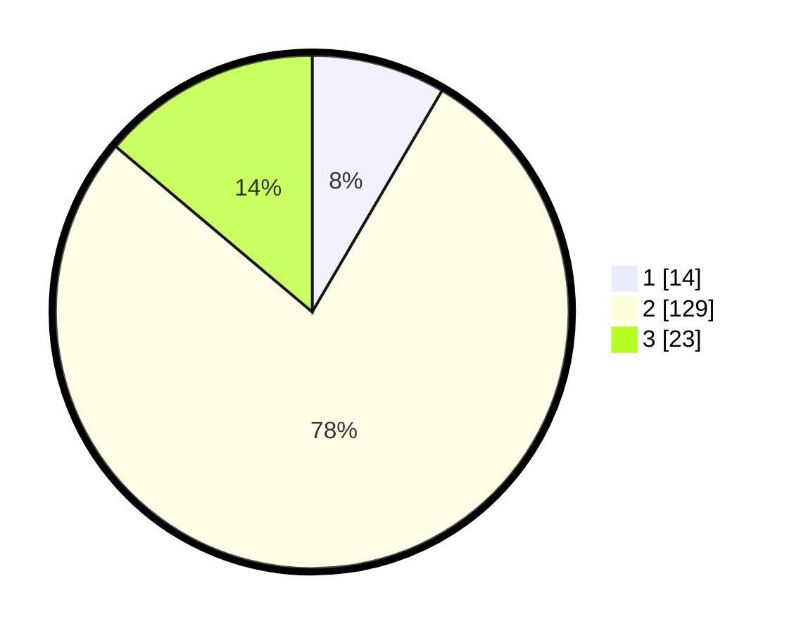

# Hasil

## Grafik

## Tabel

| No. | Nama Paslon    | Suara | Suara (raw) | Persentase |
|:--- |:-------------- | -----:| -----------:| ----------:|
| 1   | ANIES MUHAIMIN | 14    | [14][p-1]   | 8,43       |
| 2   | PRABOWO GIBRAN | 129   | [129][p-2]  | 77,71      |
| 3   | GANJAR MAHFUD  | 23    | [23][p-3]   | 13,86      |

[p-1]: https://github.com/gigit-pemilu/pemilu-2024-35-jawa-timur/blob/main/pilpres/hitung-suara/sub/35-jawa-timur/sub/01-pacitan/sub/09-tegalombo/sub/2005-pucangombo/sub/003-tps/sub/paslon-1.txt
[p-2]: https://github.com/gigit-pemilu/pemilu-2024-35-jawa-timur/blob/main/pilpres/hitung-suara/sub/35-jawa-timur/sub/01-pacitan/sub/09-tegalombo/sub/2005-pucangombo/sub/003-tps/sub/paslon-2.txt
[p-3]: https://github.com/gigit-pemilu/pemilu-2024-35-jawa-timur/blob/main/pilpres/hitung-suara/sub/35-jawa-timur/sub/01-pacitan/sub/09-tegalombo/sub/2005-pucangombo/sub/003-tps/sub/paslon-3.txt

## Foto C Plano

https://sirekap-obj-formc.kpu.go.id/e3bb/pemilu/ppwp/35/01/09/20/05/3501092005003-20240214-141734--a1bc3091-94b0-4cec-ac96-1384c942bfcf.jpg

https://sirekap-obj-formc.kpu.go.id/e3bb/pemilu/ppwp/35/01/09/20/05/3501092005003-20240214-141819--0450d6fe-9e23-40d6-bae9-9c6493e0c083.jpg

https://sirekap-obj-formc.kpu.go.id/e3bb/pemilu/ppwp/35/01/09/20/05/3501092005003-20240218-154027--53d55b40-3e10-4caf-98a2-9bbe1d48824d.jpg

## Metadata

| Key        | Value               |
| ---------- | ------------------- |
| Time Stamp | 2024-02-19 06:16:00 |

