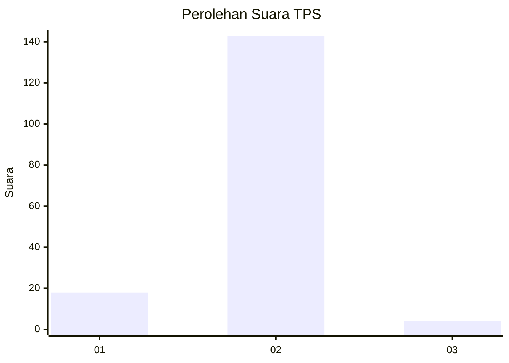
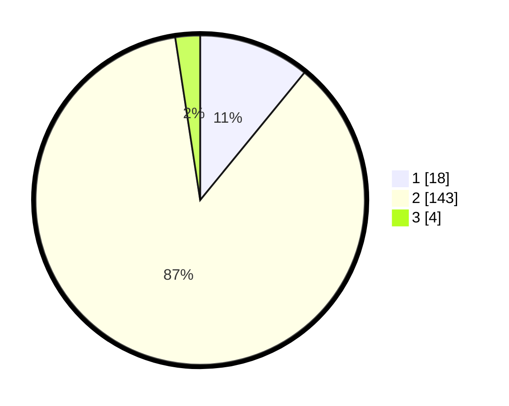

# Hasil

## Grafik

## Tabel

| No. | Nama Paslon    | Suara | Suara (raw) | Persentase |
|:--- |:-------------- | -----:| -----------:| ----------:|
| 1   | ANIES MUHAIMIN | 18    | [18][p-1]   | 10,91      |
| 2   | PRABOWO GIBRAN | 143   | [143][p-2]  | 86,67      |
| 3   | GANJAR MAHFUD  | 4     | [4][p-3]    | 2,42       |

[p-1]: https://github.com/gigit-pemilu/pemilu-2024/blob/main/pilpres/hitung-suara/sub/35-jawa-timur/sub/01-pacitan/sub/10-tulakan/sub/2001-jetak/sub/001-tps/sub/paslon-1.txt
[p-2]: https://github.com/gigit-pemilu/pemilu-2024/blob/main/pilpres/hitung-suara/sub/35-jawa-timur/sub/01-pacitan/sub/10-tulakan/sub/2001-jetak/sub/001-tps/sub/paslon-2.txt
[p-3]: https://github.com/gigit-pemilu/pemilu-2024/blob/main/pilpres/hitung-suara/sub/35-jawa-timur/sub/01-pacitan/sub/10-tulakan/sub/2001-jetak/sub/001-tps/sub/paslon-3.txt

## Foto C Plano

https://sirekap-obj-formc.kpu.go.id/1639/pemilu/ppwp/35/01/10/20/01/3501102001001-20240215-005419--f6ff4fda-7f5d-464e-86b6-1a4a6983b484.jpg

https://sirekap-obj-formc.kpu.go.id/1639/pemilu/ppwp/35/01/10/20/01/3501102001001-20240218-003411--f65b0474-de37-4cea-a0e2-875dbed8265a.jpg

https://sirekap-obj-formc.kpu.go.id/1639/pemilu/ppwp/35/01/10/20/01/3501102001001-20240218-003410--26dd55f5-ced1-468c-adb7-b623ccbb7332.jpg

## Metadata

| Key        | Value               |
| ---------- | ------------------- |
| Time Stamp | 2024-02-19 06:16:00 |

## DATA PEMILIH TETAP

Jumlah pemilih dalam DPT: **271**.
 * L: **130**.
 * P: **141**.

## DATA PENGGUNA HAK PILIH

Jumlah pengguna hak pilih dalam DPT: **165**.
 * L: **67**.
 * P: **98**.

Jumlah pengguna hak pilih dalam DPTb: **0**.
 * L: **400**.
 * P: **5**.

Jumlah pengguna hak pilih dalam DPK: **1**.
 * L: **0**.
 * P: **1**.

Jumlah pengguna hak pilih: **166**.
 * L: **67**.
 * P: **99**.

## JUMLAH SUARA SAH DAN TIDAK SAH

JUMLAH SELURUH SUARA SAH: **165**.

JUMLAH SUARA TIDAK SAH: **1**.

JUMLAH SELURUH SUARA SAH DAN SUARA TIDAK SAH: **166**.

