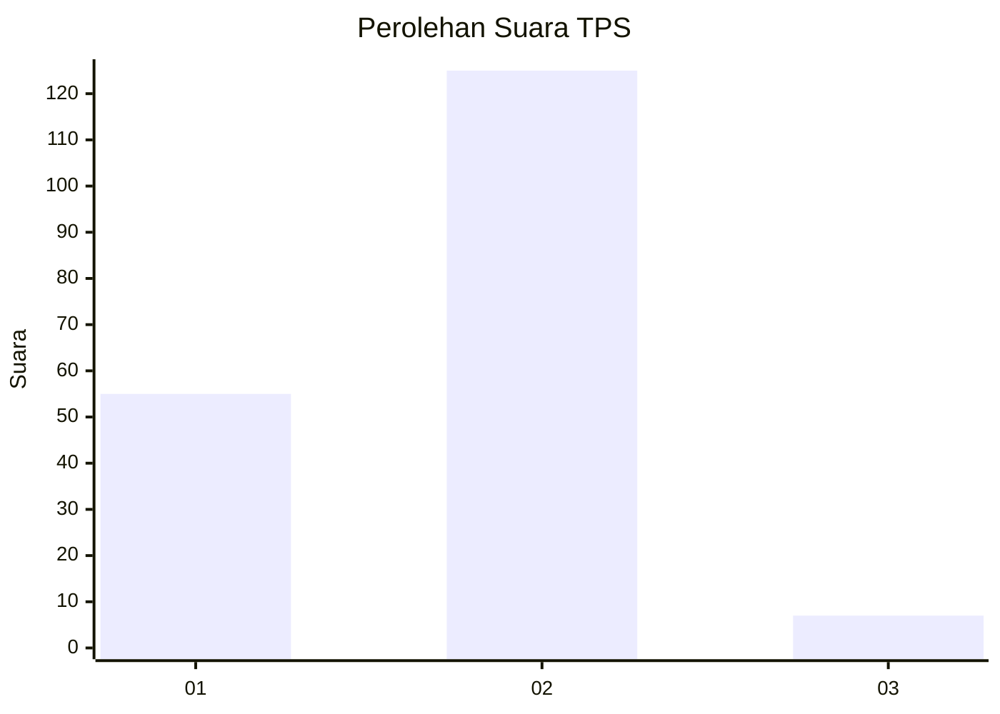
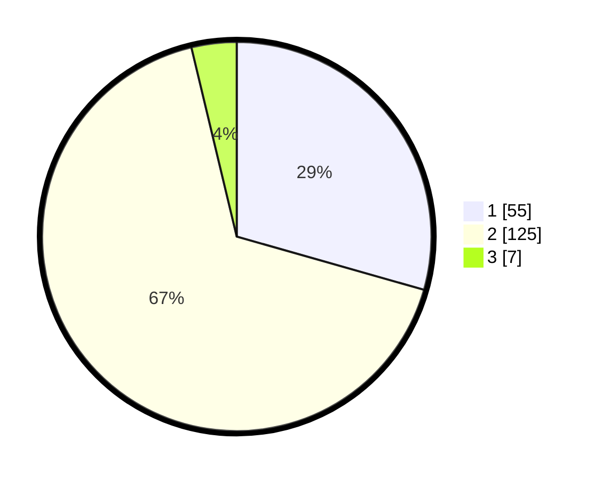

# Hasil

## Grafik

## Tabel

| No. | Nama Paslon    | Suara | Suara (raw) | Persentase |
|:--- |:-------------- | -----:| -----------:| ----------:|
| 1   | ANIES MUHAIMIN | 55    | [55][p-1]   | 29,41      |
| 2   | PRABOWO GIBRAN | 125   | [125][p-2]  | 66,84      |
| 3   | GANJAR MAHFUD  | 7     | [7][p-3]    | 3,74       |

[p-1]: https://github.com/gigit-pemilu/pemilu-2024/blob/main/pilpres/hitung-suara/sub/35-jawa-timur/sub/01-pacitan/sub/11-ngadirojo/sub/2001-sidomulyo/sub/002-tps/sub/paslon-1.txt
[p-2]: https://github.com/gigit-pemilu/pemilu-2024/blob/main/pilpres/hitung-suara/sub/35-jawa-timur/sub/01-pacitan/sub/11-ngadirojo/sub/2001-sidomulyo/sub/002-tps/sub/paslon-2.txt
[p-3]: https://github.com/gigit-pemilu/pemilu-2024/blob/main/pilpres/hitung-suara/sub/35-jawa-timur/sub/01-pacitan/sub/11-ngadirojo/sub/2001-sidomulyo/sub/002-tps/sub/paslon-3.txt

## Foto C Plano

https://sirekap-obj-formc.kpu.go.id/fc3b/pemilu/ppwp/35/01/11/20/01/3501112001002-20240215-214330--23901039-d6a8-49dd-960a-fc98094b3d6c.jpg

https://sirekap-obj-formc.kpu.go.id/fc3b/pemilu/ppwp/35/01/11/20/01/3501112001002-20240215-214344--c8eb0bd3-f94b-4a3b-b573-f61d9d296595.jpg

https://sirekap-obj-formc.kpu.go.id/fc3b/pemilu/ppwp/35/01/11/20/01/3501112001002-20240215-214353--6bc3fe9a-b047-4644-8edb-af819f4c765f.jpg

## Metadata

| Key        | Value               |
| ---------- | ------------------- |
| Time Stamp | 2024-02-24 22:31:28 |

## DATA PEMILIH TETAP

Jumlah pemilih dalam DPT: **232**.
 * L: **118**.
 * P: **114**.

## DATA PENGGUNA HAK PILIH

Jumlah pengguna hak pilih dalam DPT: **188**.
 * L: **92**.
 * P: **96**.

Jumlah pengguna hak pilih dalam DPTb: **2**.
 * L: **1**.
 * P: **1**.

Jumlah pengguna hak pilih dalam DPK: **0**.
 * L: **0**.
 * P: **0**.

Jumlah pengguna hak pilih: **190**.
 * L: **93**.
 * P: **97**.

## JUMLAH SUARA SAH DAN TIDAK SAH

JUMLAH SELURUH SUARA SAH: **187**.

JUMLAH SUARA TIDAK SAH: **3**.

JUMLAH SELURUH SUARA SAH DAN SUARA TIDAK SAH: **190**.

