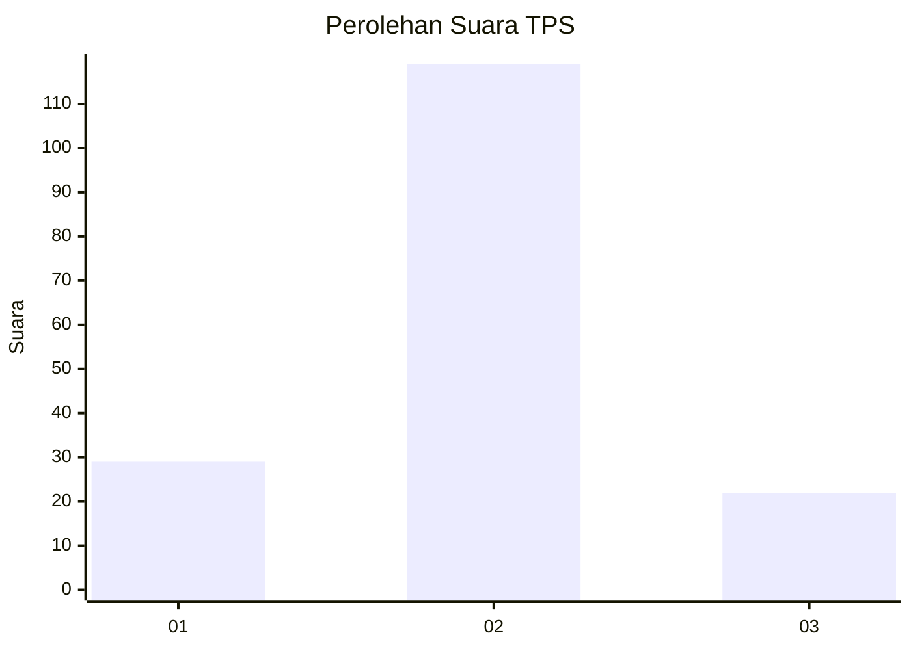
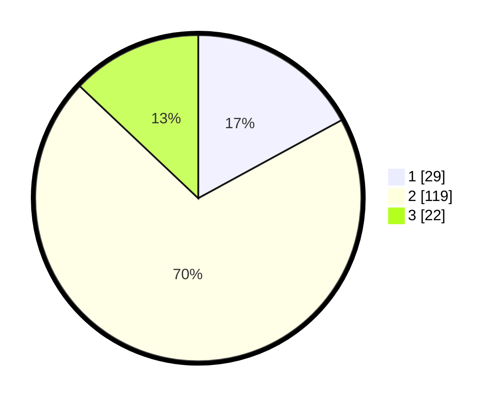

# Hasil

## Grafik

## Tabel

| No. | Nama Paslon    | Suara | Suara (raw) | Persentase |
|:--- |:-------------- | -----:| -----------:| ----------:|
| 1   | ANIES MUHAIMIN | 29    | [29][p-1]   | 17,06      |
| 2   | PRABOWO GIBRAN | 119   | [119][p-2]  | 70,00      |
| 3   | GANJAR MAHFUD  | 22    | [22][p-3]   | 12,94      |

[p-1]: https://github.com/gigit-pemilu/pemilu-2024/blob/main/pilpres/hitung-suara/sub/35-jawa-timur/sub/01-pacitan/sub/11-ngadirojo/sub/2001-sidomulyo/sub/005-tps/sub/paslon-1.txt
[p-2]: https://github.com/gigit-pemilu/pemilu-2024/blob/main/pilpres/hitung-suara/sub/35-jawa-timur/sub/01-pacitan/sub/11-ngadirojo/sub/2001-sidomulyo/sub/005-tps/sub/paslon-2.txt
[p-3]: https://github.com/gigit-pemilu/pemilu-2024/blob/main/pilpres/hitung-suara/sub/35-jawa-timur/sub/01-pacitan/sub/11-ngadirojo/sub/2001-sidomulyo/sub/005-tps/sub/paslon-3.txt

## Foto C Plano

https://sirekap-obj-formc.kpu.go.id/6df6/pemilu/ppwp/35/01/11/20/01/3501112001005-20240216-174715--dfb30ad7-9689-47c6-8892-0fcb109ea12b.jpg

https://sirekap-obj-formc.kpu.go.id/6df6/pemilu/ppwp/35/01/11/20/01/3501112001005-20240216-174716--3d6856ce-25cb-4feb-afaf-437b6acf79fe.jpg

https://sirekap-obj-formc.kpu.go.id/6df6/pemilu/ppwp/35/01/11/20/01/3501112001005-20240216-174716--ce0967a1-b8a3-4aa8-9093-3f239e71b62c.jpg

## Metadata

| Key        | Value               |
| ---------- | ------------------- |
| Time Stamp | 2024-02-16 21:01:00 |

## DATA PEMILIH TETAP

Jumlah pemilih dalam DPT: **213**.
 * L: **99**.
 * P: **114**.

## DATA PENGGUNA HAK PILIH

Jumlah pengguna hak pilih dalam DPT: **161**.
 * L: **70**.
 * P: **91**.

Jumlah pengguna hak pilih dalam DPTb: **6**.
 * L: **3**.
 * P: **3**.

Jumlah pengguna hak pilih dalam DPK: **3**.
 * L: **2**.
 * P: **1**.

Jumlah pengguna hak pilih: **170**.
 * L: **75**.
 * P: **95**.

## JUMLAH SUARA SAH DAN TIDAK SAH

JUMLAH SELURUH SUARA SAH: **170**.

JUMLAH SUARA TIDAK SAH: **0**.

JUMLAH SELURUH SUARA SAH DAN SUARA TIDAK SAH: **170**.

